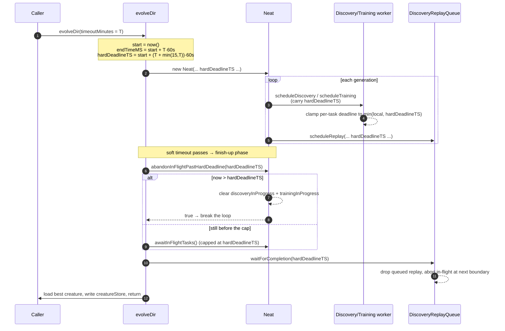

# ⏱️ Timeout Semantics — the T+15 Hard Cap

How long can an evolution run actually take? This document is the single source
of truth for the **`timeoutMinutes`** option and the **absolute hard cap** that
bounds `evolveDir` (and its siblings `evolveDataSet`, `evolveEnv`, `evolveRL`).

> [!IMPORTANT]
> **The guarantee in one line:** a run configured with `timeoutMinutes = T`
> returns within **`T + min(15, T)` minutes** of wall-clock — "T+15" for any
> `T ≥ 15` — abandoning in-flight work while keeping the best creature found so
> far. A run started with `--timeout=45` therefore finishes inside the hour,
> leaving the caller time for its normal save / model check-in.

## 🧩 The two deadlines

Evolution tracks **two** wall-clock deadlines, both anchored at the run's start
timestamp:

| Deadline                        | Value                             | Role                                                                                                                                                                                                  |
| ------------------------------- | --------------------------------- | ----------------------------------------------------------------------------------------------------------------------------------------------------------------------------------------------------- |
| **Soft timeout** (`endTimeMS`)  | `start + max(1, T) × 60 000 ms`   | Stops starting _new_ generations once it passes. The loop then enters the finish-up phase and waits — briefly — for in-flight discovery / training to settle so their partial results are not wasted. |
| **Hard cap** (`hardDeadlineTS`) | `start + (T + grace) × 60 000 ms` | The point of no return. Once it passes, every phase abandons in-flight work and the run returns. Nothing is allowed to push past it.                                                                  |

The grace period is clamped:

```text
grace = min(HARD_DEADLINE_GRACE_MINUTES, max(1, T))   // HARD_DEADLINE_GRACE_MINUTES = 15
```

So the grace never exceeds 15 minutes for long runs, and stays proportionate for
short ones (a 2-minute run gets at most 2 minutes of grace, not 15). When
`timeoutMinutes` is `0`/unset there is **no** soft timeout and **no** hard cap —
the run is bounded only by `iterations`, `targetError`, `SIGTERM`, and the
external watchdog. The canonical computation lives in
[`src/NEAT/HardDeadline.ts`](../src/NEAT/HardDeadline.ts)
(`computeHardDeadlineTS`).

## 🛑 What each phase does at the hard cap

The cap is enforced cooperatively — each phase checks the absolute
`hardDeadlineTS` at its own next safe boundary and stops there. None of them
waits past it.

- **Evolve loop** — `Neat.abandonInFlightPastHardDeadline(hardDeadlineTS)` is
  the first check in the finish-up branch. Once the cap has passed it clears
  `discoveryInProgress` / `trainingInProgress` (so the abandoned promises can
  never be re-awaited) and breaks the loop **unconditionally**, even when
  `finishUp()` would otherwise still ask for more wait generations.
- **Finish-up wait** — `Neat.awaitInFlightTasks()` caps its own timeout at the
  time remaining before `hardDeadlineTS`. A never-resolving in-flight promise
  can therefore never wedge the wait past the cap.
- **Discovery** — the absolute `discoveryHardDeadlineTS` crosses the worker
  boundary (Issue #2898), so the worker clamps every per-discovery
  record/analysis deadline to the cap regardless of how long the request waited
  in the queue. The relative phase-split allocation (record vs analysis) still
  applies _inside_ that ceiling.
- **Training** — scheduled training tasks carry the same absolute hard deadline
  (Issue #2899) and are clamped to it.
- **Discovery replay** — `DiscoveryReplayQueue.scheduleReplay()` refuses to
  start a replay once the cap has passed, and
  `waitForCompletion(hardDeadlineTS)` drops any queued replay and signals the
  in-flight one to abort cooperatively at its next candidate boundary (Issue
  #2901).

In every case the **partial results already gathered are kept** and the **best
creature found so far is loaded onto the caller's creature**, `creatureStore` is
written, and the run returns its normal `{ error, score, generation, time }`
summary. The cap costs you only the _unfinished_ work, never the finished work.

## 🤝 Cooperative return vs. forced abandon (Issue #3166)

A task asked to stop should **return on its own** within a small bounded grace
window — a _forced abandon_ is the failure mode, not the design. Two behaviours
keep the "Abandoning stuck training task(s)" force-cleanup path from firing in
normal runs:

- **A bounded grace cycle before force-abandon.** When the soft timeout passes,
  a worker that has hit its own per-task deadline has already returned
  cooperatively — but its result-handling callback (which removes the task from
  `trainingInProgress` / `discoveryInProgress`) runs as a microtask on the next
  finish-up cycle. `Neat.finishUp()` now grants **one** grace cycle after the
  wall-clock deadline passes, during which `awaitInFlightTasks()` drains those
  settled promises, so a cooperatively-returning task removes itself instead of
  being mislabelled "stuck" and force-abandoned the instant the deadline passes.
  Genuinely stuck tasks (whose promise never settles) are still abandoned — by
  the per-task stuck-task watchdog (`abandonStuckTrainingTasks`, Issue #3053)
  and, as a final backstop, on the next cycle after the grace — so the run
  always finalizes within a bounded window.
- **Sub-second training budgets are rejected, not silently run.**
  `scheduleTraining` computes each task's effective budget
  (`min(relative budget, hardDeadlineTS) − now`) up front. When that budget is
  below `MIN_TRAINING_BUDGET_MS` (1 s) the task is **skipped and flagged** with
  a warning rather than dispatched to a worker that could only "time out" in
  milliseconds. This surfaces mis-scaled budgets (the GRQ-16 run saw 16–93 ms
  budgets) and stops burning a worker slot near the hard deadline on a no-op.
  The pure helpers `computeEffectiveTrainingBudgetMs` and
  `isTrainingBudgetTooSmall` live in
  [`src/NEAT/PerTaskTrainingTimeout.ts`](../src/NEAT/PerTaskTrainingTimeout.ts).

## 🔀 How the deadline propagates



The data flow, in one line:

```text
evolveDir → Neat.hardDeadlineTS → scheduleDiscovery / scheduleTraining / replay queue → worker clamps
```

## 🛰️ The external watchdog is unchanged

The T+15 hard cap is an **in-process** guarantee. The external watchdog — for
example GRQ's 3-hour `max-task-hours` — remains the independent backstop and is
**unchanged** by any of this. The cap exists so that, in the normal case, a run
finishes and checks its model in _well before_ the watchdog ever has to fire;
the watchdog only catches pathological situations (a wedged process, a deadlock
outside the cooperative checkpoints) that an in-process deadline cannot reach.

## ✅ Verifying the guarantee

The end-to-end guard
[`test/creature/EvolveDirHardDeadline.ts`](../test/creature/EvolveDirHardDeadline.ts)
drives `evolveDir` with a tiny `timeoutMinutes` and stubbed never-resolving
discovery / training work, with the cap placed in the past via an injected start
timestamp (so the assertions are behavioural, never elapsed-time measurements —
the policy from Issue #2888). It asserts the run **returns**, the best creature
is loaded onto the caller's creature, `creatureStore` is written and loadable,
and the in-flight maps are empty. The replay-queue hard-cap bound has dedicated
coverage in
[`test/NEAT/DiscoveryReplayQueueDeadline.ts`](../test/NEAT/DiscoveryReplayQueueDeadline.ts).

## 🔗 Related

- [`src/NEAT/HardDeadline.ts`](../src/NEAT/HardDeadline.ts) — the pure
  `computeHardDeadlineTS` helper and `HARD_DEADLINE_GRACE_MINUTES` constant.
- [CONFIGURATION_GUIDE.md](CONFIGURATION_GUIDE.md) — the full configuration
  surface, including `timeoutMinutes`.
- [TROUBLESHOOTING.md](TROUBLESHOOTING.md) — what to do when a run does not stop
  when you expect it to.
