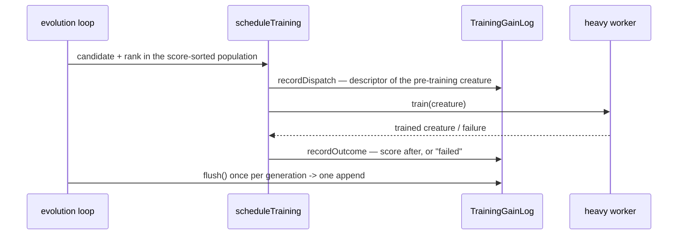

# Training-gain log (Issue #3934)

NEAT-AI is a memetic algorithm: evolution plus per-individual local search,
where the local search is per-generation backpropagation and the trained weights
are written back (the Lamarckian choice — see
[Memetic algorithms](./comparison/REFERENCES.md#-memetic-algorithms)).
[Jin (2011)](./comparison/REFERENCES.md#-surrogate-assisted-search-and-racing)
§5 makes the point this log exists to test: in a memetic algorithm local search
is a **large fixed cost per individual**, so the dominant waste is spending it
on individuals that will not benefit, and the surrogate's job is to decide **who
gets refined**.

`selectTrainingCandidates` allocates that budget by **current score** — the top
`trainPerGen` creatures of the score-sorted population. That answers "who is
currently best?", not "who will gain most from a gradient step?". Until this log
there was no record of what any gradient step realised, so the rule had never
been compared with its own outcomes.

The log **observes and changes nothing**. Selection is untouched; Stage 1 of
Issue #3934 is measurement only.

> [!IMPORTANT]
> **Off by default.** `trainingGainLog.enabled` defaults to `false`: nothing is
> constructed, no disk is touched, and the scheduler behaves exactly as it did
> before. What the measurement found is in
> [`docs/evidence/memetic-gain-3934.md`](./evidence/memetic-gain-3934.md) — and
> the finding was **no-go** for a gain predictor.

## What a record is

One record is one **real training event**: a gradient step that was dispatched
to a heavy worker, after every guard in `scheduleTraining` passed.



| Field                           | Meaning                                                          |
| ------------------------------- | ---------------------------------------------------------------- |
| `descriptorVersion`             | Layout version of `descriptor`; a reader refuses to mix versions |
| `runId`, `generation`, `uuid`   | Provenance: which run, which generation, which creature          |
| `rank`, `rankedPopulation`      | Where the rule chose it, and out of how many                     |
| `scoreBefore`, `scoreAfter`     | Exact score in, score out (`scoreAfter` absent on a failure)     |
| `errorBefore`, `errorAfter`     | The two errors the run's own regression check compares           |
| `wallClockMs`                   | Dispatch to outcome — what the run actually paid                 |
| `outcome`                       | `trained` or `failed`                                            |
| `dispatchedAt`, `referenceUuid` | When, and the creature the genetic-distance slot was measured on |
| `descriptor`                    | The **pre-training** feature vector (Issue #3929's layout)       |

Gain is **not** stored. It is `scoreAfter - scoreBefore`, derived by
`trainingGain()`, because a stored derived column is how a log comes to disagree
with itself. A `failed` event has **no** gain — `undefined`, never `0`, so a
fault can never be averaged in with a measurement.

## The three properties it guarantees

- **One event is one dispatched gradient step.** A step that was skipped
  (`#3553`'s once-per-run guard, a regression streak, too small a budget) is not
  an event. A step that **failed** is recorded as `failed`, because it consumed
  a heavy worker slot: omitting it would report a gain per unit wall-clock that
  no run achieved. A step the run **abandoned** past its hard deadline records
  nothing — its cost belongs to the abandon.
- **The design point is the creature before the step.** The question is which
  creature a gradient step will reward, so the descriptor is computed at
  dispatch.
- **One feature space.** Appending to a log whose first record carries another
  `descriptorVersion` is refused loudly rather than silently mixing two.

## Retention: a per-run write bound

`maxRecords` (default 20,000) bounds what **this run** appends, and the log is
never rewritten. That differs deliberately from the evaluation archive's
retention window (Issue #3929), for two reasons: a training event costs minutes,
so no run produces enough of them to justify a compaction pass; and rewriting a
file that earlier runs also appended to would throw away their measurements.
When the bound is reached the log says so — loudly, once per flush — and stops.

## Enabling it

```ts
const creature = new Creature(inputs, outputs);
await creature.evolveDir(dataDir, {
  trainingGainLog: {
    enabled: true,
    directory: ".training-gain-log",
    // Optional: share the archive's run id so the two join.
    runId: "grq-2026-09-11",
  },
});
```

One directory is one log; the file name (`training-events.jsonl`) is fixed, so
no caller-supplied string goes near a filesystem path. Read it back with
`readTrainingGainLog(path)`, which validates every record rather than skipping
the ones it cannot parse.

## Overhead

`bench/TrainingGainLogOverhead.ts` measures the whole hook at the GRQ lineage's
working size (5,300 neurons, 87,000 synapses) and **asserts a budget** rather
than printing a number: 0.1 % of a 60,000 ms training step. Measured on a 7-core
container: **1.8 ms per event** — one `O(neurons + synapses)` descriptor plus
one small append — which is 0.003 % of that step.

## Scope

This log is about **who is selected** for local search. How that local search
runs internally is owned elsewhere: stochastic weight averaging (#3918) and
ensemble distillation (#3915) are out of scope here, and nothing in this log
changes either.
