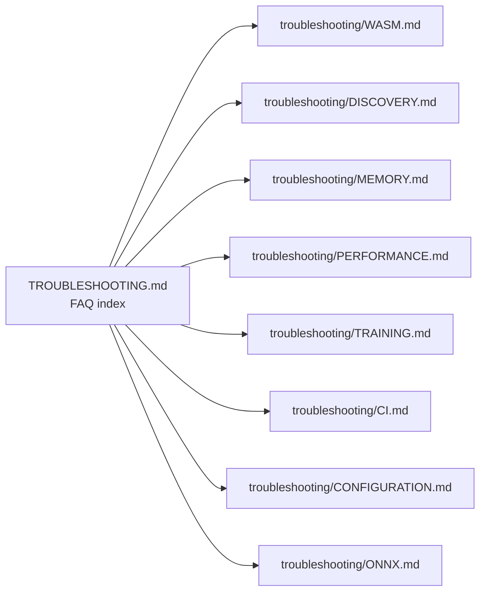

# 🐛 Troubleshooting Guide

Quick FAQ-style index of [NEAT-AI](../AGENTS.md#-terminology) failure modes.
Each entry describes the symptom in one sentence and links to a detail doc under
[`troubleshooting/`](troubleshooting/) where the full diagnosis lives.

If you have arrived here by Googling an error message, jump straight to the
matching topic doc — each one is self-contained.

## 🗺️ Topic map

## ⚙️ WASM (WebAssembly) — init, load, and runtime panics

WASM activation is mandatory; there is no JavaScript fallback. See
[`troubleshooting/WASM.md`](troubleshooting/WASM.md) for full diagnostics.

- **`WASM activation: pkg not found at the canonical package location.`** — the
  `wasm_activation/pkg/` directory is missing or Deno lacks `--allow-read` /
  `--allow-net`. →
  [WASM module not found](troubleshooting/WASM.md#-wasm-module-not-found-or-failed-to-compile).
- **`WASM module not initialised`** — activation methods called before WASM
  finished loading, usually in a custom worker. →
  [WASM module not initialised](troubleshooting/WASM.md#-wasm-module-not-initialised).
- **`Worker WASM activation payload missing`** / `Worker init timed out` —
  parent did not pre-fetch the WASM payload, or `NEAT_AI_WORKER_INIT_TIMEOUT_MS`
  is too low. →
  [WASM in Deno Workers vs Main Thread](troubleshooting/WASM.md#-wasm-in-deno-workers-vs-main-thread).
- **`NotCapable: Requires net access to "jsr.io:443"` inside a worker** — your
  app spawned a Deno Worker against the JSR (JavaScript Registry) build of
  NEAT-AI; pre-fetch the payload in the parent and forward it. →
  [JSR-hosted NEAT-AI in your own workers (Issue #2545)](troubleshooting/WASM.md#-jsr-hosted-neat-ai-in-your-own-workers-issue-2545).
- **`RuntimeError: unreachable` in long runs** — WASM heap exhaustion from too
  many cached compiled networks. →
  [RuntimeError: unreachable](troubleshooting/WASM.md#-runtimeerror-unreachable).
- **WASM panic during fitness evaluation** — handled gracefully since Issues
  #2207 / #2212; root cause is usually numerical overflow. →
  [WASM panic recovery](troubleshooting/WASM.md#-wasm-panic-recovery).

## 🦀 Discovery / Rust FFI — build, load, and GPU backend selection

The Rust FFI (Foreign Function Interface) extension is optional; discovery is
skipped when the library is unavailable. See
[`troubleshooting/DISCOVERY.md`](troubleshooting/DISCOVERY.md) for full
diagnostics.

- **`FFI permission denied for discovery library`** — run with `--allow-ffi`. →
  [FFI permission denied](troubleshooting/DISCOVERY.md#-ffi-permission-denied).
- **Segfault / "Killed: 9" loading the library** — `arm64` vs `x86_64` (or
  `glibc` vs `musl`) mismatch; rebuild on the target machine. →
  [Architecture mismatch errors](troubleshooting/DISCOVERY.md#-architecture-mismatch-errors-arm64-vs-x86).
- **`Discovery disabled: Rust library loaded but GPU probe failed`** — no
  compatible `wgpu` adapter (Metal / Vulkan / DirectX 12); discovery falls back
  to CPU or is disabled. →
  [No GPU detected](troubleshooting/DISCOVERY.md#-no-gpu-detected).
- **Library cannot be found at the default locations** — set
  `NEAT_AI_DISCOVERY_LIB_PATH` to an absolute path. →
  [Setting NEAT_AI_DISCOVERY_LIB_PATH](troubleshooting/DISCOVERY.md#-setting-neat_ai_discovery_lib_path).
- **Discovery runs but proposes no useful candidates** — diagnose timeouts,
  `costOfGrowth`, minimum-candidate counts, and dataset coverage. →
  [Discovery not finding improvements](troubleshooting/DISCOVERY.md#-discovery-not-finding-improvements).

## 💾 Memory pressure / OOM during evolution

See [`troubleshooting/MEMORY.md`](troubleshooting/MEMORY.md) for the full
decision tree.

- **`deno test exited with 143 (SIGTERM)` or process killed mid-run** — OOM
  (out-of-memory) kill; lower `--max-old-space-size`, disable `--parallel`, or
  shrink the population. →
  [Exit code 143](troubleshooting/MEMORY.md#-exit-code-143-sigterm--oom-kill).
- **Performance degrades over long runs** — caches are not evicting; tune the
  `MemoryMonitor` thresholds and the WASM cache size. →
  [Memory issues during training](troubleshooting/MEMORY.md#-memory-issues-during-training).
- **Tuning V8 heap, leak-detection tests, or discovery memory knobs** — see the
  corresponding sections in
  [`troubleshooting/MEMORY.md`](troubleshooting/MEMORY.md).

## 🐢 Performance unexpectedly slow

See [`troubleshooting/PERFORMANCE.md`](troubleshooting/PERFORMANCE.md) for the
full decision tree.

- **Each generation takes far too long** — confirm WASM is initialised, check
  worker thread count, scale dataset / population, and bound discovery overhead.
  → [Training is slow](troubleshooting/PERFORMANCE.md#training-is-slow).

## 📉 Training divergence — plateau, NaN / infinity, fuzzing, hyperparameters

See [`troubleshooting/TRAINING.md`](troubleshooting/TRAINING.md) for the full
decision trees.

- **Fitness plateau — best creature's error stays flat** — enable plateau
  detection, check mutation rate / diversity / `costOfGrowth`. →
  [Fitness plateau](troubleshooting/TRAINING.md#-fitness-plateau).
- **Activations producing `NaN` or `Infinity`** — input normalisation,
  activation choice, weight / bias bounds, stability adaptation. →
  [Creatures producing NaN or Infinity](troubleshooting/TRAINING.md#-creatures-producing-nan-or-infinity).
- **Noise injection / cross-validation tuning** — see
  [Data fuzzing and regularisation](troubleshooting/TRAINING.md#-data-fuzzing-and-regularisation).
- **Evolved hyperparameters cluster at extremes** — see
  [Hyperparameter evolution](troubleshooting/TRAINING.md#-hyperparameter-evolution).

## 🔄 CI / quality.sh failures

See [`troubleshooting/CI.md`](troubleshooting/CI.md) for full details.

- **`coverage.yaml` fails first attempt with exit 143** — workflow auto-retries
  with halved memory and parallel disabled. →
  [Understanding coverage.yaml](troubleshooting/CI.md#-understanding-coveragesyaml).
- **`quality.sh` fails on a specific step** — see the per-step list in
  [quality.sh failures](troubleshooting/CI.md#-quality-sh-failures).

## ⚙️ Configuration — invalid options and `ValidationError`

See [`troubleshooting/CONFIGURATION.md`](troubleshooting/CONFIGURATION.md) for
the full surface.

- **`Feedback Loop, Disable Random Samples must be set together`** — set both. →
  [Feedback loop](troubleshooting/CONFIGURATION.md#feedback-loop-without-disabling-random-samples).
- **Adaptive mutation / plateau threshold ordering errors** — see
  [Common invalid option combinations](troubleshooting/CONFIGURATION.md#-common-invalid-option-combinations).
- **Unexpected `RECURSIVE_SYNAPSE` or `SELF_CONNECTION` `ValidationError`** —
  forward-only mode disallows both; switch to `feedbackLoop: true` if you need
  recurrence. →
  [Forward-only vs recurrent mode constraints](troubleshooting/CONFIGURATION.md#-forward-only-vs-recurrent-mode-constraints).

## 📤 ONNX export issues

See [`troubleshooting/ONNX.md`](troubleshooting/ONNX.md) for full details.

- **`checkOnnxCompatibility` reports unsupported squashes** — IF, MINIMUM,
  MAXIMUM, HYPOT, HYPOTv2, MEAN are not exportable. →
  [Unsupported squashes](troubleshooting/ONNX.md#checkonnxcompatibility-reports-unsupported-squashes).
- **Exported ONNX model produces different outputs** — small differences (<
  1e-10) are expected; larger differences usually indicate recurrent
  connections. →
  [Different outputs](troubleshooting/ONNX.md#exported-onnx-model-produces-different-outputs).

## 🌐 Environment variables reference

| Variable                          | Default  | Purpose                                     |
| --------------------------------- | -------- | ------------------------------------------- |
| `NEAT_AI_DISCOVERY_LIB_PATH`      | _(none)_ | Override discovery library location         |
| `NEAT_AI_WORKER_INIT_TIMEOUT_MS`  | `60000`  | Worker initialisation timeout (ms)          |
| `NEAT_AI_DISCOVERY_VERBOSE`       | _(none)_ | Enable verbose discovery logging in workers |
| `NEAT_AI_DISCOVERY_DETERMINISTIC` | _(none)_ | Force deterministic discovery (testing)     |

## 🆘 Getting help

If your symptom is not listed above:

1. Search [open issues](https://github.com/stSoftwareAU/NEAT-AI/issues) for
   similar problems.
2. Open a new issue with reproduction steps and error output.
3. For development questions, see [`../AGENTS.md`](../AGENTS.md) for coding
   conventions and architecture details.

---

**Up to:** [`README.md`](../README.md) (entry point) ·
[`docs/README.md`](README.md) (topic index).
