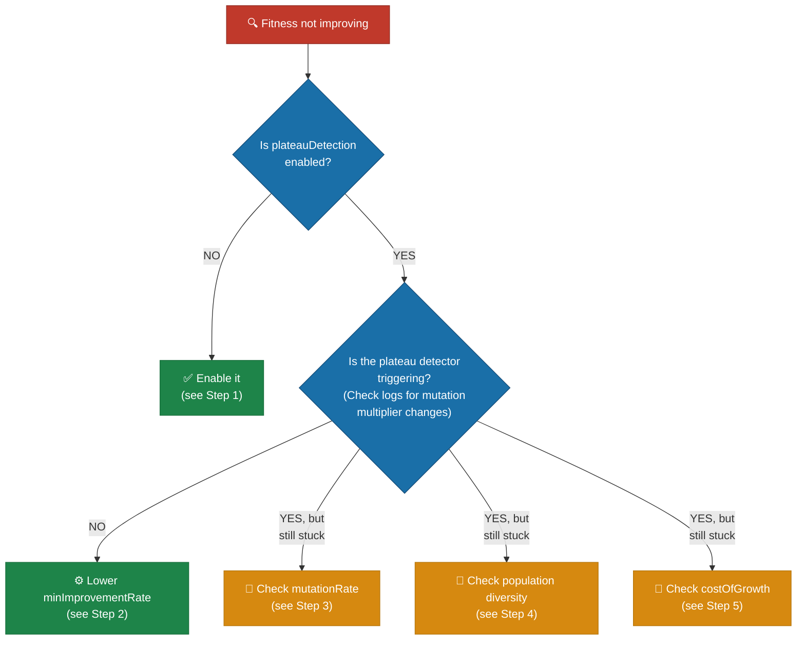
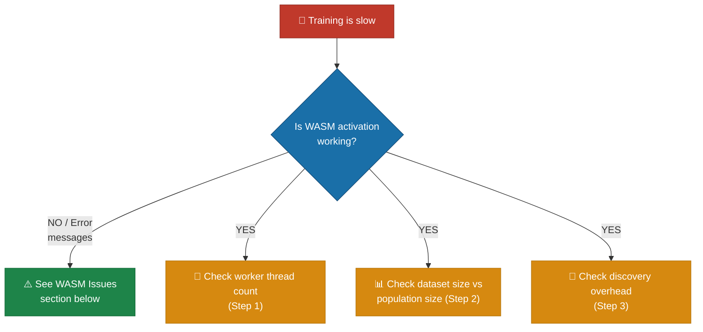
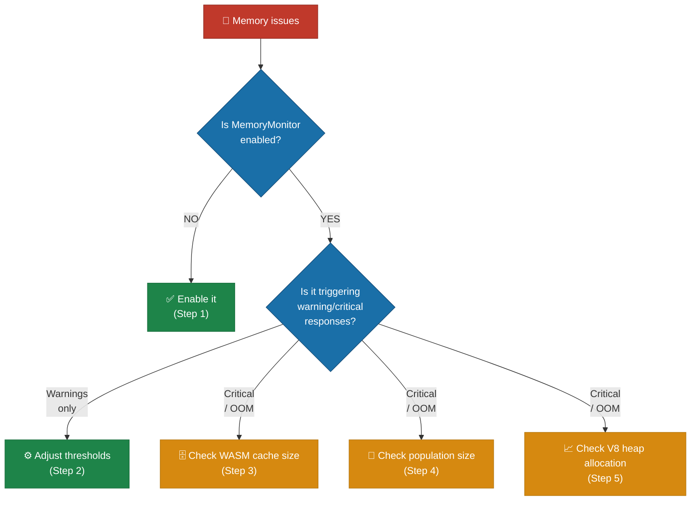
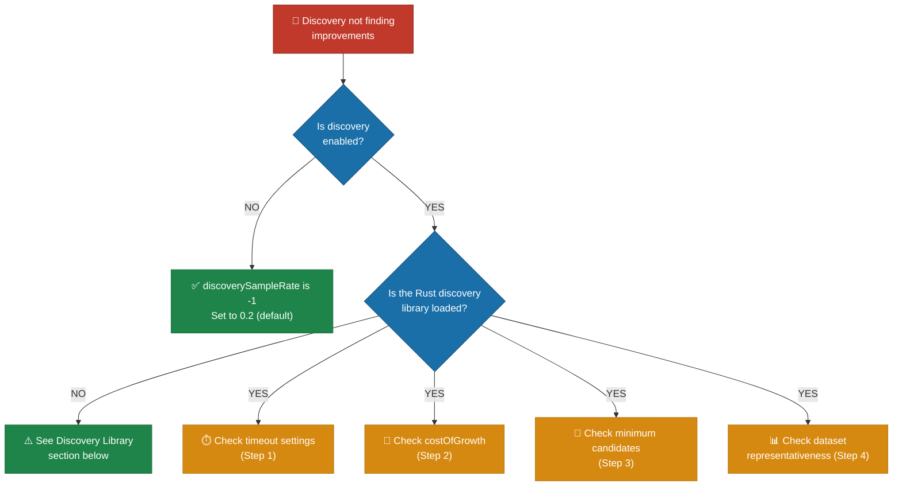
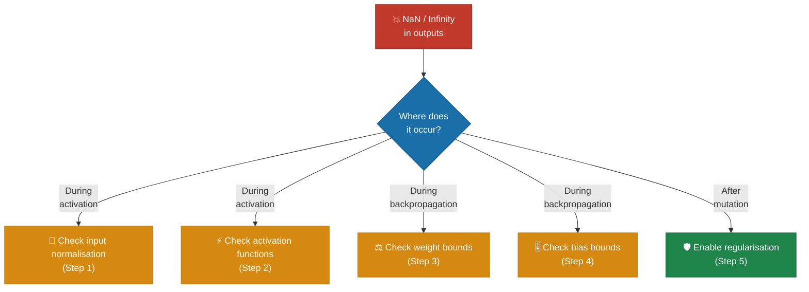

# 🐛 Troubleshooting Guide

This guide covers common issues encountered when using or contributing to
NEAT-AI. Each section describes the symptoms, likely causes, and solutions.

The first part of this guide provides **diagnostic decision trees** for common
training problems. Each tree walks you through a structured diagnosis: what to
check, how to check it, and what to change.

## Table of Contents

- [Diagnostic Decision Trees](#diagnostic-decision-trees)
  - [Fitness Plateau](#fitness-plateau)
  - [Training Is Slow](#training-is-slow)
  - [Memory Issues During Training](#memory-issues-during-training)
  - [Discovery Not Finding Improvements](#discovery-not-finding-improvements)
  - [Creatures Producing NaN or Infinity](#creatures-producing-nan-or-infinity)
- [WASM Issues](#wasm-issues)
- [Discovery Library](#discovery-library)
- [Memory Management](#memory-management)
- [CI Failures](#ci-failures)
- [Configuration](#configuration)
- [Data Fuzzing and Regularisation](#data-fuzzing-and-regularisation)
- [Hyperparameter Evolution](#hyperparameter-evolution)
- [ONNX Export Issues](#onnx-export-issues)

---

## 🔍 Diagnostic Decision Trees

These decision trees help you diagnose common training issues. Start at the top
of the relevant tree and follow the branches based on what you observe.

### 📉 Fitness Plateau

**Symptom:** Fitness stops improving — the best creature's error remains flat
across generations.



**Step 1 — Enable plateau detection:**

```typescript
const config = createNeatConfig({
  plateauDetection: {
    enabled: true,
    windowSize: 10, // Generations to consider
    minImprovementRate: 0.001, // Below this = plateau
    responseMutationMultiplier: 2.0, // Boost mutation on plateau
  },
});
```

The `PlateauDetector` tracks fitness over a sliding window and increases the
mutation rate when improvement stalls, helping the population escape local
optima.

**Step 2 — Adjust plateau sensitivity:**

If the detector is not triggering despite flat fitness, lower
`minImprovementRate`:

```typescript
plateauDetection: {
  enabled: true,
  minImprovementRate: 0.0001, // More sensitive (default: 0.001)
  windowSize: 15,              // Wider window to detect slow drifts
}
```

**Step 3 — Check mutation rate:**

A `mutationRate` that is too low prevents exploration. A rate that is too high
disrupts good solutions.

- **Too low** (< 0.1): Increase to `0.3` (default) or higher
- **Too high** (> 0.7): Reduce to `0.3`–`0.5`
- Consider enabling `stabilityAdaptation` to auto-tune per creature:

```typescript
stabilityAdaptation: {
  enabled: true,
  brittlenessThreshold: 0.3,
  brittleReductionFactor: 0.5,
  stableBoostFactor: 1.3,
}
```

**Step 4 — Check population diversity:**

Low diversity means the population has converged prematurely.

- **Increase `populationSize`**: Larger populations maintain more diversity (try
  `100`–`200` for production runs)
- **Enable ensemble diversity scoring:**

```typescript
ensembleDiversity: {
  enabled: true,
  diversityWeight: 0.15,
  protectDiverseLowPerformers: true,
}
```

- **Lower `geneticCompatibilityThreshold`** (default: `0.3`) to create more
  species and preserve niche exploration

**Step 5 — Check `costOfGrowth`:**

If `costOfGrowth` is too high, evolution avoids adding neurons and synapses,
limiting the network's capacity. Try reducing it:

```typescript
costOfGrowth: 0.00000001, // Lower than default 0.0000001
```

Set to `0` to remove the growth penalty entirely and let fitness alone drive
structural decisions.

> [!TIP]
> If you have already lowered `costOfGrowth` and enabled plateau detection but
> fitness is still flat, try combining both a lower
> `geneticCompatibilityThreshold` and a higher `populationSize` — premature
> convergence is the most common cause of stubborn plateaus.

---

### 🐢 Training Is Slow

**Symptom:** Each generation takes a long time, or evolution progresses too
slowly overall.



**Step 1 — Check worker threads:**

Verify how many threads are being used. By default, NEAT-AI uses
`navigator.hardwareConcurrency` (all available CPU cores).

```typescript
// Check effective thread count
const config = createNeatConfig({
  threads: 8, // Explicit thread count
  verbose: true, // Log thread allocation
});
```

If you have limited memory, the `workerThreadCap` can automatically reduce
threads:

```typescript
workerThreadCap: {
  maxMemoryMB: 8192,              // 8 GB memory budget
  estimatedMemoryPerWorkerMB: 2048, // 2 GB per worker (default)
}
// Effective threads = min(threads, floor(8192 / 2048)) = 4
```

Check logs for "thread count capped" warnings — this indicates your thread count
was reduced due to memory constraints.

**Step 2 — Check dataset size vs population size:**

Large datasets with large populations multiply compute per generation:

- **Reduce `trainingSampleRate`** to use a fraction of the dataset per
  generation (stochastic training):
  ```typescript
  trainingSampleRate: 0.5, // Use 50% of data each generation (default: 1)
  ```
- **Reduce `populationSize`** for prototyping — start with `10`–`30`
- **Reduce `trainPerGen`** to `0` if you want evolution-only (no
  backpropagation):
  ```typescript
  trainPerGen: 0, // Disable per-generation backpropagation
  ```

**Step 3 — Check discovery overhead:**

Discovery (structural analysis via Rust FFI) can be time-consuming. If you do
not need structural improvements:

```typescript
discoverySampleRate: -1, // Disable discovery entirely
```

If discovery is needed but slow, tune its time budgets:

```typescript
discoveryRecordTimeOutMinutes: 3,   // Reduce from default 5
discoveryAnalysisTimeoutMinutes: 5, // Reduce from default 10
```

> [!NOTE]
> WASM activation is mandatory in NEAT-AI and is the primary performance driver.
> If WASM is failing to initialise — even silently — training will appear
> extremely slow or may hang. Always confirm WASM is active before investigating
> other bottlenecks.

---

### 💾 Memory Issues During Training

**Symptom:** Out-of-memory errors, process killed (exit code 143/137), or
performance degrades over long runs.



**Step 1 — Enable `MemoryMonitor`:**

The `MemoryMonitor` proactively evicts caches before the heap fills up. It is
enabled by default but can be configured:

```typescript
memory: {
  enabled: true,
  warningThreshold: 0.70,   // Start cache eviction at 70% heap usage
  criticalThreshold: 0.85,  // Aggressive cleanup at 85% heap usage
}
```

At **warning level** (70%), the monitor halves the WASM activation cache and
evicts the oldest quarter of entries. At **critical level** (85%), it reduces
the cache to a single entry and clears the compilation cache.

**Step 2 — Adjust `MemoryMonitor` thresholds:**

If warnings trigger too frequently, your workload may need more headroom:

```typescript
memory: {
  warningThreshold: 0.60,   // Trigger earlier to prevent spikes
  criticalThreshold: 0.75,  // More aggressive critical threshold
}
```

**Step 3 — Check WASM cache size:**

The WASM activation cache stores compiled creature networks. Reduce the limit
for memory-constrained environments:

```typescript
import { setMaxCachedWasmCreatureActivations } from "neat-ai/wasm";
setMaxCachedWasmCreatureActivations(256); // Default: 512
```

**Step 4 — Check population size:**

Each creature consumes memory for its network structure, activation state, and
WASM compilation. Reduce `populationSize` if memory is tight:

```typescript
populationSize: 30, // Reduce from default 50
```

Also consider limiting network complexity:

```typescript
maxConns: 100,            // Limit connections
maximumNumberOfNodes: 30, // Limit neurons
```

**Step 5 — Check V8 heap allocation:**

Increase the V8 heap size for large workloads:

```bash
deno run --v8-flags=--max-old-space-size=8192 your_script.ts
```

Or reduce parallelism to lower peak memory:

```typescript
threads: 4, // Fewer concurrent workers
```

See the [Memory Management](#memory-management) section below for more details
on V8 heap configuration and OOM recovery.

---

### 🔬 Discovery Not Finding Improvements

**Symptom:** Discovery runs complete but no structural improvements are applied
to the population.



**Step 1 — Check timeout settings:**

Discovery has two phases — recording and analysis. If either times out too
early, the analysis may not produce useful candidates.

```typescript
discoveryRecordTimeOutMinutes: 10,  // More time for recording (default: 5)
discoveryAnalysisTimeoutMinutes: 20, // More time for analysis (default: 10)
discoverySampleRate: 0.3,            // Sample more data (default: 0.2)
```

Also check the replay timeout if caching is enabled:

```typescript
discoveryReplayTimeoutMinutes: 10,  // More time for replay (default: 5)
discoveryReplayMinTimeMinutes: 0.5, // Lower min-time threshold (default: 1)
```

**Step 2 — Check `costOfGrowth`:**

A high `costOfGrowth` penalises structural changes, meaning discovery candidates
that add neurons or synapses may be rejected because their complexity penalty
outweighs the fitness gain.

```typescript
costOfGrowth: 0.00000001, // Lower penalty (default: 0.0000001)
```

**Step 3 — Check minimum candidates per category:**

Ensure discovery produces enough candidates in each category:

```typescript
discoveryMinCandidatesPerCategory: {
  addNeurons: 2,      // Default: 1
  addSynapses: 2,     // Default: 1
  changeSquash: 2,    // Default: 1
  removeLowImpact: 5, // Default: 3
}
```

Increase `discoveryMaxNeurons` to analyse more neurons per iteration:

```typescript
discoveryMaxNeurons: 10, // Default: 6
```

**Step 4 — Check dataset representativeness:**

Discovery analyses error patterns in the training data. If the dataset is too
small, too noisy, or not representative of the problem domain:

- **Increase `discoverySampleRate`** to give the analyser more data:
  ```typescript
  discoverySampleRate: 0.5, // 50% of records (default: 0.2)
  ```
- **Increase `discoveryBatchSize`** for more observations per batch:
  ```typescript
  discoveryBatchSize: 256, // Default: 128
  ```
- Ensure your training dataset adequately covers the input space — discovery
  cannot find structural improvements if the data does not expose the weaknesses
  in the current network topology

---

### 💥 Creatures Producing NaN or Infinity

**Symptom:** Creature activations return `NaN` or `Infinity` values, or training
produces `NaN` errors.



**Step 1 — Check input normalisation:**

Extreme input values can cause numerical overflow in activation functions.
Ensure your inputs are normalised to a reasonable range (typically `[-1, 1]` or
`[0, 1]`).

Common mistakes:

- Raw pixel values (0–255) instead of normalised (0–1)
- Unscaled financial data (prices in thousands)
- Missing values represented as large numbers

**Step 2 — Check activation functions:**

Some activation functions are more susceptible to numerical issues:

- **`Exponential`**: Can produce `Infinity` for large positive inputs
- **`TAN`**: Unbounded; can produce very large values near asymptotes
- **`SQRT`**: Returns `NaN` for negative inputs (though NEAT-AI guards this)
- **`Cube`**: x³ grows rapidly for large inputs

Safer alternatives for hidden neurons include `LOGISTIC`, `TANH`, `ReLU`,
`LeakyReLU`, `Mish`, or `Swish`. These are bounded or grow linearly.

NEAT-AI's `ActivationRange` clamps outputs to prevent `Infinity` propagation,
but persistent `NaN` values indicate the root cause needs fixing.

**Step 3 — Check weight bounds:**

Weight regularisation is enabled by default and prevents extreme weight values:

```typescript
weightRegularisation: {
  enabled: true,             // Default: true
  maxAbsoluteWeight: 100,    // Maximum absolute weight (default: 100)
  maxWeightChange: 10,       // Maximum change per mutation (default: 10)
  preferSmallChanges: true,  // Bias towards smaller changes (default: true)
}
```

If you have disabled weight regularisation, re-enable it. If `NaN` persists with
regularisation enabled, lower the bounds:

```typescript
weightRegularisation: {
  maxAbsoluteWeight: 50,  // Tighter bound
  maxWeightChange: 5,     // Smaller mutations
}
```

**Step 4 — Check bias bounds:**

Bias regularisation mirrors weight regularisation:

```typescript
biasRegularisation: {
  enabled: true,           // Default: true
  maxAbsoluteBias: 100,    // Maximum absolute bias (default: 100)
  maxBiasChange: 10,       // Maximum change per mutation (default: 10)
  preferSmallChanges: true,
}
```

Lower `maxAbsoluteBias` and `maxBiasChange` if biases are causing exploding
activations:

```typescript
biasRegularisation: {
  maxAbsoluteBias: 50,
  maxBiasChange: 5,
}
```

**Step 5 — Enable regularisation and stability adaptation:**

If `NaN`/`Infinity` occurs after mutations, the stability adaptation system can
detect and reduce mutations for brittle creatures:

```typescript
stabilityAdaptation: {
  enabled: true,
  brittlenessThreshold: 0.3,      // Fraction of bad outcomes to trigger
  brittleReductionFactor: 0.5,    // Halve mutation rate for brittle creatures
  topologyMutationReductionForBrittle: 0.3, // Reduce structural mutations
}
```

Combined with weight and bias regularisation (both enabled by default), this
prevents the feedback loop where extreme values produce `NaN`, which then
corrupts further calculations.

> [!WARNING]
> If `NaN` values persist despite enabling all regularisation options, check
> whether your fitness function itself can produce `NaN` or `Infinity`. A
> fitness function that divides by zero or takes the logarithm of a non-positive
> number will corrupt the entire population silently.

---

## ⚙️ WASM Issues

WASM activation is **mandatory** in NEAT-AI. There is no JavaScript fallback.
The library initialises the WASM backend automatically; callers do not need to
call any init function or set environment variables.

### ⚠️ WASM module not found or failed to compile

**Symptoms:**

- `WASM activation: pkg not found at the canonical package location.`
- `WASM activation could not be loaded. Ensure the NEAT-AI package is installed
  correctly. WASM activation is required.`

**Causes:**

1. The `wasm_activation/pkg/` directory is missing or incomplete.
2. Network connectivity issues when loading from JSR (for `https://` URLs).
3. Insufficient Deno permissions.

**Solutions:**

- Verify the NEAT-AI package includes `wasm_activation/pkg/` with at least:
  - `wasm_activation.js`
  - `wasm_activation_bg.wasm`
- Ensure Deno has `--allow-read` (for local files) and `--allow-net` (for JSR).
- If building from source, run:
  ```bash
  cd wasm_activation && ./build.sh
  ```

### ⚠️ WASM module not initialised

**Symptoms:**

- `WASM module not initialised`

**Causes:**

- Calling activation methods before the WASM module has finished loading. This
  can happen in custom worker setups that bypass the standard initialisation.

**Solutions:**

- Use the standard `Creature.activate()` API which handles initialisation
  transparently.
- In custom worker setups, ensure `initWasmActivationSync()` is called with the
  correct JS bindings and WASM binary payload before activating creatures.

### 🧵 WASM in Deno Workers vs Main Thread

**Main thread:** WASM auto-initialises at module evaluation time. No action
required.

**NEAT-AI worker system:** The parent thread pre-loads the WASM payload and
sends it to workers during initialisation. Workers call
`initWasmActivationSync()` with the received payload.

**Independent Deno Workers:** If your Deno Worker imports NEAT-AI directly,
auto-initialisation runs at module load. Ensure the worker has `--allow-read`
and/or `--allow-net` permissions.

**Common worker issues:**

- `Worker WASM activation payload missing` — The parent thread did not send the
  WASM payload. Call `fetchWasmForWorkers()` before spawning workers.
- `Worker WASM activation init failed` — Synchronous init returned false. Check
  for re-entrancy issues or payload corruption.
- `Worker init timed out after Ns` — Increase the timeout by setting
  `NEAT_AI_WORKER_INIT_TIMEOUT_MS` (default: 60,000 ms, minimum: 1,000 ms).

### 💥 RuntimeError: unreachable

**Symptoms:**

- `RuntimeError: unreachable` during activation in long-running workloads.

**Cause:** WASM heap exhaustion from too many cached `CompiledNetwork` instances
(Issue #1338).

**Solutions:**

- The LRU cache automatically evicts old entries (default: 512 cached
  instances). Reduce the limit if memory is tight:
  ```typescript
  import { setMaxCachedWasmCreatureActivations } from "neat-ai/wasm";
  setMaxCachedWasmCreatureActivations(256);
  ```
- Reduce parallel creature count or population size.

---

## 🦀 Discovery Library

The [NEAT-AI-Discovery](https://github.com/stSoftwareAU/NEAT-AI-Discovery) Rust
FFI extension provides GPU-accelerated structural analysis. It is **optional** —
if unavailable, the discovery phase is skipped.

### 🔧 Building NEAT-AI-Discovery locally

```bash
# Clone into a sibling directory
git clone https://github.com/stSoftwareAU/NEAT-AI-Discovery.git ../NEAT-AI-Discovery
cd ../NEAT-AI-Discovery

# Build and install
cargo build --release
./scripts/runlib.sh
```

The build script installs the library to `~/.cargo/lib/`.

### 🔧 Setting NEAT_AI_DISCOVERY_LIB_PATH

If the library is not in a standard location, set the environment variable:

```bash
export NEAT_AI_DISCOVERY_LIB_PATH="/absolute/path/to/libneat_ai_discovery.dylib"
```

This can point to either the library file or a directory containing it.

**Resolution order** (the first match wins):

1. `NEAT_AI_DISCOVERY_LIB_PATH` environment variable
2. `~/.cargo/lib/`
3. `./target/release/`
4. `../NEAT-AI-Discovery/target/release/`

**Library names by platform:**

| Platform | Library Name                 |
| -------- | ---------------------------- |
| macOS    | `libneat_ai_discovery.dylib` |
| Linux    | `libneat_ai_discovery.so`    |
| Windows  | `libneat_ai_discovery.dll`   |

### ⚠️ Architecture mismatch errors (arm64 vs x86)

**Symptoms:**

- Segmentation fault ("Killed: 9") when loading the library.
- Library file exists but cannot be loaded.
- Silent initialisation failure.

**Diagnosis:**

```bash
# macOS: check architecture and dependencies
file ~/.cargo/lib/libneat_ai_discovery.dylib
otool -L ~/.cargo/lib/libneat_ai_discovery.dylib

# Linux: check architecture and dependencies
file /path/to/libneat_ai_discovery.so
ldd /path/to/libneat_ai_discovery.so
```

**Solutions:**

- Rebuild the library on the target machine:
  ```bash
  cd ../NEAT-AI-Discovery && cargo build --release
  ```
- Ensure `rustup` targets match your system architecture.
- Use the verification script:
  ```bash
  deno run --allow-ffi scripts/check_discovery_safe.ts
  ```

### 💡 NEAT_RUST_DISCOVERY_OPTIONAL for graceful degradation

In environments where discovery is not required (e.g. CI without GPU):

```bash
export NEAT_RUST_DISCOVERY_OPTIONAL=true
```

Values `"1"`, `"true"`, or `"yes"` (case-insensitive) cause discovery tests to
skip gracefully rather than fail.

> [!NOTE]
> Setting `NEAT_RUST_DISCOVERY_OPTIONAL=true` only affects test behaviour — it
> does not disable discovery at runtime. If you want to disable discovery during
> training, set `discoverySampleRate: -1` in your configuration instead.

### 🔐 FFI permission denied

**Symptom:** `FFI permission denied for discovery library`

**Solution:** Run with the `--allow-ffi` flag:

```bash
deno run --allow-ffi --allow-read --allow-env your_script.ts
```

### 🖥️ No GPU detected

**Symptom:** `Discovery disabled: Rust library loaded but GPU probe failed`

This is a **non-fatal** condition. The library loaded but no usable GPU was
found. Discovery simply will not run. On macOS, ensure Metal is available.

---

## 🧠 Memory Management

### 🔧 V8 heap size configuration

For large populations or long training runs, increase the V8 heap:

```bash
deno test --v8-flags=--max-old-space-size=8192 ...
```

The `quality.sh` script uses 8,192 MB (8 GB) by default.

### ⚠️ Test parallelism and memory pressure

Running tests with `--parallel` uses more memory. If you encounter OOM kills:

1. **Reduce heap allocation:**
   ```bash
   deno test --v8-flags=--max-old-space-size=4096 ...
   ```
2. **Disable parallelism:**
   ```bash
   deno test ...  # omit --parallel flag
   ```
3. **Use `--expose-gc`** for explicit garbage collection hints (used by
   `quality.sh`).

### 💀 Exit code 143 (SIGTERM / OOM kill)

**Symptoms:**

- `deno test exited with 143 (SIGTERM)`
- Test process killed by the operating system or container orchestrator.

**Cause:** Memory usage exceeded system limits. Common when running all 2,000+
tests in parallel with a large heap.

**Solutions:**

- Reduce `--max-old-space-size` to leave headroom for the OS.
- Run tests without `--parallel`.
- In CI, the `coverage.yaml` workflow automatically retries with 50% memory and
  no parallelism if the first attempt exits with code 143.

### 🔬 Memory leak detection tests

Issue #1505 added automated tests that verify WASM resources are properly
reclaimed throughout the activation lifecycle. These tests live in `test/wasm/`:

| Test File                  | What It Verifies                                                                                                                       |
| -------------------------- | -------------------------------------------------------------------------------------------------------------------------------------- |
| `WasmMemoryLifecycle.ts`   | `disposeWasm()` clears cached state; repeated activate/dispose cycles produce consistent output; LRU eviction respects capacity bounds |
| `WorkerMemoryIsolation.ts` | Workers activate and terminate cleanly; multiple spawn/terminate cycles succeed; worker disposal does not affect parent WASM state     |
| `FFICleanupLifecycle.ts`   | Repeated FFI calls with `free_discovery_result()` cleanup succeed; library close/reopen cycles work (requires Rust discovery library)  |

**Running the tests:**

```bash
# Run all memory lifecycle tests
deno test --allow-all test/wasm/WasmMemoryLifecycle.ts test/wasm/WorkerMemoryIsolation.ts

# Run FFI cleanup tests (requires discovery library)
deno test --allow-all test/wasm/FFICleanupLifecycle.ts
```

**Detecting regressions:** If a change removes `disposeWasm()` calls or breaks
the LRU eviction logic, these tests will fail because:

- Creatures will retain `cachedWasmActivation` after disposal
- The LRU cache count will exceed the configured maximum
- Evicted creatures will not have their WASM resources freed

### 📊 Discovery memory tuning

For discovery workloads, tune these options to control peak memory:

| Option                        | Default | Effect                             |
| ----------------------------- | ------- | ---------------------------------- |
| `discoveryRustFlushRecords`   | 4,096   | Samples buffered before Rust flush |
| `discoveryRustFlushBytes`     | ~50 MiB | Byte threshold before flush        |
| `discoveryDrainEveryNBatches` | 10      | Drain frequency for promise chains |

Lower values reduce peak memory at the cost of more I/O.

---

## 🔄 CI Failures

### 📋 Understanding coverage.yaml

The CI workflow (`coverage.yaml`) uses a two-stage strategy:

1. **First attempt:** Detects available CPU cores and memory, then allocates
   resources dynamically:
   - 8+ cores and 8+ GB RAM: 70% memory, parallel enabled
   - 4+ cores and 4+ GB RAM: 60% memory, parallel enabled
   - Under 4 cores or 4 GB: 50% memory, no parallelism

2. **Retry on SIGTERM:** If exit code 143 (OOM kill), retries with:
   - 50% of original memory allocation (minimum 512 MB)
   - Parallelism disabled
   - Minimum 1 GB floor

**Exit code meanings:**

| Exit Code | Meaning            | CI Action               |
| --------- | ------------------ | ----------------------- |
| 0         | All tests passed   | Proceed to coverage     |
| 1         | Test failures      | Report failure          |
| 143       | SIGTERM (OOM kill) | Retry with lower memory |
| Other     | Unexpected error   | Fail the job            |

### 🔧 quality.sh failures

The `quality.sh` script runs these steps in order:

1. `deno outdated --update --latest` — Update dependencies
2. `deno fmt` — Format code
3. `deno lint --fix` — Lint with auto-fix
4. Bash syntax check — Validates `.sh` files
5. Discovery library check — Validates Rust library availability
6. `deno check` — Type-check
7. `deno test` — Run all tests with leak detection

If discovery checks fail with exit codes 137 or 9 (segfault), the script
provides diagnostic guidance. See the
[Architecture mismatch](#architecture-mismatch-errors-arm64-vs-x86) section.

---

## ⚙️ Configuration

### ⚠️ Common invalid option combinations

#### Feedback loop without disabling random samples

```
Error: "Feedback Loop, Disable Random Samples must be set together"
```

When enabling `feedbackLoop: true`, you must also set
`disableRandomSamples: true`:

```typescript
createNeatConfig({
  feedbackLoop: true,
  disableRandomSamples: true, // Required when feedbackLoop is true
});
```

#### Adaptive mutation threshold ordering

```
Error: "Adaptive mutation large threshold must be greater than medium threshold"
```

The `large` threshold must exceed the `medium` threshold:

```typescript
createNeatConfig({
  adaptiveMutationThresholds: {
    medium: 6, // Must be less than large
    large: 12,
  },
});
```

#### Plateau detection rate ordering

```
Error: "Plateau detection rapidImprovementRate must be greater than
minImprovementRate"
```

The `rapidImprovementRate` must exceed `minImprovementRate`:

```typescript
createNeatConfig({
  plateauDetection: {
    minImprovementRate: 0.001, // Must be less
    rapidImprovementRate: 0.02, // Must be greater
  },
});
```

### 💡 Understanding ValidationError messages

NEAT-AI uses typed `ValidationError` exceptions with a `name` property
indicating the category:

| Error Name               | Meaning                                                                  |
| ------------------------ | ------------------------------------------------------------------------ |
| `NO_OUTWARD_CONNECTIONS` | A hidden or constant neuron has no outward connections                   |
| `NO_INWARD_CONNECTIONS`  | A hidden neuron has no inward connections                                |
| `IF_CONDITIONS`          | An IF neuron is missing required condition/positive/negative connections |
| `RECURSIVE_SYNAPSE`      | A backward connection in forward-only mode                               |
| `SELF_CONNECTION`        | A self-loop in forward-only mode                                         |
| `MEMETIC`                | Issues with memetic (learned weight) structures                          |
| `OTHER`                  | General validation errors                                                |

Example of catching and inspecting a validation error:

```typescript
try {
  creatureValidate(creature, { feedbackLoop: false });
} catch (error) {
  if (
    error instanceof ValidationError && error.reason === "RECURSIVE_SYNAPSE"
  ) {
    // Handle forward-only violation
  }
}
```

### 🔄 Forward-only vs recurrent mode constraints

**Forward-only** (default) rejects:

- **Self-connections** (neuron connected to itself). Checked when
  `forwardOnly: true` is passed to `creatureValidate()`.
- **Recursive synapses** (connection from a higher-indexed neuron to a
  lower-indexed one). Checked when `feedbackLoop: false`.

**Recurrent** mode (enabled with `feedbackLoop: true`) allows both self-loops
and backward connections, which is useful for time-series behaviours.

If you see unexpected `RECURSIVE_SYNAPSE` or `SELF_CONNECTION` errors, check
whether your creature topology matches the configured mode.

---

## 🎲 Data Fuzzing and Regularisation

### Noise injection does not seem to help

- **Check noise scale:** If `inputNoiseScale` is too small (e.g. `0.001`), the
  perturbations may not be meaningful enough to regularise. Try increasing to
  `0.02`–`0.05`.
- **Check noise scale is not too large:** If `inputNoiseScale` is above `0.1`,
  you may be injecting so much noise that the signal is overwhelmed. Start small
  and increase gradually.
- **Consider combining with cross-validation:** Noise injection works best when
  paired with `crossValidation` to get a more reliable estimate of
  generalisation performance.

### Training converges more slowly with fuzzing enabled

This is expected — noise injection deliberately makes the training task harder
to prevent memorisation. If convergence is unacceptably slow, reduce
`inputNoiseScale` or increase `iterations`/`timeoutMinutes`.

### Cross-validation increases training time significantly

Each generation evaluates creatures `k` times (once per fold). If training time
is a concern, reduce `folds` from the default of 5 to 3, or increase
`timeoutMinutes` to allow more time for the additional evaluations.

---

## 🧬 Hyperparameter Evolution

### Evolved hyperparameters cluster around extreme values

- **Check bounds:** If `minLearningRate` and `maxLearningRate` are too far
  apart, evolution may oscillate between extremes. Narrow the range.
- **Reduce mutation magnitude:** Lower `mutationStdDev` from `0.1` to `0.05` for
  more gradual adaptation.
- **Increase population size:** Hyperparameter evolution benefits from larger
  populations to maintain diversity in the hyperparameter gene pool.

---

## 📤 ONNX Export Issues

### `checkOnnxCompatibility` reports unsupported squashes

The ONNX format does not support NEAT-AI's aggregate functions (IF, MINIMUM,
MAXIMUM) or deprecated functions (HYPOT, HYPOTv2, MEAN). If your creature uses
these, consider:

- Running **Intelligent Design** with restricted squash lists that exclude
  unsupported functions
- Retraining with `activations` limited to ONNX-compatible functions (e.g. TANH,
  SIGMOID, RELU, LOGISTIC)

### Exported ONNX model produces different outputs

Small floating-point differences (< 1e-10) are expected due to different
computation order and precision between the WASM-based activation in NEAT-AI and
standard ONNX runtimes. If differences are larger, check for recurrent
connections — ONNX export does not support feedback loops.

---

## 🌐 Environment Variables Reference

| Variable                          | Default  | Purpose                                             |
| --------------------------------- | -------- | --------------------------------------------------- |
| `NEAT_AI_DISCOVERY_LIB_PATH`      | _(none)_ | Override discovery library location                 |
| `NEAT_RUST_DISCOVERY_OPTIONAL`    | `false`  | Skip discovery tests gracefully when library absent |
| `NEAT_AI_WORKER_INIT_TIMEOUT_MS`  | `60000`  | Worker initialisation timeout (ms)                  |
| `NEAT_AI_DISCOVERY_VERBOSE`       | _(none)_ | Enable verbose discovery logging in workers         |
| `NEAT_AI_DISCOVERY_DETERMINISTIC` | _(none)_ | Force deterministic discovery (testing)             |

---

## 🆘 Getting Help

If your issue is not covered here:

1. Search [open issues](https://github.com/stSoftwareAU/NEAT-AI/issues) for
   similar problems.
2. Open a new issue with reproduction steps and error output.
3. For development questions, see [AGENTS.md](../AGENTS.md) for coding
   conventions and architecture details.
