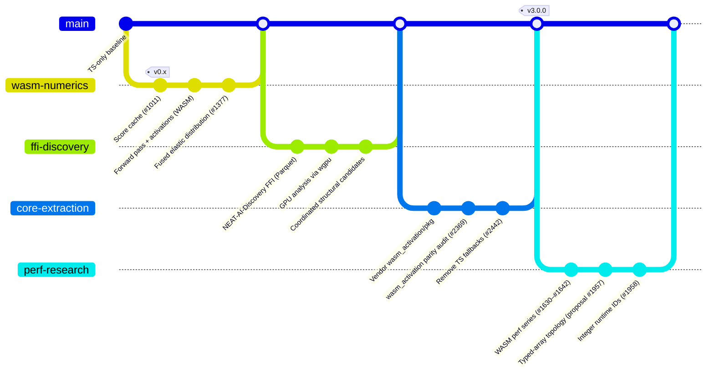

# TypeScript ↔ Rust Migration

> **Summary** — Tracks which subsystems live in TypeScript versus Rust /
> WebAssembly (WASM) today, why each move was made, and what is still on the
> roadmap. Companion docs in this cluster:
> [DISCOVERY_GUIDE.md](DISCOVERY_GUIDE.md) (user intro),
> [DISCOVERY_ARCHITECTURE.md](DISCOVERY_ARCHITECTURE.md) (deep dive — TS ↔ Rust
> Foreign Function Interface (FFI) flow), [DISCOVERY_DIR.md](DISCOVERY_DIR.md)
> (on-disk cache layout), [GPU_ACCELERATION.md](GPU_ACCELERATION.md) (wgpu
> backend selection), and the [`docs/README.md`](README.md) topic index.
>
> The external core dependency cluster
> ([CORE_DEPENDENCY_POLICY.md](CORE_DEPENDENCY_POLICY.md),
> [EXTERNAL_NEAT_AI_CORE.md](EXTERNAL_NEAT_AI_CORE.md)) governs how vendored
> Rust artefacts cross into this repository.

## 📖 Overview

NEAT-AI began as a single TypeScript runtime. Over the past two years the
numerically heavy paths have moved into Rust — compiled either to WASM
(in-process) or to a native shared library reached via Deno FFI (the Rust
**Discovery** extension). This document is the migration ledger: what moved,
when, and which Pull Request (PR) carried it across.

The work is informed by the WASM performance research series (#1630–#1633,
#1639, #1642), which established that:

1. **Tight numerical loops** are the prime migration targets — and most are
   already across.
2. **Graph-structure operations** cannot be moved blindly because the
   serialisation wall (converting `Map<string, Neuron>` to flat arrays) can
   consume more time than the operation it accelerates.
3. **Architectural changes** — typed-array topology, integer runtime IDs — are
   prerequisites for the next migration tranche.

## 🦀 Where things live today (May 2026)

| Subsystem                             | Lives in             | Reason / evidence                                                |
| ------------------------------------- | -------------------- | ---------------------------------------------------------------- |
| Activation functions (squashes)       | Rust → WASM          | Vendored from NEAT-AI-core; see audit #2369                      |
| Forward pass (accumulate)             | Rust → WASM          | Numerically heavy inner loop                                     |
| Topological backprop loop             | Rust → WASM only     | TS fallback removed in #2442                                     |
| Elastic error distribution            | Rust → WASM only     | Migrated #1377 (#1519/#1526); TS fallback removed in #2442       |
| Predictive coding (inference + learn) | Rust → WASM          | `wasm_activation/src/pc_inference.rs`, `pc_learning.rs`          |
| Score computation                     | Rust → WASM          | Cache-aware incremental scorer (#1011/#1078)                     |
| Training state                        | Rust → WASM          | `wasm_activation/src/training_state.rs`                          |
| Topology validation, cycle detection  | Rust → WASM          | Core-owned operation per `AGENTS.md` §"No TS fallbacks"          |
| Discovery recording (Parquet)         | Rust extension (FFI) | `recordDiscovery()` writes Parquet via Rust                      |
| Discovery analysis (GPU/CPU)          | Rust extension (FFI) | `analyzeParallel()` — wgpu (Metal/Vulkan/DX12) with CPU fallback |
| Discovery focus ranking               | Rust extension (FFI) | `rankFocusNeurons()`                                             |
| NEAT loop / breeding / mutation       | TypeScript           | Orchestration; non-numerical                                     |
| Cache-dominated paths (LRU)           | TypeScript           | Already faster than any WASM path (66 ns/hit)                    |
| Graph surgery (compact, prune)        | TypeScript           | Map/Set work that V8 handles efficiently                         |
| Discovery candidate filtering         | TypeScript           | Slot allocation, weighted sampling, cache lookups                |

> [!IMPORTANT]
> **No TS fallbacks for core-owned operations.** Once an operation moves into
> NEAT-AI-core (topology validation, reverse topological order, structural
> integrity, cycle detection, the topological backprop loop, elastic weight
> distribution), the TypeScript side does not keep a parallel implementation —
> it calls through `src/wasm/` or `src/propagate/` instead. See
> [`AGENTS.md`](../AGENTS.md) §"NEAT-AI-core Dependency Policy".

## 🌐 Wire-format invariant: UUID-only across boundaries

Any payload that crosses a process, machine, disk, cache, or FFI boundary must
identify neurons by **Universally Unique Identifier (UUID)** strings only.
Numeric runtime `id` values are ephemeral and must never appear in:

- `creature.exportJSON()` output
- Discovery cache entries (success or failure)
- Parquet recording files
- Anything sent to the Rust Discovery extension over FFI

Numeric IDs are reconstructed at the last internal application step. This is
enforced by `loadFrom` (UUID-first resolution, integer fallback only for
internal round-trips) and by the wire-key utilities in `src/architecture/`. See
[`AGENTS.md`](../AGENTS.md) §"Neuron UUID stability".

## 🛤️ Migration timeline

### Evidence — selected migration PRs

| Move                                                  | PR / Issue    |
| ----------------------------------------------------- | ------------- |
| Cache score components incrementally                  | #1011 (#1078) |
| Fused backward-pass error distribution in WASM        | #1377 (#1382) |
| WASM overhead research for backpropagation            | #1375 (#1380) |
| Migrate elastic error distribution to Rust            | #1519 (#1526) |
| WASM performance research series (parent)             | #1639         |
| WASM-resident topology investigation                  | #1642         |
| `wasm_activation/` parity audit vs external core      | #2369 (#2374) |
| Publish core migration verification sign-off          | #2371 (#2376) |
| **Remove TS fallbacks** for topological backprop      | #2442         |
| **Remove TS fallbacks** for elastic distribution      | #2442         |
| Tighten Rust FFI per-chunk deadline                   | #2501 (#2506) |
| Engram-inspired subnetwork hash index for disc. cache | #2531 (#2551) |

## 🚧 Migration roadmap

### Phase 1: Foundation (prerequisite)

These changes restructure the TypeScript-side data representation so that future
WASM migration becomes a `memcpy` rather than field-by-field marshalling.

1. **Typed-array topology** (#1957) — Replace JavaScript object topology with
   typed arrays (`Float64Array`, `Uint32Array`, `Uint8Array`). Estimated effort:
   2–3 weeks.
2. **Integer runtime neuron IDs** (#1958) — Replace UUID strings with integer
   identifiers **inside the runtime only**. UUIDs remain the canonical wire
   format; integer IDs are the internal accelerator. Eliminates the UUID→index
   mapping overhead that dominates serialisation cost.

### Phase 2: Selective migration

With typed-array topology in place, specific operations become viable WASM
candidates:

3. **Selective WASM residency** (#1959) — Migrate read-heavy topology operations
   (validation, connection scanning, dependency analysis) to Rust → WASM.
4. **Batch Application Programming Interface (API) design** (#1960) — Group
   multiple operations into single WASM calls to amortise the boundary-crossing
   overhead (~100–500 ns per call).
5. **Topology validation in Rust** (#1961) — Migrate forward-only checks, cycle
   detection, and structural integrity validation. Once moved, the TypeScript
   side calls through `src/wasm/` only.

## 🛑 What should NOT be migrated

The performance research established that these categories are unsuitable:

- **Orchestration code** (NEAT loop, breeding selection, mutation scheduling) —
  non-numerical; TypeScript is appropriate.
- **Cache-dominated paths** (compatibility scoring at 66 ns per Least Recently
  Used (LRU) hit) — already faster than any WASM path.
- **Trivially fast operations** (under 2 µs in TypeScript) — WASM
  boundary-crossing overhead alone is a significant fraction of the total.
- **Graph surgery** (compaction, pruning, neuron merging) — dominated by Map/Set
  operations that V8 handles efficiently.

## 📚 See also

- [`docs/README.md`](README.md) — topic index for all NEAT-AI docs.
- [DISCOVERY_ARCHITECTURE.md](DISCOVERY_ARCHITECTURE.md) — TS ↔ Rust FFI flow
  diagram, two-phase pipeline, cache layer.
- [DISCOVERY_DIR.md](DISCOVERY_DIR.md) — on-disk cache directory layout.
- [GPU_ACCELERATION.md](GPU_ACCELERATION.md) — `wgpu` backend selection and CPU
  fallback.
- [CORE_DEPENDENCY_POLICY.md](CORE_DEPENDENCY_POLICY.md) — pinning policy for
  the external [NEAT-AI-core](https://github.com/stSoftwareAU/NEAT-AI-core).
- [EXTERNAL_NEAT_AI_CORE.md](EXTERNAL_NEAT_AI_CORE.md) — day-to-day workflow for
  bumping the pinned revision and refreshing `wasm_activation/pkg`.
- [PERFORMANCE_RESEARCH.md](PERFORMANCE_RESEARCH.md) — WASM migration learnings.
- [PERFORMANCE_TUNING.md](PERFORMANCE_TUNING.md) — operational tuning guide.
- #1639 — Parent tracking issue for the WASM performance series.
- #1642 — WASM-resident topology investigation.
