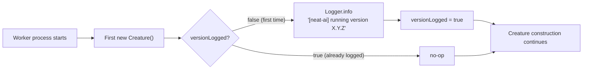

# Runtime version visibility

Issue #2682 — every NEAT-AI worker must surface the `@stsoftware/neat-ai`
version it actually loaded, once per process, at startup.

## Why

Two pieces of context made this necessary:

- The GRQ-logs / Develop trap-sample storm in May 2026 was eventually traced
  back to GRQ (a downstream NEAT-AI consumer) workers pinned to `5.0.13`. That
  [JavaScript Registry (JSR)](https://jsr.io/) release predates the
  position-blind topology-hash collision fix from Pull Request (PR) #2678, which
  only landed in `5.0.14`+.
- The only way to discover the running version at the time was to read it out of
  a captured stack trace
  (`https://jsr.io/@stsoftware/neat-ai/5.0.13/src/architecture/Offspring.ts:688`).
  That is a poor experience for incident response and a worse one for the
  routine "is my deploy actually running the fix?" question.

Every worker now emits a single line at startup so the running version is
unambiguous from the first log line of any run:

```
[neat-ai] running version 5.0.14            # published JSR build
[neat-ai] running version 5.0.27 (local)    # local file:// dev/test load
```

## Convention

- Each worker process logs the line **exactly once**, regardless of how many
  Creatures it constructs or how many entry points it touches.
- The line goes through the project Logger
  ([`src/utils/Logger.ts`](../src/utils/Logger.ts)) at `info` severity. Hosts
  that inject a custom logger via `NeatOptions.logger` or `setLogger()` see the
  line through their own sink.
- The prefix is fixed: `[neat-ai] running version X.Y.Z`. Tools that grep log
  streams for fleet-wide version audits depend on the prefix. A trailing
  `(local)` suffix marks dev/test runs so they are not counted as JSR
  deployments.

## Implementation

- [`src/utils/Version.ts`](../src/utils/Version.ts) owns the convention.
  - `getNeatAiVersion()` returns the running version. When the module is loaded
    from JSR (`https://jsr.io/@stsoftware/neat-ai/<X.Y.Z>/...`) the version is
    parsed from `import.meta.url` — no filesystem I/O. For local `file://` loads
    during development the version is read once from `deno.json` at module load
    (Issue #2720); `deno.json` is the single source of truth.
  - `logNeatAiVersionOnce()` is the idempotent emit. A module-level boolean
    guards subsequent calls. The local load path appends a `(local)` suffix so
    dev/test log lines are distinguishable from JSR builds.
- The `Creature` constructor ([`src/Creature.ts`](../src/Creature.ts)) calls
  `logNeatAiVersionOnce()` as its first statement, so any worker that constructs
  a Creature (i.e. every production worker) gets the log for free.



## Adding a new worker / entry point

If you write a new worker entry point that does **not** construct a Creature on
the hot path, call `logNeatAiVersionOnce()` from `@utils/Version.ts` at the top
of your bootstrap. The idempotent flag ensures duplicate calls from sibling
entry points stay quiet.

## Fleet rollout

When `deno.json` `version` is bumped (typically by `bump-deps.sh` or the
`update-package-version.yml` workflow), no extra change is needed in
`src/utils/Version.ts` — `deno.json` is the single source of truth on the local
load path, and JSR consumers derive the version from `import.meta.url` after
publish. Downstream consumers (GRQ and sibling repos) need to refresh their
`@stsoftware/neat-ai` pin to the new JSR version so they pick up the fix; verify
the line in their logs after the restart.

## Related documents

- [docs/README.md](README.md) — full documentation index.
- [docs/CORE_DEPENDENCY_POLICY.md](CORE_DEPENDENCY_POLICY.md) — how the pinned
  NEAT-AI-core revision (and the `@stsoftware/neat-ai` version) is bumped.
- [docs/EXTERNAL_NEAT_AI_CORE.md](EXTERNAL_NEAT_AI_CORE.md) — cluster overview
  for the NEAT-AI-core dependency.

---

**Up to:** [`README.md`](../README.md) (entry point) ·
[`docs/README.md`](README.md) (topic index).
