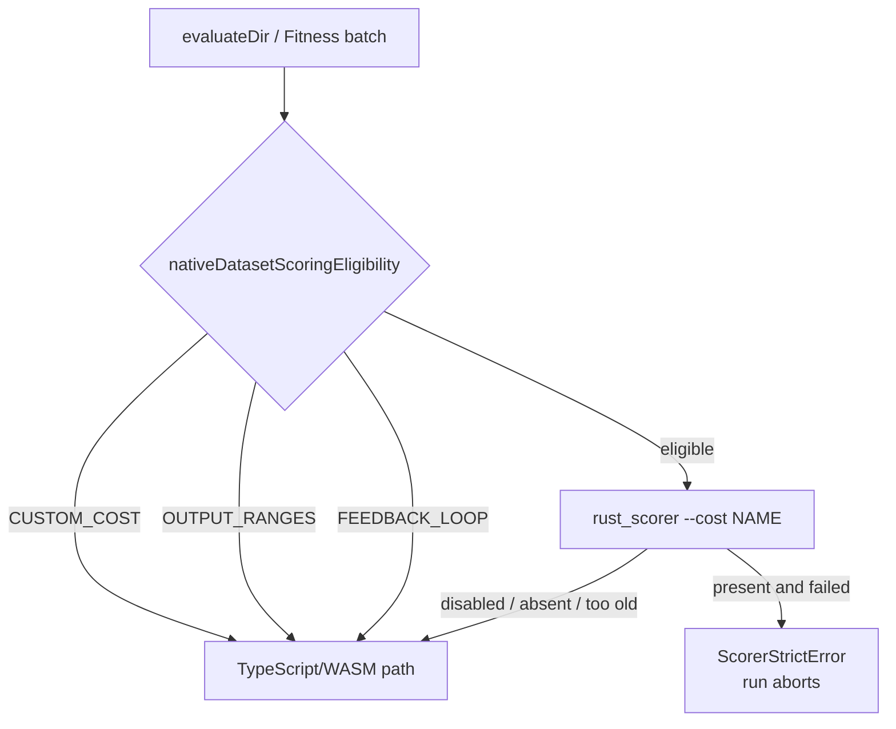
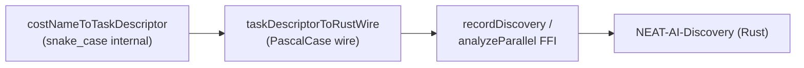

# 💰 Costs and Activations

Cost (fitness) functions and the activation function (squash) menu used by NEAT
(NeuroEvolution of Augmenting Topologies) creatures.

> **Acronyms:** API (Application Programming Interface), MSE (Mean Squared
> Error), RMSE (Root Mean Squared Error), MAE (Mean Absolute Error), MAPE (Mean
> Absolute Percentage Error), MSLE (Mean Squared Logarithmic Error), SVM
> (Support Vector Machine), ReLU (Rectified Linear Unit), GELU (Gaussian Error
> Linear Unit), SELU (Scaled Exponential Linear Unit), ELU (Exponential Linear
> Unit), WASM (WebAssembly).

## 📦 Exports documented here

- `Costs`, `CostInterface`
- Cost → task descriptor: `costNameToTaskDescriptor`, `OTHER_COST_NAME`,
  `OTHER_TASK_DESCRIPTOR`, `TaskDescriptor`, `CostRange`, `CostTopology`,
  `DescriptorCostName`, `OutputSquashFamily`
- Activation function names (referenced in `NeuronExport.squash` and CRISPR DNA)

## 💰 Cost Functions

Cost functions measure the error between predicted and expected outputs.

```typescript
import { Costs } from "@stsoftware/neat-ai";
import type { CostInterface } from "@stsoftware/neat-ai";
```

### 📋 Built-in cost functions

| Name              | Class                          | Best For                     | Formula                                 |
| ----------------- | ------------------------------ | ---------------------------- | --------------------------------------- |
| `"MSE"`           | Mean Squared Error             | General regression (default) | `(1/n) * Sum((y - y')^2)`               |
| `"RMSE"`          | Root Mean Squared Error        | Regression, error in units   | `sqrt((1/n) * Sum((y - y')^2))`         |
| `"MAE"`           | Mean Absolute Error            | Regression with outliers     | `(1/n) * Sum(\|y - y'\|)`               |
| `"MAPE"`          | Mean Absolute Percentage Error | Forecasting, relative error  | `(1/n) * Sum(\|(y' - y) / y\|)`         |
| `"MSLE"`          | Mean Squared Logarithmic Error | Wide value ranges            | `(1/n) * Sum((log(y) - log(y'))^2)`     |
| `"CROSS_ENTROPY"` | Cross Entropy                  | Classification               | `-Sum(y * log(y') + (1-y) * log(1-y'))` |
| `"HINGE"`         | Hinge Loss                     | SVM / binary classification  | `max(0, 1 - y * y')`                    |

These seven names make up the `BUILT_IN_COST_NAMES` tuple in
[`src/Costs.ts`](../../src/Costs.ts), which backs the `costName` option. The
tuple is internal — it is not re-exported from `mod.ts`, so pass the name as a
string literal (e.g. `costName: "RMSE"`).

`RMSE` is the square root of `MSE`. It ranks creatures in exactly the same order
as `MSE` but reports the error in the target's own units, and it mirrors the
Rust scorer's `CostKind` list (NEAT-AI-scorer#340).

> [!IMPORTANT]
> **`RMSE` is aggregated once, over the whole dataset** — `sqrt(mean(e))`, not
> `mean(sqrt(e))` (Issue #3853). Unlike every other built-in cost it cannot be
> accumulated per record: scoring accumulates MSE's squared-error sum and takes
> the root at finalisation, on both the TypeScript and the `rust_scorer` path.
> `src/costs/CostAggregation.ts` owns that decision for the TypeScript side and
> mirrors the scorer's `CostKind::finalise_mean`. A custom cost that is a
> non-linear function of a mean has the same problem — implement it so that
> `calculate` is the per-record value that averages correctly.

### 🦀 Native scorer off-load (`--cost`)

When the optional `rust_scorer` binary is enabled
(`NEAT_AI_RUST_SCORER_ENABLED`), NEAT-AI passes the configured `costName` to the
binary via `--cost <NAME>`. **All seven `BUILT_IN_COST_NAMES` values are
eligible for native off-load** once the scorer release containing
[NEAT-AI-scorer#134](https://github.com/stSoftwareAU/NEAT-AI-scorer/issues/134)
is deployed.

- If the probed binary does not advertise `--cost`, a non-`MSE` cost falls back
  to WASM scoring (MSE is the binary's historical default and stays compatible
  without the flag).
- Custom (user-registered) costs are never off-loaded — they stay on the TS/WASM
  path because the binary cannot resolve them. This now holds on the batch
  (once-per-generation) path too: `costName` keeps its `"MSE"` default when a
  `customCost` module is configured (Issue #3776), so `Fitness` is told about
  the custom cost explicitly rather than inferring it from the name (Issue
  #3854).

#### When the TypeScript path keeps a dataset score (Issue #3854)

One predicate —
[`nativeDatasetScoringEligibility`](../../src/score/NativeDatasetScoringEligibility.ts)
— owns the whole decision, and both call sites (`evaluateDir` and the `Fitness`
batch partition) ask it rather than re-deriving the rule. It refuses to off-load
whenever the native engine cannot reproduce the semantics the call was asked
for:

| Refusal         | Trigger                                        | Why the native engine cannot serve it                        |
| --------------- | ---------------------------------------------- | ------------------------------------------------------------ |
| `CUSTOM_COST`   | user-registered cost, or a `customCost` module | `rust_scorer` cannot resolve a JavaScript `CostInterface`    |
| `OUTPUT_RANGES` | `outputRanges` configured                      | the out-of-range penalty (Issue #1620) has no native concept |
| `FEEDBACK_LOOP` | recurrent creature scored with `feedbackLoop`  | the native recurrent path resets state per record            |

Before this gate the last two delegated anyway and returned a number computed
under different rules — the range penalty was dropped entirely, and a recurrent
creature with `feedbackLoop: true` was scored as if it were `false`.



> [!IMPORTANT]
> **A refusal routes here; a failure does not** (Issue #3871). The
> TypeScript/WASM path serves requests the native engine was never asked to take
> — a refusal above, or a scorer that is disabled, absent, or too old. A
> `rust_scorer` that _was_ asked and failed throws instead: re-scoring on the
> other engine would hand back a number computed under different rules, which is
> what Issue #3810 exposed. `CUSTOM_COST` is a **permanent** refusal (decision 2
> of Issue #3863), so this path is demoted, never deleted.

`test/score/RustScorerDatasetParity.ts` runs the real binary and the TypeScript
path over the same dataset for every built-in cost and both topology styles, and
asserts they agree. It is skipped when no binary can be resolved; `quality.sh`
resolves one for the default run.

The same file also compares the `score` field `rust_scorer` returns — which
`Fitness` discards in favour of recomputing with `Score.ts` — against
`Score.ts`'s `calculate` over the scorer's own error (Issue #3867). Given the
same error and the same growth cost the two formulae agree **bit-for-bit**, so
the only thing separating `record.score` from `creature.score` is the growth
cost: `rust_scorer` hardcodes it at `DEFAULT_COST_OF_GROWTH` and offers no flag,
while `Fitness` passes whatever the run configured. Both facts are pinned as
assertions, so a formula move on either side fails the lane.

### 📐 CostInterface

Custom cost functions implement this interface:

```typescript
interface CostInterface {
  getName(): string;
  calculate(target: Float32Array, output: Float32Array): number;
}
```

### 🗂️ Costs registry

```typescript
// Find a cost function by name
const mse = Costs.find("MSE");
const error = mse.calculate(target, output);

// List all available costs
const names: string[] = Costs.getAvailableCosts();

// Register a custom cost function
Costs.registerCustomCost(myCustomCost);

// Register a factory (creates new instances on demand)
Costs.registerCostFactory("MY_COST", () => new MyCost());
```

### 🧭 Cost → task descriptor

`costNameToTaskDescriptor(costName)` maps a configured cost name to the
structural `TaskDescriptor` sent to Discovery. Built-in costs map to their
canonical descriptor; custom (user-registered) costs collapse to the `OTHER`
sentinel without leaking their real name.

```typescript
import {
  costNameToTaskDescriptor,
  OTHER_COST_NAME,
  OTHER_TASK_DESCRIPTOR,
} from "@stsoftware/neat-ai";
import type {
  CostRange,
  CostTopology,
  DescriptorCostName,
  OutputSquashFamily,
  TaskDescriptor,
} from "@stsoftware/neat-ai";

const descriptor = costNameToTaskDescriptor("MSE");
const custom = costNameToTaskDescriptor("MY_COST"); // === OTHER_TASK_DESCRIPTOR
```

```typescript
interface TaskDescriptor {
  readonly costName: DescriptorCostName;
  readonly topology: CostTopology;
  readonly range: CostRange;
  readonly outputSquashFamily: OutputSquashFamily;
}
```

| Type                 | Values                                                                          |
| -------------------- | ------------------------------------------------------------------------------- |
| `CostRange`          | `"unbounded" \| "positive" \| "unit" \| "signed_unit"`                          |
| `CostTopology`       | `"independent" \| "simplex" \| "margin" \| "one_hot" \| "unknown"`              |
| `OutputSquashFamily` | `"unbounded" \| "positive" \| "bounded_unipolar" \| "bounded_bipolar" \| "any"` |
| `DescriptorCostName` | a built-in cost name, `"BINARY_CROSS_ENTROPY"`, or `"OTHER"`                    |

`OTHER_COST_NAME` is `"OTHER"`; `OTHER_TASK_DESCRIPTOR` is the fully-`unknown`
descriptor returned for any unrecognised cost.

#### FFI wire shape (Issue #3012)

The `TaskDescriptor` above uses snake_case **internal** names. NEAT-AI-Discovery
(the Rust consumer) deserialises a different, PascalCase shape, so every
descriptor crossing the FFI boundary is mapped through
`taskDescriptorToRustWire(descriptor, numOutputs)` first. Forwarding the
internal shape unchanged makes Rust fail with `unknown variant 'unbounded'`.

```typescript
interface RustWireTaskDescriptor {
  readonly targetTopology: RustWireTopology; // "Independent" | "Simplex" | …
  readonly targetRange: RustWireRange; // "Unbounded" | "Positive" | …
  readonly outputSquashFamily: RustWireSquashFamily; // "BoundedUnipolar" | …
  readonly numOutputs: number; // from the creature export
}
```

| Internal field       | Wire field           | Example mapping                        |
| -------------------- | -------------------- | -------------------------------------- |
| `topology`           | `targetTopology`     | `independent` → `Independent`          |
| `range`              | `targetRange`        | `signed_unit` → `SignedUnit`           |
| `outputSquashFamily` | `outputSquashFamily` | `bounded_unipolar` → `BoundedUnipolar` |
| _(none)_             | `numOutputs`         | output neuron count                    |
| `costName`           | _(dropped)_          | never sent on the wire                 |



---

## ⚡ Activation Functions

NEAT-AI provides 39 activation functions (called "squash" functions). The
library uses WASM (WebAssembly) for all activation computation.

```typescript
// Activations are referenced by name in neuron definitions.
// The library handles activation internally via WASM.
```

### 📊 Summary table

The **weight** column is each activation's `mutationProbability`, the value it
declares in `src/methods/activations/types/` (or `aggregate/`). `Activations`
pushes one pool entry per unit of weight, so an activation is picked by random
mutation in proportion to its weight, and weight `0` means it is never picked.
The weights below are the shipped values — treat the source files as
authoritative if they ever diverge.

> [!TIP]
> When in doubt, **LeakyReLU** (weight 36, the heaviest) is the default choice
> and works well for most general-purpose networks. For deeper architectures,
> consider **Swish** (35) or **GELU** (34).

| Activation          | Weight | Range          | Best For                                  |
| ------------------- | :----: | -------------- | ----------------------------------------- |
| **LeakyReLU**       |   36   | (-Inf, +Inf)   | General purpose, default choice           |
| **Swish**           |   35   | ~(-0.28, +Inf) | Deep networks, smooth non-linearity       |
| **GELU**            |   34   | ~(-0.17, +Inf) | Deep networks, transformer-style          |
| **ELU**             |   33   | (-1, +Inf)     | Regression, avoids dead neurons           |
| **SELU**            |   32   | ~(-1.76, +Inf) | Self-normalising networks                 |
| **Mish**            |   31   | ~(-0.31, +Inf) | Deep networks, stable gradients           |
| **TANH**            |   30   | (-1, 1)        | Bounded output, recurrent networks        |
| **LOGISTIC**        |   25   | (0, 1)         | Binary classification, probability output |
| **Softplus**        |   24   | (0, +Inf)      | Smooth approximation to ReLU              |
| **ArcTan**          |   23   | (-pi/2, pi/2)  | Smooth, always nonzero slope              |
| **SOFTSIGN**        |   22   | (-1, 1)        | Soft alternative to TANH                  |
| **HARD_TANH**       |   21   | [-1, 1]        | Fast bounded output                       |
| **BENT_IDENTITY**   |   20   | (-Inf, +Inf)   | Always smooth, no dead zones              |
| **SINE**            |   16   | [-1, 1]        | Periodic patterns                         |
| **Cosine**          |   15   | [-1, 1]        | Periodic patterns                         |
| **ABSOLUTE**        |   14   | [0, +Inf)      | Magnitude detection                       |
| **Cube**            |   13   | (-Inf, +Inf)   | Non-linear, fast                          |
| **ISRU**            |   12   | (-1, 1)        | Smooth, fades in tails                    |
| **LogSigmoid**      |   11   | (-Inf, 0)      | Negative log-probability                  |
| **GAUSSIAN**        |   10   | (0, 1]         | Radial basis patterns                     |
| **ReLU**            |   5    | [0, +Inf)      | Simple, fast activation                   |
| **ReLU6**           |   3    | [0, 6]         | Mobile/embedded applications              |
| **Exponential**     |   2    | (0, +Inf)      | Exponential growth patterns               |
| **STEP**            |   2    | {0, 1}         | Binary threshold                          |
| **TAN**             |   2    | (-Inf, +Inf)   | Unbounded periodic                        |
| **BIPOLAR**         |   1    | {-1, 1}        | Binary symmetric threshold                |
| **BIPOLAR_SIGMOID** |   1    | (-1, 1)        | Symmetric sigmoid                         |
| **COMPLEMENT**      |   1    | (-Inf, +Inf)   | Inversion (1 - x)                         |
| **IDENTITY**        |   1    | (-Inf, +Inf)   | Pass-through (linear)                     |
| **IF**              |   1    | Conditional    | Multi-input conditional                   |
| **MAXIMUM**         |   1    | Special        | Max of inputs                             |
| **MINIMUM**         |   1    | Special        | Min of inputs                             |
| **SQRT**            |   1    | [0, +Inf)      | Square root transform                     |
| **SQUARE**          |   1    | [0, +Inf)      | Quadratic transform                       |
| **StdInverse**      |   1    | (-Inf, +Inf)   | Inverse function                          |
| **HYPOT**           |   0    | Special        | Euclidean distance (deprecated)           |
| **HYPOTv2**         |   0    | Special        | Euclidean distance variant (deprecated)   |
| **MEAN**            |   0    | (-Inf, +Inf)   | Mean of inputs (deprecated)               |
| **SOFTMAX**         |   0    | (0, 1)         | Multi-class output (vector-normalised)    |

> [!NOTE]
> The four weight-`0` entries are the only activations random mutation never
> picks. **SOFTMAX** is intended as an output-layer activation: per-neuron it
> behaves like **LOGISTIC**, and true vector normalisation across the output
> layer happens at the caller layer. **HYPOT**, **HYPOTv2** and **MEAN** are
> deprecated and kept only so existing genomes keep loading.

For detailed backpropagation strategy notes, see
[`src/methods/activations/README.md`](../../src/methods/activations/README.md)
and the user-facing [`docs/ACTIVATION_FUNCTIONS.md`](../ACTIVATION_FUNCTIONS.md)
selection guide.

---

## 🔗 Related topics

- [Configuration reference](CONFIGURATION.md) — `costName` field on
  `NeatOptions`.
- [Training](TRAINING.md) — backpropagation uses cost functions to score each
  batch.
- [Interop](INTEROP.md) — `checkOnnxCompatibility()` rejects creatures that use
  aggregate activations (IF, MIN, MAX) or deprecated activations (HYPOT,
  HYPOTv2, MEAN).
- [`docs/ACTIVATION_FUNCTIONS.md`](../ACTIVATION_FUNCTIONS.md) — narrative
  selection guide for the 30+ built-in squash functions.

---

**Up to:** [`README.md`](../../README.md) (entry point) ·
[`docs/README.md`](../README.md) (topic index).
