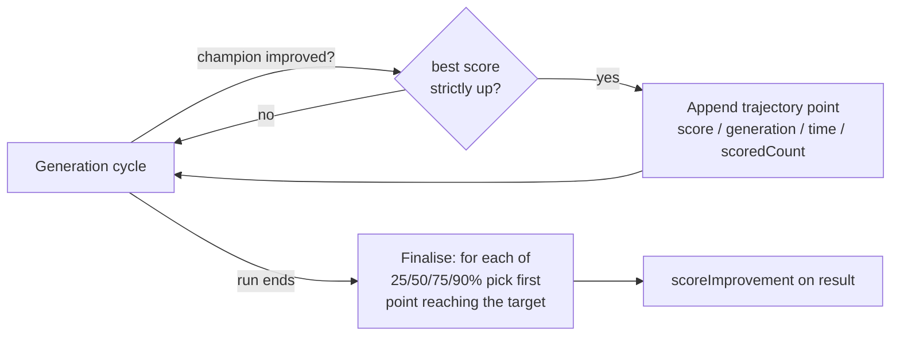

# 🧬 Evolution API

The evolution loop, selection strategies, mutation operators, configuration
presets, and plateau detection.

> **Acronyms:** API (Application Programming Interface), NEAT (NeuroEvolution of
> Augmenting Topologies), JSON (JavaScript Object Notation), FFW (Feed-Forward),
> MCMC (Markov Chain Monte Carlo).

## 📦 Exports documented here

- `Creature.evolveDir()`, `Creature.evolveRL()` (methods on `Creature`)
- Run-level tuning statistics (Issue #3422): `EvolveResult`,
  `EvolveRunStatistics`, `HardwareDescriptors`, `OptionsEcho`,
  `ScoreImprovementMilestone`, `ScoreImprovementMilestones`
- Reinforcement-learning episode contract: `EpisodeAdapter`, `StepResult`,
  `DEFAULT_MAX_STEPS`, `DEFAULT_WALL_CLOCK_MS`, `EpisodeResult`,
  `TruncationReason`, `EvolveRLOptions`, `EvolveRLMilestone`,
  `EpisodeTrialsEvent`, `EpisodicOptions`, `LegacyEpisodeAdapter`,
  `defaultRewardToError`
- `Selection`
- `Mutation`
- `QUICK_START_PRESET`, `FAST_CONVERGENCE_PRESET`, `LARGE_NETWORK_PRESET`,
  `MEMORY_CONSTRAINED_PRESET`, `DISCOVERY_FOCUSED_PRESET`
- `PlateauDetector`, `detectPlateau`, `DEFAULT_PLATEAU_DETECTION`,
  `PlateauDetectionConfig`, `RequiredPlateauDetectionConfig`
- `Species`, `Genus`
- `SpecialistPipeline`, `DEFAULT_SPECIALIST_CONFIG`, `SpecialistConfig`,
  `RequiredSpecialistConfig`, `SpecialistMode`, `DistillationResult`,
  `SubTaskScores`

## 🔄 Creature.evolveDir()

The main entry point for NEAT evolution.

```typescript
async evolveDir(
  dataSetDir: string,
  options: NeatOptions,
): Promise<{
  error: number;
  score: number;
  time: number;
  generation: number;
  phaseTimingTotals: PhaseTimingTotals;
  scorerUtilisation: ScorerUtilisationTotals;
  // Issue #3422 — run-level tuning statistics:
  populationSize: number;
  finalPopulationSize?: number; // only when adaptive sizing is enabled
  requestedOptions: OptionsEcho;
  hardware: HardwareDescriptors;
  scoreImprovement: ScoreImprovementMilestones;
}>
```

| Parameter    | Type          | Description                                           |
| ------------ | ------------- | ----------------------------------------------------- |
| `dataSetDir` | `string`      | Path to directory containing training data JSON files |
| `options`    | `NeatOptions` | Evolution configuration                               |

**Returns** an object with:

- `error` — Final best error
- `score` — Final best score (negative error minus complexity penalty)
- `time` — Elapsed milliseconds
- `generation` — Number of generations completed
- `phaseTimingTotals` — Whole-run summed per-phase timing totals
  (`PhaseTimingTotals`, Issue #3210); see [Run telemetry](#run-telemetry)
- `scorerUtilisation` — Whole-run scorer-utilisation totals split by backend
  (`ScorerUtilisationTotals`, Issue #3234); see [Run telemetry](#run-telemetry)
- `populationSize` — Configured population size, always recorded explicitly
  (Issue #3422); see [Tuning statistics](#tuning-statistics-issue-3422)
- `finalPopulationSize` — Final effective population size, present **only** when
  adaptive population sizing is enabled
- `requestedOptions` — Echo of the caller-requested options (changes from
  defaults; functions/non-serialisable values recorded by name with a marker)
- `hardware` — CPU cores, total memory and host identifier for cross-machine
  comparison
- `scoreImprovement` — Milestone summary of the score-improvement curve
  (25/50/75/90%)

### 📁 Dataset Format

Training data is stored as JSON files in `dataSetDir`, each containing an array
of samples:

```json
[
  { "input": [0, 0], "output": [0] },
  { "input": [0, 1], "output": [1] },
  { "input": [1, 0], "output": [1] },
  { "input": [1, 1], "output": [0] }
]
```

### 💡 Example

```typescript
import { Creature } from "@stsoftware/neat-ai";
import type { NeatOptions } from "@stsoftware/neat-ai";

const creature = new Creature(2, 1);

const options: NeatOptions = {
  costName: "MSE",
  populationSize: 100,
  iterations: 500,
  targetError: 0.01,
  mutationRate: 0.3,
  elitism: 2,
  threads: 4,
  seed: 42, // Reproducible evolution
};

const result = await creature.evolveDir("./training-data", options);
console.log(`Error: ${result.error}, Generations: ${result.generation}`);
```

`NeatOptions` and every sub-config are documented in the
[Configuration reference](CONFIGURATION.md).

---

## 🎮 Creature.evolveRL()

`evolveRL` is the reinforcement-learning sibling of `evolveDir`. Instead of
reading a static dataset directory, it drives an
[`EpisodeAdapter`](#episodeadapter) wrapping a streaming-observation simulator,
running `episodesPerCreature` episode rollouts per creature per generation.
Population management, mutation, plateau detection, lifecycle events, and stop
conditions match `evolveDir()`.

```typescript
async evolveRL<S, A>(
  adapter: EpisodeAdapter<S, A>,
  options: EvolveRLOptions,
): Promise<{
  error: number;
  score: number;
  time: number;
  generation: number;
  phaseTimingTotals: PhaseTimingTotals;
  scorerUtilisation: ScorerUtilisationTotals;
  milestones?: EvolveRLMilestone[];
}>
```

`phaseTimingTotals` and `scorerUtilisation` carry the same whole-run telemetry
as `evolveDir()` — see [Run telemetry](#run-telemetry). `milestones` is present
only when `options.statistics === true`.

`EvolveRLOptions` extends `NeatOptions` with:

| Field                 | Type                 | Default    | Description                                                                 |
| --------------------- | -------------------- | ---------- | --------------------------------------------------------------------------- |
| `episodesPerCreature` | `number`             | `3`        | Episodes per creature per generation; fitness is the mean return            |
| `seed`                | `number`             | time-based | Base seed mixed into the per-generation seed set; pin for reproducibility   |
| `fixedSeedSet`        | `boolean`            | `false`    | Lock the seed set for every generation (tests / regression only)            |
| `statistics`          | `boolean`            | `false`    | Opt-in geometric milestone payloads                                         |
| `onEpisodeTrials`     | `(event) => void`    | —          | Per-creature per-generation reward breakdown for variance charts            |
| `signal`              | `AbortSignal`        | —          | External interrupt signal                                                   |
| `adapterDescription`  | `AdapterDescription` | —          | Importable adapter URL + JSON config for the worker pool when `threads > 1` |

### Run telemetry

Both `evolveDir()` and `evolveRL()` return two whole-run telemetry objects
alongside the scalar result. `PhaseTimingTotals` is a public export documented
as "returned by the `evolve*` fns"; the signatures below are mirrored from
`src/creature/PhaseTimingTotals.ts` and
`src/creature/ScorerUtilisationTotals.ts`.

```typescript
// phaseTimingTotals — summed per-phase wall-clock across the whole run,
// in raw milliseconds (Issue #3210). The named buckets plus otherMs
// reconcile to totalMs (== the returned `time`).
interface PhaseTimingTotals {
  readonly generations: number;
  readonly totalMs: number;
  readonly fitnessMs: number;
  readonly breedingMs: number;
  readonly mutationMs: number;
  readonly deduplicationMs: number;
  readonly speciationMs: number;
  readonly sortMs: number;
  readonly writeScoresMs: number;
  readonly checkpointWriteMs: number;
  readonly otherMs: number; // unattributed wall-clock; clamped at 0
}

// scorerUtilisation — per-backend scorer counts summed across the run
// (Issue #3234). batchFallbackGenerations > 0 means the native batch
// path failed at least once and scoring fell back to the slow worker path.
interface ScorerUtilisationTotals {
  readonly generations: number;
  readonly batchScorerInvocations: number;
  readonly creaturesBatchScored: number;
  readonly creaturesPerCreatureScored: number;
  readonly batchFallbackGenerations: number;
}
```

### Tuning statistics (Issue #3422)

Every `evolve*` result also carries the inputs needed to tune throughput across
machines — the population size, the caller-requested options, the hardware the
run used, and a milestone summary of the score-improvement curve. Judging
"optimal" (most variants checked per hour, best rate of score gain) happens
downstream from these fields; the library only records the data. The signatures
below mirror `src/creature/EvolveRunStatistics.ts`.

```typescript
// populationSize — configured population size, always recorded explicitly
// even when it came from a default (the primary tuning variable).
// finalPopulationSize — final effective size, present ONLY when adaptive
// population sizing (AdaptivePopulationConfig) is enabled.

// requestedOptions — echo of just the options the caller requested (changes
// from defaults). Non-serialisable options (functions/callbacks and other
// values that cannot round-trip through JSON) are dropped entirely. The one
// exception is `creatures`: the seed array is echoed as its count (a number),
// e.g. `creatures: 12`; an empty seed array echoes as 0 (Issue #3427).
type OptionsEcho = Record<string, unknown>;

// hardware — machine descriptors for cross-machine comparison. The best-effort
// fields degrade to null (never throw) when --allow-sys is not granted.
interface HardwareDescriptors {
  readonly cpuCores: number | null; // navigator.hardwareConcurrency
  readonly totalMemoryBytes: number | null; // needs --allow-sys=systemMemoryInfo
  readonly host: string | null; // needs --allow-sys=hostname
}

// scoreImprovement — when the run reached 25/50/75/90% of its total score
// improvement. Computed at run end from a compact in-memory best-score
// trajectory; no per-generation series is kept or persisted.
interface ScoreImprovementMilestone {
  readonly fraction: number; // 0.25 | 0.5 | 0.75 | 0.9
  readonly generation: number;
  readonly timeMs: number;
  readonly scoredCount: number; // cumulative creatures scored ("variants checked")
  readonly score: number;
}
interface ScoreImprovementMilestones {
  readonly initialScore: number; // first champion (baseline)
  readonly finalScore: number;
  readonly totalImprovement: number; // finalScore - initialScore; 0 if no gain
  readonly milestones: ScoreImprovementMilestone[]; // empty when no positive gain
}
```

The improvement milestones are derived from a compact trajectory that only grows
when the best score improves — nothing per-generation is stored:



### EpisodeAdapter

```typescript
abstract class EpisodeAdapter<S = unknown, A = unknown> {
  abstract reset(rngSeed: number): { observation: Float32Array; state: S };
  abstract step(state: S, action: A): StepResult<Float32Array> & { state: S };
  abstract get observationLength(): number;
  abstract decodeAction(creatureOutput: Float32Array, state: S): A;

  // Overridable termination guards (library defaults shown):
  maxSteps(): number; // DEFAULT_MAX_STEPS = 5000
  wallClockMs(): number; // DEFAULT_WALL_CLOCK_MS = 60_000
}

interface StepResult<O> {
  readonly observation: O;
  readonly reward: number;
  readonly terminated: boolean; // natural episode end (death / goal)
  readonly truncated: boolean; // a guard fired (step or wall-clock cap)
  readonly info?: Readonly<Record<string, unknown>>;
}
```

The class-shaped contract mirrors Gym/Gymnasium semantics: `terminated` and
`truncated` are distinct, never collapsed into a single `done` flag. A finished
episode is reported as an `EpisodeResult` (`returnValue`, `steps`, `terminated`,
`truncated`, optional `truncationReason: TruncationReason`, `elapsedMs`,
`seed`).

> [!NOTE]
> `LegacyEpisodeAdapter`, `EpisodicOptions`, `EpisodeTrialsEvent`, and
> `defaultRewardToError` are the **legacy** `evolveEnv()` episode shape,
> retained until the runner replaces it. New code should subclass
> `EpisodeAdapter`.

For the full walkthrough and a worked `CountingAdapter` example, see
[`docs/REINFORCEMENT_LEARNING.md`](../REINFORCEMENT_LEARNING.md#-driving-evolution-with-evolverl)
and the RFC [`docs/event-driven-evolution.md`](../event-driven-evolution.md).

---

## 🎯 Selection strategies

```typescript
import { Selection } from "@stsoftware/neat-ai";
```

| Strategy                          | Description                                          | Parameters                    |
| --------------------------------- | ---------------------------------------------------- | ----------------------------- |
| `Selection.FITNESS_PROPORTIONATE` | Roulette wheel selection based on fitness proportion | —                             |
| `Selection.POWER`                 | Fitness raised to a power before selection           | `power: 4`                    |
| `Selection.TOURNAMENT`            | Best of random subset is selected                    | `size: 5`, `probability: 0.5` |

Pick a strategy through `NeatOptions.selection`. If left unset, the evolution
loop chooses one at random each run. The previously-hardcoded pressure knobs
(the POWER exponent, tournament size/probability, and adaptive-tournament
bounds) are exposed via `NeatOptions.selectionPressure` — see
[Configuration → selection pressure](CONFIGURATION.md#selectionpressure--selectionpressureconfig).

---

## 🧬 Mutation operators

```typescript
import { Mutation } from "@stsoftware/neat-ai";
```

| Mutation        | Description                                   |
| --------------- | --------------------------------------------- |
| `ADD_NODE`      | Add a new hidden neuron                       |
| `SUB_NODE`      | Remove a hidden neuron                        |
| `ADD_CONN`      | Add a new forward connection                  |
| `SUB_CONN`      | Remove a connection                           |
| `MOD_WEIGHT`    | Modify a synapse weight                       |
| `MOD_BIAS`      | Modify a neuron bias                          |
| `MOD_SQUASH`    | Change a neuron's activation function         |
| `SWAP_NODES`    | Swap two neurons                              |
| `ADD_SELF_CONN` | Add a self-loop (recurrent only)              |
| `SUB_SELF_CONN` | Remove a self-loop (recurrent only)           |
| `ADD_BACK_CONN` | Add a backward connection (recurrent only)    |
| `SUB_BACK_CONN` | Remove a backward connection (recurrent only) |

**Preset groups:**

- `Mutation.FFW` — Forward-feed mutations only (default): `ADD_NODE`,
  `SUB_NODE`, `ADD_CONN`, `SUB_CONN`, `MOD_WEIGHT`, `MOD_BIAS`, `MOD_SQUASH`,
  `SWAP_NODES`.
- `Mutation.ALL` — All mutations including recurrent connections.

---

## 📦 Configuration presets

Issue #1619: pre-built `NeatOptions` shapes for common training scenarios. Each
preset can be spread into user configuration.

```typescript
import {
  DISCOVERY_FOCUSED_PRESET,
  FAST_CONVERGENCE_PRESET,
  LARGE_NETWORK_PRESET,
  MEMORY_CONSTRAINED_PRESET,
  QUICK_START_PRESET,
} from "@stsoftware/neat-ai";

const options = {
  ...QUICK_START_PRESET,
  populationSize: 25, // override preset value
};
```

| Preset                      | Best For                                                          |
| --------------------------- | ----------------------------------------------------------------- |
| `QUICK_START_PRESET`        | First-run smoke tests on a small dataset (pop 10, 100 iterations) |
| `FAST_CONVERGENCE_PRESET`   | Quick convergence with plateau escape (pop 50, 1 000 iterations)  |
| `LARGE_NETWORK_PRESET`      | Topology growth on large input/output dimensions (pop 200)        |
| `MEMORY_CONSTRAINED_PRESET` | Reduced WASM cache and worker counts for tight machines           |
| `DISCOVERY_FOCUSED_PRESET`  | Heavier discovery cadence for error-pattern exploration           |

---

## 📉 Plateau detection

Detects when evolution stagnates and adjusts mutation rates to help escape local
optima.

```typescript
import {
  DEFAULT_PLATEAU_DETECTION,
  detectPlateau,
  PlateauDetector,
} from "@stsoftware/neat-ai";

import type {
  PlateauDetectionConfig,
  RequiredPlateauDetectionConfig,
} from "@stsoftware/neat-ai";
```

### PlateauDetector

```typescript
class PlateauDetector {
  constructor(config: RequiredPlateauDetectionConfig);

  recordFitness(fitness: number): void;
  isOnPlateau(): boolean;
  isImproving(): boolean;
  getMutationMultiplier(): number;
  getGenerationsOnPlateau(): number;
}
```

### 💡 Example

```typescript
const detector = new PlateauDetector({
  ...DEFAULT_PLATEAU_DETECTION,
  enabled: true,
});

detector.recordFitness(-0.5);
detector.recordFitness(-0.49);

if (detector.isOnPlateau()) {
  const multiplier = detector.getMutationMultiplier();
  // multiplier > 1.0 when on plateau (increase mutations)
}
```

`detectPlateau(values, config)` is the stateless variant: it inspects a fitness
history slice and returns the same diagnostic shape.

Plateau detection is also available as a `NeatOptions.plateauDetection`
sub-config (see [Configuration](CONFIGURATION.md#plateaudetection)) and applied
automatically during evolution when enabled.

---

## 🌱 Speciation primitives

```typescript
import { Genus, Species } from "@stsoftware/neat-ai";
```

- `Species` — a cluster of genetically-similar creatures with shared fitness
  sharing and speciation thresholds.
- `Genus` — collection of `Species` instances tracked across the population.

These are exposed for advanced users embedding NEAT-AI inside a custom
orchestrator. The default `Creature.evolveDir()` loop manages them internally.

---

## 🧪 Specialist Pipeline

Issue #2530: two-stage post-training pipeline that mirrors specialist /
generalist distillation. Stage 1 seeds dedicated specialist species per declared
sub-task; Stage 2 periodically distils the elites into a generalist via the OPD
(On-Policy Distillation) breed operator. Disabled by default. See the
[glossary entry for OPD](../GLOSSARY.md).

```typescript
import {
  DEFAULT_SPECIALIST_CONFIG,
  type DistillationResult,
  SpecialistPipeline,
  type SubTaskScores,
} from "@stsoftware/neat-ai";

import type {
  RequiredSpecialistConfig,
  SpecialistConfig,
  SpecialistMode,
} from "@stsoftware/neat-ai";
```

`SpecialistConfig` is consumed via `NeatOptions.specialist` and documented
alongside other sub-configs in [Configuration](CONFIGURATION.md).

---

## 🔗 Related topics

- [Configuration reference](CONFIGURATION.md) — every `NeatOptions` field
  consumed here.
- [Costs and activations](COSTS_AND_ACTIVATIONS.md) — fitness functions and
  squash menu used during evolution.
- [Training](TRAINING.md) — backpropagation runs each generation before
  selection.
- [Discovery](DISCOVERY.md) — error-pattern-driven structural growth that hooks
  into the evolution loop.
- [Compute / multithreading](COMPUTE.md) — `threads` and WASM cache controls
  used by `evolveDir()`.

---

**Up to:** [`README.md`](../../README.md) (entry point) ·
[`docs/README.md`](../README.md) (topic index).
