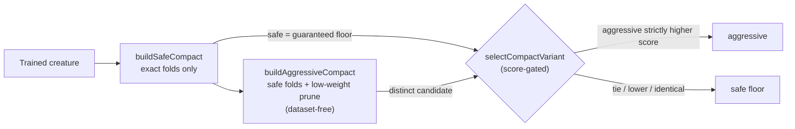

# 🎓 Training API

Backpropagation options, sparse training controls, and the synthetic synapse
densification step.

> **Acronyms:** API (Application Programming Interface), MSE (Mean Squared
> Error), DRY (Don't Repeat Yourself), WASM (WebAssembly), GC (Garbage
> Collection).

NEAT-AI uses elastic backpropagation to train creatures within each generation.
Training is typically invoked internally by `evolveDir()`, but the configuration
types are documented here for fine-grained control and for callers wiring their
own training loop.

## 📦 Exports referenced here

These types are consumed via `NeatOptions` and (when training is invoked
directly) via `Creature.propagate()` / `Creature.propagateUpdate()`.

- `BackPropagationOptions` (interface; configures elastic backprop)
- `TrainOptions` (extends `BackPropagationOptions`)
- Synthetic synapse helpers (internal — documented here for architectural
  reference)

## ⚙️ BackPropagationOptions

```typescript
interface BackPropagationOptions {
  generations?: number; // Training iterations (default: random 1–100)
  learningRate?: number; // 0–1 (default: random low value)
  batchSize?: number; // Samples per batch (default: 64)
  sparseRatio?: number; // Neuron selection ratio (default: 1.0)
  trainingMutationRate?: number; // Gene change probability (default: random)
  plankConstant?: number; // Minimum unit of change (default: 0.000_000_1)
  maximumBiasAdjustmentScale?: number; // Max bias delta (default: 1)
  maximumWeightAdjustmentScale?: number; // Max weight delta (default: 1)
  limitBiasScale?: number; // Absolute bias cap (default: 10_000)
  limitWeightScale?: number; // Absolute weight cap (default: 100_000)
  disableBiasAdjustment?: boolean; // Skip bias updates (default: false)
  disableWeightAdjustment?: boolean; // Skip weight updates (default: false)
  disableRandomSamples?: boolean; // Use sequential sampling (default: false)
  learningRateStrategy?: "fixed" | "decay" | "adaptive"; // Default: random
  initialLearningRate?: number; // For decay/adaptive (default: 0.01)
  learningRateDecay?: number; // Decay factor (default: 0.95)
}
```

### 🧬 TrainOptions — additional training fields

`TrainOptions` extends `BackPropagationOptions` with these optional fields:

| Field               | Type                     | Default  | Description                                                                           |
| ------------------- | ------------------------ | -------- | ------------------------------------------------------------------------------------- |
| `syntheticSynapses` | `boolean`                | `false`  | Generate dense inter-layer synapses before backprop, then prune near-zero ones after. |
| `predictiveCoding`  | `PredictiveCodingConfig` | disabled | Use local Hebbian learning rules instead of standard backpropagation.                 |
| `crossValidation`   | `CrossValidationConfig`  | disabled | Split data into k folds for cross-validated training.                                 |
| `dataFuzzing`       | `DataFuzzingConfig`      | disabled | Inject noise into training data each iteration to prevent memorisation.               |
| `dataQuantisation`  | `DataQuantisationConfig` | disabled | Quantise training data values to discrete levels.                                     |
| `feedbackLoop`      | `boolean`                | `false`  | Feed previous output back as input for time-series tasks.                             |

### 💡 Direct training example

```typescript
import { Creature } from "@stsoftware/neat-ai";

const creature = new Creature(2, 1);

// Activate, then propagate errors
const input = new Float32Array([1.0, 0.0]);
const expected = new Float32Array([1.0]);

creature.activate(input);
// Propagation is handled internally by evolveDir() during evolution.
```

For backprop strategy details (minimum-change updates, saturation avoidance,
plank constant), see [`docs/BACKPROP_ELASTICITY.md`](../BACKPROP_ELASTICITY.md).

---

## 🧪 Synthetic Synapses

Issue #1919: synthetic synapses address a key weakness of NEAT's incremental
topology growth — newly evolved networks often have sparse inter-layer
connectivity compared to conventional dense neural networks. Synthetic synapses
temporarily densify the network during backpropagation, giving gradient descent
a richer search space to discover useful connections.

### Lifecycle

The synthetic synapse lifecycle has three phases, all handled automatically when
`syntheticSynapses: true` is set in the training options:

1. **Generation** — Before backpropagation begins, `generateSyntheticSynapses()`
   computes a topological layer assignment for every neuron and adds zero-weight
   synapses between each pair of adjacent layers. Existing connections, constant
   neurons, and frozen neurons are skipped.
2. **Training** — Standard backpropagation runs with the additional synthetic
   synapses present. Useful connections are trained to non-trivial weights;
   unhelpful ones remain near zero.
3. **Pruning** — After training completes, `removeSyntheticSynapses()` removes
   any synthetic synapse whose absolute weight remains below a threshold
   (default: `plankConstant`, 1e-7). Synthetic synapses trained to meaningful
   weights are retained as permanent connections. Orphaned neurons are cleaned
   up automatically.

### Enabling synthetic synapses

Synthetic synapses are opt-in. Set `syntheticSynapses: true` in the training
options passed to `evolveDir()`:

```typescript
const result = await creature.evolveDir(dataDir, {
  costName: "MSE",
  iterations: 100,
  syntheticSynapses: true, // Enable synthetic synapse generation
});
```

### Internal functions

These functions are used internally by the training pipeline and are **not**
exported from `mod.ts`. They are documented here for architectural reference.

#### `generateSyntheticSynapses(creature, options?)`

Adds zero-weight synapses between neurons in adjacent topological layers.

| Parameter  | Type                       | Description                               |
| ---------- | -------------------------- | ----------------------------------------- |
| `creature` | `Creature`                 | The creature to modify (mutated in place) |
| `options`  | `SyntheticSynapsesOptions` | Optional generation limits                |

**`SyntheticSynapsesOptions`**:

| Field          | Type     | Default | Description                                                                                                      |
| -------------- | -------- | ------- | ---------------------------------------------------------------------------------------------------------------- |
| `maxPerTarget` | `number` | `50`    | Maximum synthetic connections per target neuron per layer pair. Prevents combinatorial explosion on wide layers. |

**Returns:** `SyntheticSynapsesResult`

| Field           | Type          | Description                                         |
| --------------- | ------------- | --------------------------------------------------- |
| `addedCount`    | `number`      | Number of synthetic synapses added                  |
| `syntheticKeys` | `Set<string>` | Set of `"fromIndex-toIndex"` keys for later cleanup |
| `skippedCount`  | `number`      | Connections skipped due to the per-target cap       |

#### `removeSyntheticSynapses(creature, syntheticKeys, threshold?)`

Prunes near-zero synthetic synapses after training. Synthetic synapses that have
been trained to non-trivial weights are retained as permanent connections.

| Parameter       | Type          | Default | Description                                     |
| --------------- | ------------- | ------- | ----------------------------------------------- |
| `creature`      | `Creature`    |         | The creature to prune (mutated in place)        |
| `syntheticKeys` | `Set<string>` |         | Keys returned by `generateSyntheticSynapses()`  |
| `threshold`     | `number`      | `1e-7`  | Maximum absolute weight to consider "near zero" |

**Safety rules:**

- Typed synapses (IF condition/positive/negative) are never removed.
- Output neurons always retain at least one inward connection.
- Orphaned neurons are handled by the standard compact function (DRY).

**Returns:** `RemoveSyntheticSynapsesResult`

| Field     | Type     | Description                                              |
| --------- | -------- | -------------------------------------------------------- |
| `removed` | `number` | Number of synthetic synapses zeroed (removed by compact) |

#### `computeLayerAssignments(creature)`

Computes topological layer assignments for all neurons using longest-path
distance from input neurons.

| Parameter  | Type       | Description                            |
| ---------- | ---------- | -------------------------------------- |
| `creature` | `Creature` | The creature whose topology to analyse |

**Returns:** `Map<number, number[]>` — maps layer number to an array of neuron
indices in that layer.

**Layer assignment rules:**

- Input and constant neurons → layer 0.
- Hidden neurons → layer based on longest path from inputs.
- Output neurons → always placed in the final layer.
- Recurrent connections and self-loops are ignored.

---

## 🗜️ Compaction

After training, a creature is **compacted** to shed redundant structure before
it is scored. Compaction produces **two candidates** and lets the existing
score-based population selection pick the winner:

- **Safe** — only exact, behaviour-preserving folds. Its output is
  mathematically identical to the original, so its score is guaranteed to be `≥`
  the original. Built by `buildSafeCompact()`
  (`src/compact/CompactCreature.ts`).
- **Aggressive** — the safe folds **plus** a speculative low-impact prune. Built
  by `buildAggressiveCompact()` on top of the safe variant.

`Creature.compactVariants()` returns `{ safe?, aggressive? }`;
`selectCompactVariant()` (`src/compact/CompactVariants.ts`) chooses one.
`Creature.compact()` / `compactCreature()` are thin wrappers that return the
safe variant for back-compat.

### The invariant: safe is the floor

> **The safe variant is a guaranteed score floor, so the aggressive gamble can
> never cost anything.** `selectCompactVariant()` is score-gated: the safe
> variant wins ties and is the fallback; the aggressive candidate only displaces
> it when it is a **distinct** creature (different UUID) with a strictly higher
> finite score. Identical variants dedupe by UUID and the duplicate is never
> scored.

This invariant is load-bearing. Because the aggressive prune is **purely
structural and dataset-free** (it inspects synapse-weight magnitude only — no
training data is threaded into `compactCreature`) and can only ever be
**discarded** in favour of the safe floor, an over-eager prune is free. Two
changes would break it and must not be made without replacing this rationale:

1. **Do not add a training-data threshold to the aggressive prune.** Its safety
   comes precisely from being dataset-free and score-gated after the fact —
   threading data into compaction couples pruning to a particular dataset and
   voids the "costs nothing" guarantee.
2. **Do not drop the safe floor.** Removing the safe candidate (or letting the
   aggressive variant win a tie) removes the floor that makes the gamble free.

### The safe folds

The safe variant is exactly these exact, lossless transforms:

1. **Constant fold into additive consumers.** A `type:"constant"` neuron emits
   the fixed scalar `bias`. For every **non-aggregate** consumer `B`, the
   contribution `weight · constant.bias` is folded into `B.bias` and the synapse
   dropped; once a constant has no outbound synapses it is deleted. A constant
   feeding an **aggregate** consumer
   (`MAXIMUM`/`MINIMUM`/`IF`/`HYPOT`/`HYPOTv2`) is retained.
   (`src/compact/ConstantFold.ts`)
2. **Transitive constant fold to a fixpoint + zero-varying-input collapse.**
   Each fold can turn another neuron's inputs entirely constant, so the pass
   repeats until nothing changes. A hidden neuron with **zero** genuinely
   varying inputs collapses to the fixed scalar `squash(pre)` (via the standard
   `Activations.find()` lookup) and is folded downstream like a constant. A
   neuron with even one varying input is never treated as constant.
   (`src/compact/ConstantFold.ts`)
3. **Exact `IF`-collapse when all condition inputs are constant.** An `IF`
   selects its branch by `condition = Σ(condition-type inputs)`. When every
   condition input is constant the selector is fixed at compaction time, so the
   `IF` collapses losslessly to its always-taken branch: the taken branch's
   synapses become ordinary additive edges and the squash is rewritten to
   `IDENTITY`. (`src/compact/IfCollapse.ts`)

The aggressive prune adds one non-exact step: it drops **untyped** synapses
whose `|weight|` is below `AGGRESSIVE_PRUNE_WEIGHT_THRESHOLD = 1e-3`
(`src/compact/AggressivePrune.ts`) — including synapses into aggregate consumers
and non-constant neurons that the safe variant must leave untouched. Frozen
synapses, typed synapses (`IF` roles), synapses into `IF` neurons, and an
output's last inbound edge are never pruned.



---

## 🔗 Related topics

- [Configuration reference](CONFIGURATION.md) — training fields on `NeatOptions`
  (`trainPerGen`, `trainingBatchSize`, etc.).
- [Costs and activations](COSTS_AND_ACTIVATIONS.md) — cost functions used inside
  the training loop.
- [Evolution API](EVOLUTION.md) — `Creature.evolveDir()` invokes training each
  generation.
- [`docs/BACKPROP_ELASTICITY.md`](../BACKPROP_ELASTICITY.md) — narrative on
  minimum-change weight updates.
- [`docs/PREDICTIVE_CODING.md`](../PREDICTIVE_CODING.md) — predictive coding
  training mode.

---

**Up to:** [`README.md`](../../README.md) (entry point) ·
[`docs/README.md`](../README.md) (topic index).
