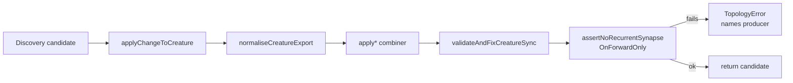

# Issue #2515 — Forward-only audit of `applyChangeToCreature` and `normaliseCreatureExport`

> **📦 Archived under
> [Issue #2575](https://github.com/stSoftwareAU/NEAT-AI/issues/2575).** This
> investigation note was moved from `docs/` to `docs/archive/investigations/`.
> The line of work has closed — read on demand for historical context. Topic
> index: [`docs/README.md`](../../README.md); entry point:
> [`README.md`](../../../README.md).

## Summary

This note records the audit that wired `assertNoRecurrentSynapseOnForwardOnly`
into every combiner that produces a candidate creature in the discovery
pipeline, so a recurrent synapse on a forward-only creature now throws a
`TopologyError` at the producer site instead of being silently stripped at
`loadFrom` time.

## Why the audit was needed

`exportJSONUnchecked(...)` is intentionally called from four sites because the
input may legitimately carry illegal hints:

- `compact/CompactCreature.ts` — backward synapses are stripped during
  compaction.
- `discovery/CandidateApplication.ts::applyChangeToCreature(...)` — candidate
  creatures may carry recurrent hints that the combiner is meant to filter.
- `utils/Diagnostics.ts` — post-validation-failure capture.
- `upgrade/Upgrade.ts` — legacy capture.

Of these, the discovery combiner was the most likely producer of the
GRQ-3-rocket.log signature (output-0 self-loops). The combiner already filtered
illegal hints in best-effort fashion, but if any branch ever let a recurrent
edge through, it surfaced only as a `[loadFrom] Stripping recurrent synapse`
warning on the receiving worker — which named the wrong stack frame.

## What changed

The producer-site post-condition `assertNoRecurrentSynapseOnForwardOnly` is now
called immediately before the combiner returns a candidate creature, at each of
these introduction sites:

| Site                                  | Source tag in the thrown error                  |
| ------------------------------------- | ----------------------------------------------- |
| `applyAddSynapses`                    | `discovery:applyAddSynapses`                    |
| `applyAddNeurons`                     | `discovery:applyAddNeurons`                     |
| `applyChangeSquash`                   | `discovery:applyChangeSquash`                   |
| `applyRemoveSynapse`                  | `discovery:applyRemoveSynapse`                  |
| `applyRemoveNeuron`                   | `discovery:applyRemoveNeuron(<changeType>)`     |
| `applyCoordinatedStructuralCandidate` | `discovery:applyCoordinatedStructuralCandidate` |

If any of these tags ever appears in a `TopologyError` message in production,
the producer is named directly in the stack frame.

## Pipeline

## Tests added

- `test/architecture/NormaliseCreatureExportForwardOnly.ts` — pins the
  forward-only invariant on `normaliseCreatureExport`. Round-trip exports,
  idempotent re-normalisation, output-id remapping, and UUID-keyed wire inputs
  are all checked against `buildIdToIndexMap` to confirm that no synapse leaves
  the function violating `from < to`.
- `test/lifecycle/ForwardOnlyApplyChangeLifecycle.ts` — exercises every branch
  of `applyChangeToCreature` (`add-synapses`, `add-neurons`, `change-squash`,
  `remove-synapse`, `remove-neuron`, `coordinated-structural`) on a forward-only
  base and asserts the result is still forward-only. Includes adversarial cases
  that feed deliberately illegal candidate hints to confirm the combiner filters
  them rather than passing the corruption through.

## Outcome

- `normaliseCreatureExport` does not introduce back-edges: it remaps wrong
  output IDs to their canonical `outputNeuronId(i)` values and re-points
  synapses, but it does not reorder neurons or invert edge direction. The pinned
  test (`output-id remap without flipping edges`) is the canonical check.
- The producer-side assertions are now load-bearing. The downstream GRQ-side
  defences (#2099, #2100) become true defence-in-depth — if a recurrent edge
  ever reaches `loadFrom` again, the upstream `TopologyError` will name the
  responsible combiner.

## Related

- Builds on #2511 (save-side assertion in `exportJSON`) and #2514 (load-side
  throw in `loadFrom`).
- Closes the producer-side audit requested in stSoftwareAU/GRQ#2109.
