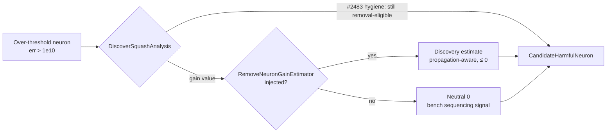

# Stop the Deno placeholder remove-neuron gain in `DiscoverSquashAnalysis.ts`

## Summary

The over-threshold ("harmful") remove-neuron gain in
`src/architecture/ErrorGuidedStructuralEvolution/DiscoverSquashAnalysis.ts` was
**fabricated** on the Deno side by the Issue #2483 sink:

```
expectedCreatureScoreGain = min(0.5, max(0.1, 0.1 + (excessMagnitude / 10) * 0.4))
```

where `excessMagnitude = log10(err) − log10(1e10)`. That formula ignored network
topology — it turned a large squash error into a large _positive_ gain
regardless of how many layers separated the neuron from the output(s). For the
recorded `neuron-1802938338` failure it claimed `+0.17882921` while the measured
effect was `−0.000194` (~920× too large and opposite in sign).

Estimation authority has moved to the propagation-aware **NEAT-AI-Discovery
(Rust)** estimator `estimate_remove_neuron_gain`
(stSoftwareAU/NEAT-AI-Discovery#1518, cross-repo per
stSoftwareAU/NEAT-AI-Discovery#2942). This change makes the Deno side **stop
synthesising the gain** and instead **consume an injected Discovery estimate**:

- Both remove-neuron sinks (`findCandidateSquash` and
  `analyzeSelectedNeuronsForHarmfulRemoval`) now take an optional
  `RemoveNeuronGainEstimator` and surface its value verbatim.
- When no estimate is injected, the emitted gain is a **non-fabricated neutral
  `0`** — never the old placeholder. The `DiscoverSquashAnalysis` benchmark
  surfaces a zero gain as the cross-repo sequencing signal (per #1516) that the
  Discovery estimate is not yet wired.
- The Issue #2483 WASM-hygiene behaviour is **preserved**: over-threshold
  neurons are still promoted for removal (removal is gated on error magnitude,
  not gain). Only the _gain value_ stopped being synthesised.

The estimator seam is threaded through the callers
`DiscoverStructureAnalysis.analyzeSelectedNeuronsSquashes` and
`analyzeSelectedNeuronsForHarmfulRemoval`, so a Discovery estimate can be
injected without further signature churn.

> The stale line reference `:261` in the issue is the squash-**change**
> `conservativeScale` (`sampleCount / 40000`), not a remove-neuron gain — it
> feeds `CandidateSquash`, not `CandidateHarmfulNeuron`, so it is deliberately
> left untouched. The two genuine remove-neuron placeholder sinks (`:196`,
> `:479` in the issue) are the ones removed.

Closes stSoftwareAU/NEAT-AI-Discovery#1520

## Data flow



## Evidence

Backend/CLI change — no web interface. Verified via `deno test` on the
`DiscoverSquashAnalysis` suite (14 passed, incl. 4 new), project-wide
`deno lint` (1789 files) and `deno check` (`quality.sh --check-only`), all
green.

Regression proof: the new assertions require the gain to equal the injected
estimate (or `0`), which the old placeholder path (returning `0.5` for these
inputs) would fail.

## Test Plan

Added to `test/ErrorGuidedStructuralEvolution/DiscoverSquashAnalysis.ts`:

- `DiscoverSquashAnalysis - remove-neuron gain is not synthesised locally (findCandidateSquash)`
  — injects a Discovery estimate, asserts the harmful-sink gain equals it and
  does **not** match the placeholder formula.
- `DiscoverSquashAnalysis - remove-neuron gain defaults to non-fabricated zero (findCandidateSquash)`
  — no estimator → gain `0`, still `!= placeholder`, neuron still promoted for
  removal.
- `DiscoverSquashAnalysis - remove-neuron gain is consumed from Discovery (analyzeSelectedNeuronsForHarmfulRemoval)`
  — injected estimate consumed verbatim.
- `DiscoverSquashAnalysis - harmful removal emits non-fabricated zero without an estimate`
  — default-path guard.

Existing `calculateSquashError*` and
`analyzeSelectedNeuronsForHarmfulRemoval loads records via wire uuid path` cases
continue to pass, guarding the preserved #2483 identification behaviour.
