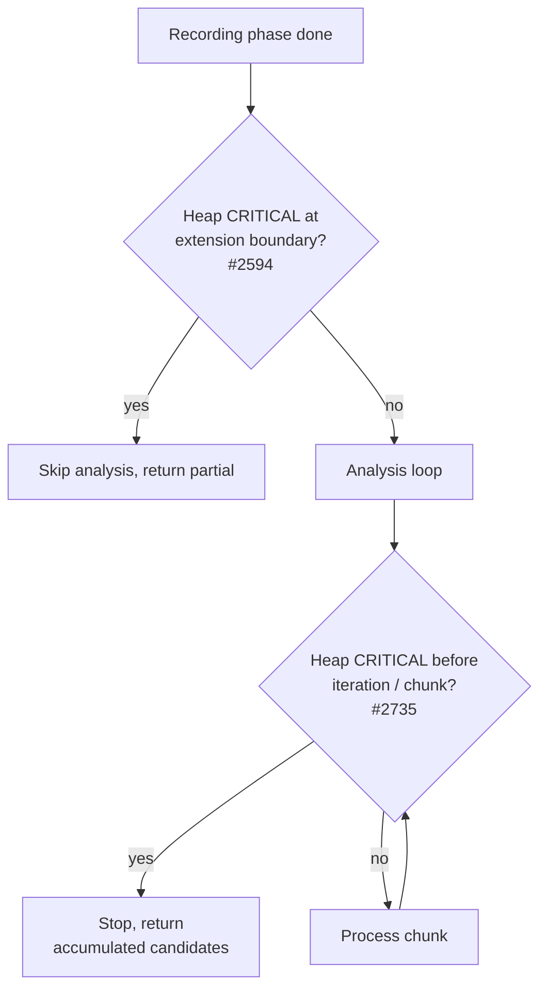

# Bound discovery analysis heap with an in-loop CRITICAL guard

## Summary

`Creature.evolveDir()` fatally ran out of heap when evolving a large layered
feed-forward seed (e.g. 986 neurons / ~109k synapses) over a large supervised
`.bin` training directory. The extension-boundary heap guard added in Issue
#2594 samples the heap **once**, just before analysis is given more time. But
the analysis itself (`runAnalysisLoop`) then processes many chunks across up to
ten retry iterations, and the per-chunk squash analysis allocates aggressively
(Issue #2642). Heap therefore climbs back to `MemoryMonitor` CRITICAL **during**
the loop, where no further guard existed — and the worker OOMed with
`Fatal JavaScript out of memory: Ineffective mark-compacts near heap limit`.

This change adds an **in-loop heap-critical guard** that re-samples heap
pressure at the start of each retry iteration and before each chunk submission.
On CRITICAL pressure the loop stops submitting work and returns the candidates
accumulated so far (graceful degradation — option 3 in the issue), recording
`perfStats.analysisHeapAborted = true` and logging a grep-friendly line:

```
[Neat] Discovery <id> analysis aborted: heap CRITICAL during analysis loop ...
```

The guard reuses the existing `isHeapCritical(config.memory)` probe, so it
honours `memory.enabled` and the shared `criticalThreshold`. The heap probe is
injectable via the new optional `AnalysisLoopContext.heapCriticalProbe` so
behaviour-focused loop tests (stall guard, chunking, cache release, per-chunk
timeout) opt out of the real heap sample — necessary because a small Deno test
process naturally reports `heapUsed/heapTotal` ≈ 0.9, above the 0.85 threshold.

Closes #2735.

## Evidence

Backend/CLI change — no web interface to screenshot. Verified by unit tests
that drive `runAnalysisLoop` with an injected heap sample and assert the loop
aborts gracefully (no chunk submitted, no neurons analysed) on CRITICAL heap,
runs normally on low heap, and never aborts when `memory.enabled === false`.



Test run:

```
ok | 33 passed | 0 failed   # all ErrorGuidedStructuralEvolution analysis specs
```

## Test Plan

- Added `test/ErrorGuidedStructuralEvolution/AnalysisLoopHeapGuard.ts`:
  - CRITICAL heap aborts the loop before any chunk runs
    (`analysisHeapAborted === true`, `chunkCalls === 0`, `neuronsAnalyzed === 0`).
  - Normal heap runs the loop without aborting.
  - `memory.enabled === false` never aborts even when heap is CRITICAL.
- Updated existing loop harnesses (`DiscoverAnalysisStallWarmup`,
  `DiscoverAnalysisChunking`, `AnalysisCacheRelease`,
  `DiscoverAnalysisPerChunkTimeout`) to inject `heapCriticalProbe: () => false`,
  isolating their behaviour-under-test from the test process's high heap ratio.
  No assertions were changed.
- Documented both guards in `docs/troubleshooting/MEMORY.md`.
