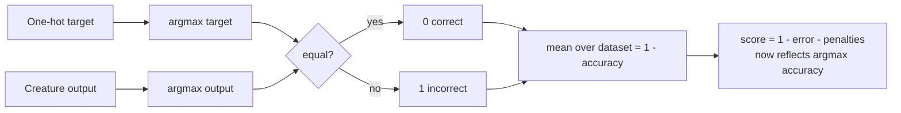

# Add `CATEGORICAL_ERROR` cost for one-hot multi-class targets

## Summary

For multi-class problems encoded as **one-hot targets**, `evolveDir` could
report a low `error` / high `score` (and even satisfy `targetError`) while real
argmax classification accuracy stayed at chance. The cause is metric semantics,
not training: distance-based costs such as `"MSE"` measure squared output
distance, not argmax accuracy. A constant classifier that emits one output near
`1` and the rest near `0` reaches a trivial MSE floor (~`0.1` for ten balanced
classes) without learning any class structure. Because
`score = 1 - error - penalties`, that decoupling lets the reported score
overstate task quality.

This PR adds a new built-in cost, **`"CATEGORICAL_ERROR"`**, that reports the
**misclassification rate** (`error = 1 - accuracy`) by comparing
`argmax(target)` with `argmax(output)` per record. Selecting it makes the
scorer, champion selection and the `targetError` early-stop reflect the user's
actual classification task. The cost is **non-differentiable** and intended for
scoring/early-stop — NEAT-AI derives backpropagation gradients independently of
`costName`, so training proceeds normally. The behaviour and the MSE-decoupling
caveat are documented in `docs/API_REFERENCE.md`.

This satisfies the issue's expected outcomes: it both **documents** the
MSE/argmax decoupling and **offers an optional classification-aware metric** so
champion selection / `targetError` can reflect the real task.

Closes #2736

## Evidence

Backend/library change with no web interface to screenshot. Verified with unit
tests that call the real cost function and the `Costs` registry.

Key behaviours verified by tests:

- A constant ten-class classifier yields `error = 0.9` (chance accuracy 10%),
  versus the misleading ~`0.1` MSE floor.
- A perfect classifier yields `error = 0`.
- Correct/incorrect single-record predictions return `0` / `1`.
- Ties resolve to the first index; empty arrays return `0`; a single output is
  always counted correct (documented limitation).
- `Costs.find("CATEGORICAL_ERROR")` resolves and the name appears in
  `Costs.getAvailableCosts()` and `BUILT_IN_COST_NAMES`.

## Test Plan

- Added `test/costs/CategoricalError.ts` (9 tests) covering happy path, error
  path, registry integration, the one-hot MSE-floor scenario, and edge cases
  (ties, empty, single output).
- Updated `test/costs/CostName.ts` so `BUILT_IN_COST_NAMES` stays in sync with
  the new built-in cost.
- All `test/costs/*.ts` tests pass (63 passed, 0 failed).
- `./quality.sh --lint-only` passes; changed files type-check cleanly with
  `deno check`.

> Note: `./quality.sh --check-only` reports 3 pre-existing `TS2322`
> `Timeout`/`number` errors in `DataRecorderAnalysis.ts`,
> `DataRecorderRecording.ts` and `ImproveSquash.ts`. These exist on the base
> branch (confirmed via `git stash`) and are unrelated to this change.
