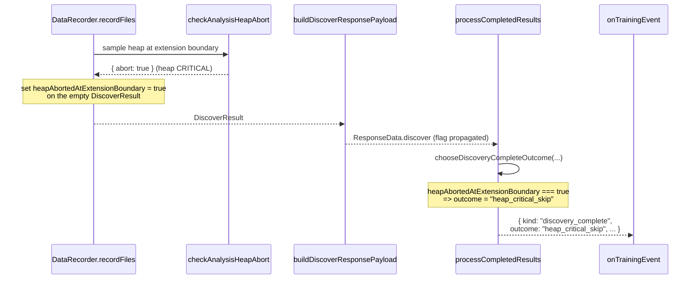

# Surface heap-pressure discovery skips as a structured training event

## Summary

`DataRecorder.recordFiles()` already aborts the analysis phase when the V8 heap
is at MemoryMonitor CRITICAL pressure at the analysis-extension boundary (PR
#2594), and #2642 reduced peak analysis heap. The remaining gap reported in
#2737 is **observability**: the abort emits a single `warn` log line, but the
upstream `discovery_complete` training event still reports `"no_change"`, so
callers can't distinguish a memory-pressure skip from a clean "found nothing"
pass — and they keep concluding Discovery "doesn't add hidden neurons" when in
fact the library prevented the analysis from running.

This PR surfaces the skip as a structured, machine-readable signal end-to-end:

- `DiscoverResult` carries a new optional `heapAbortedAtExtensionBoundary` flag.
  `DataRecorder.recordFiles()` sets it on the empty result it returns when the
  heap guard trips.
- `buildDiscoverResponsePayload` in the worker copies the flag across the
  worker/parent thread boundary so the parent thread sees the same signal as the
  worker thread. `ResponseData.discover` adds the same field.
- `DiscoveryCompleteEvent.outcome` now includes a `"heap_critical_skip"` member
  alongside `"improved" | "no_change" | "timeout"`.
- A small pure helper `chooseDiscoveryCompleteOutcome` in
  `src/NEAT/DiscoveryOutcome.ts` centralises the precedence rule: heap-abort
  wins over `"improved"` and `"no_change"` so a stale `improvedCreature`
  reference can't mask a memory-pressure skip.
- `processCompletedResults` calls the helper instead of inlining the outcome
  ternary.

Callers wiring `onTrainingEvent` can now `switch` on the outcome and surface the
skip as a milestone in their UI / dashboards / showcase narrative, addressing
the second of the three options listed in the issue's "Expected" section.

Closes #2737.

## Evidence

This is a backend/library change with no UI surface. Behaviour is verified by
deterministic unit tests on the pure outcome helper, the worker-payload mapper,
and the existing heap-guard tests (unchanged and still passing).



Targeted test run:

```
$ deno test --no-check --allow-all \
    test/multithreading/WorkerProcessor.ts \
    test/NEAT/DiscoveryOutcome.ts \
    test/ErrorGuidedStructuralEvolution/AnalysisHeapGuard.ts \
    test/NEAT/TrainingEventEmitter.ts \
    test/ErrorGuidedStructuralEvolution/AnalysisCacheRelease.ts
ok | 33 passed | 0 failed (1s)
```

### Why scope stops here

Of the three options the issue offers — **budget**, **surface**, or **adapt** —
this PR delivers **surface**. Budgeting and adaptive scope reduction require
deeper changes to the recording-phase batch sizing and to NEAT-AI-Discovery's
FFI cache lifecycle, and would not fit the "minimal scope" rule for one issue.
With the structured outcome in place, callers (and a follow-up
adaptive-recording PR) can now measure how often the skip fires and gate
adaptive logic on that signal.

### Pre-existing quality.sh failures

`./quality.sh` currently fails the type-check step on three pre-existing
`setTimeout` typing errors that are unrelated to this PR:

- `src/architecture/ErrorGuidedStructuralEvolution/DataRecorderAnalysis.ts:576`
- `src/architecture/ErrorGuidedStructuralEvolution/DataRecorderRecording.ts:371`
- `src/intelligentDesign/ImproveSquash.ts:43`

Verified by stashing this PR's changes and re-running
`./quality.sh
--check-only` — the same three errors fire on `origin/Develop`.
Per the project's "Change Scope" rule these are left for a separate fix; the new
code in this PR type-checks cleanly in isolation
(`deno check src/NEAT/DiscoveryOutcome.ts` passes).

## Test Plan

- Added `test/NEAT/DiscoveryOutcome.ts`:
  - `chooseDiscoveryCompleteOutcome: no inputs → no_change`.
  - `chooseDiscoveryCompleteOutcome: improvedCreature present → improved`.
  - `chooseDiscoveryCompleteOutcome: heap abort wins over no improvement →
    heap_critical_skip`.
  - `chooseDiscoveryCompleteOutcome: heap abort wins over improvedCreature
    → heap_critical_skip`
    (defends precedence even if both signals appear).
  - `chooseDiscoveryCompleteOutcome: heapAbortedAtExtensionBoundary=false
    preserves the regular precedence`.
- Extended `test/multithreading/WorkerProcessor.ts`:
  - `buildDiscoverResponsePayload: propagates heapAbortedAtExtensionBoundary
    =true`
    — confirms the flag survives the worker→parent wire copy.
  - `buildDiscoverResponsePayload: leaves heapAbortedAtExtensionBoundary
    undefined for happy-path results`.
  - `buildDiscoverResponsePayload: propagates heapAbortedAtExtensionBoundary
    =false`.
- Existing `test/ErrorGuidedStructuralEvolution/AnalysisHeapGuard.ts` and
  `test/NEAT/TrainingEventEmitter.ts` continue to pass — the guard's abort
  signal and the discovery_complete event delivery path are unchanged apart from
  the new outcome member.
