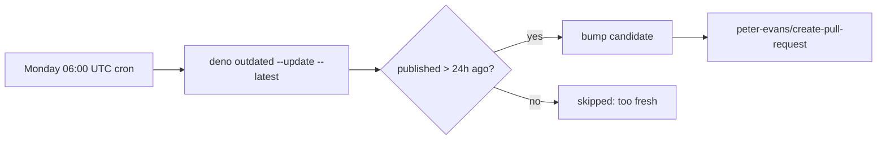

## Summary

The weekly `.github/workflows/deno-outdated.yml` workflow is the only automated
dep-bump path on the repo (the inline `quality.yml` step was removed by Issue
#2697). It ran a bare `deno outdated --update --latest` with **no**
`--minimum-dependency-age` flag, so freshly published external Deno/JSR/npm
versions could be picked up the moment they hit a registry — bypassing the
documented dep-bump quarantine (`VIBE_BUMP_QUARANTINE_HOURS`, default 24h)
enforced by `bump-deps.sh` and `docs/CORE_DEPENDENCY_POLICY.md`.

This change passes the quarantine through to the workflow:

```yaml
env:
  VIBE_BUMP_QUARANTINE_HOURS: "24"
run: deno outdated --update --latest --minimum-dependency-age="$((VIBE_BUMP_QUARANTINE_HOURS * 60))"
```

`--minimum-dependency-age` takes minutes, matching `bump-deps.sh`, so a
version published less than 24h ago can no longer land in the Monday-morning
auto-raised PR.

Closes #2741.

## Evidence

Backend/CI-only change — no web interface to screenshot.

Quarantine flow after the fix:



New test `test/ci/DenoOutdatedWorkflowQuarantine.ts` passes:

```
deno-outdated.yml passes --minimum-dependency-age to deno outdated (Issue #2741) ... ok
deno-outdated.yml never runs a bare `deno outdated --update --latest` (Issue #2741) ... ok
deno-outdated.yml drives the quarantine from VIBE_BUMP_QUARANTINE_HOURS (Issue #2741) ... ok
ok | 3 passed | 0 failed
```

`./quality.sh` passes apart from one pre-existing flaky test
(`evolveRL_heapStability_test.ts`, Issue #2693) that is unrelated to this
change and passes when run in isolation.

## Test Plan

- Added `test/ci/DenoOutdatedWorkflowQuarantine.ts`:
  - Asserts the workflow runs `deno outdated` with `--minimum-dependency-age`.
  - Asserts no executable `run:` step invokes a bare
    `deno outdated --update --latest` without the quarantine flag (comment
    lines are stripped before matching).
  - Asserts the quarantine is sourced from `VIBE_BUMP_QUARANTINE_HOURS`.
- The pre-existing `test/ci/QualityWorkflowDepBumpQuarantine.ts` still passes —
  the `deno outdated --update --latest` substring guard remains satisfied.
