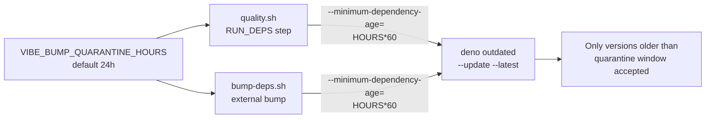

# quality.sh: enforce dep-bump quarantine window

## Summary

Closes #2742. Aligned `quality.sh` with the supply-chain quarantine policy
already enforced by `bump-deps.sh` and documented in
`docs/CORE_DEPENDENCY_POLICY.md`. The dependency-update step now passes
`--minimum-dependency-age=<minutes>` to `deno outdated --update --latest`,
sourcing the minute count from `VIBE_BUMP_QUARANTINE_HOURS` (default 24h).
Previously, any contributor running `./quality.sh` (the documented local quality
gate, see `AGENTS.md` and `CONTRIBUTING.md`) silently bypassed the quarantine
window and could pull in a registry version published only minutes earlier — the
exact short-window attack the quarantine is designed to dodge.

## Evidence

This is a shell-script / CLI change with no UI to screenshot. Verification:

- `./quality.sh --lint-only` runs the dep update step and reports
  `All dependencies are up to date.` — confirming `deno outdated` accepts the
  new `--minimum-dependency-age` flag without error.
- `deno test test/scripts/QualityScript.ts` — all 13 tests pass, including the
  two new tests for Issue #2742:
  - `quality.sh dep update passes --minimum-dependency-age (Issue #2742 quarantine)`
  - `quality.sh rejects non-integer VIBE_BUMP_QUARANTINE_HOURS (Issue #2742)`

Policy flow now matches `bump-deps.sh`:

## Test Plan

- Added
  `test/scripts/QualityScript.ts::quality.sh dep update passes --minimum-dependency-age (Issue #2742 quarantine)`
  — asserts the script honours `VIBE_BUMP_QUARANTINE_HOURS` and passes
  `--minimum-dependency-age=${QUALITY_QUARANTINE_MINUTES}` to the
  `deno outdated --update --latest` invocation. Fails against the unfixed
  script.
- Added
  `test/scripts/QualityScript.ts::quality.sh rejects non-integer VIBE_BUMP_QUARANTINE_HOURS (Issue #2742)`
  — runs `quality.sh --lint-only` with `VIBE_BUMP_QUARANTINE_HOURS=not-a-number`
  and asserts the script exits non-zero with a validation error on stderr.
- Existing 11 `QualityScript.ts` tests continue to pass — no behaviour
  regression for `--help`, `--dry-run`, `--skip-*`, `--lint-only`,
  `--check-only`, or unknown-flag handling.
- `./quality.sh --lint-only` exercises the actual dep update path end to end on
  the running tree and accepts the new flag.

## Files changed

- `quality.sh` — pass `--minimum-dependency-age=${QUALITY_QUARANTINE_MINUTES}`
  to `deno outdated --update --latest`; validate the env var; document in
  `show_help`.
- `test/scripts/QualityScript.ts` — two new tests covering the fix and
  validation guard.
- `AGENTS.md`, `CONTRIBUTING.md` — update the step-list summary so the
  documented quality-gate description matches the script.
