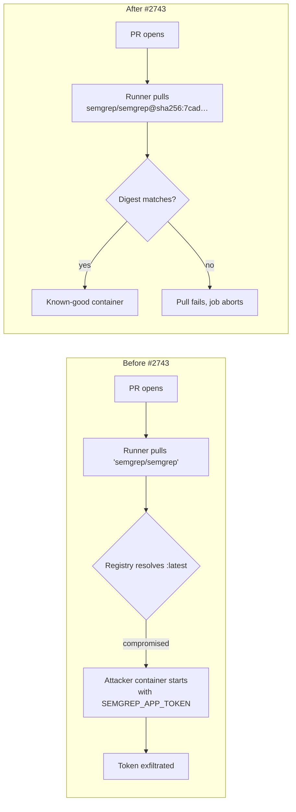

## Summary

Pin the `semgrep/semgrep` container image in `.github/workflows/semgrep.yml` to an immutable `sha256:` digest, closing the supply-chain hole on `SEMGREP_APP_TOKEN`. A bare `image: semgrep/semgrep` resolved to whatever the registry's `:latest` pointer happened to reference at runner-pull time; a takeover or compromised push of that tag would have executed attacker code with the secret in scope. Adds a regression test that scans every workflow file and asserts each `container.image:` reference is pinned to `@sha256:<64-hex>`. Closes #2743.

## Evidence

Workflow diff:

```yaml
container:
  # semgrep/semgrep:latest as of 2026-05-22 (multi-arch index digest).
  # Pinned to close the supply-chain hole on SEMGREP_APP_TOKEN — see #2743.
  # Bump alongside dependabot/renovate updates; quarantine policy: 24h.
  image: semgrep/semgrep@sha256:7cad2bc2d1e44f87f0bf4be6d1fa23aa90fb72015bebc89fb91385d813987a03
```

The pinned digest is the multi-architecture OCI index for `semgrep/semgrep:latest` as published 2026-05-22, satisfying the 24h quarantine window (Issue #1613) on today's date (2026-05-24). The image is external (not under `stSoftwareAU/*`), so the quarantine applies.

Supply-chain attack surface, before and after:



Tests:

```
running 6 tests from ./test/ci/WorkflowContainerImagePinning.ts
extractContainerImages parses the long `container:\n  image:` form ... ok
extractContainerImages parses the `container: name` shorthand ... ok
extractContainerImages parses `services.x.image:` references ... ok
extractContainerImages ignores `container:` mapping headers without inline image ... ok
every workflow `container.image:` is pinned to a sha256 digest (Issue #2743) ... ok
semgrep.yml container image is pinned (Issue #2743 regression) ... ok

ok | 6 passed | 0 failed
```

`./quality.sh --lint-only` passes (fmt, lint, shellcheck).

## Test Plan

- Added `test/ci/WorkflowContainerImagePinning.ts` with six tests:
  - Four unit tests covering the `extractContainerImages` parser (long form, shorthand, `services.*.image:`, and ignoring bare `container:` mapping headers).
  - One workflow-scan test asserting every `container.image:` in `.github/workflows/*.y*ml` ends in `@sha256:<64-hex>`. This is the long-term guard — any future workflow that introduces an unpinned image will fail CI.
  - One narrowly-scoped regression test asserting `semgrep.yml` pins `semgrep/semgrep` specifically.
- Existing `test/ci/SemgrepRulePacks.ts` continues to pass — the rule-pack flags are unchanged.
- Existing `test/ci/WorkflowActionPinning.ts` continues to pass — the `actions/checkout@<SHA>` pin is unchanged.

## Notes for Reviewers

- The digest is the multi-arch OCI image index, not a per-architecture manifest, so it resolves correctly on the `ubuntu-latest` (amd64) runner without locking out future arm64 runners.
- The `extractContainerImages` parser is intentionally lightweight (line-by-line regex, strips trailing comments) rather than a full YAML parser. The risk of a false negative is mitigated by the four parser unit tests; the shape of GitHub Actions workflows is narrow enough that a regex is appropriate here and consistent with the sibling `extractUses` / `extractSemgrepConfigs` helpers.
