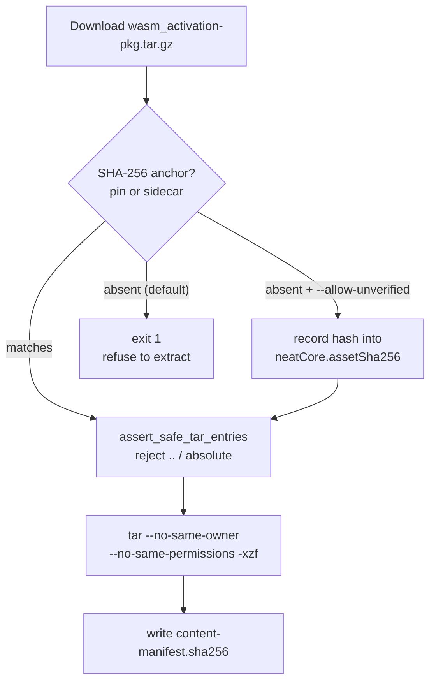

## Summary

`build.sh` previously treated the absence of **both** SHA-256 attestation
sources (the `deno.json` `neatCore.assetSha256` pin and the upstream release
sidecar `wasm_activation-pkg.tar.gz.sha256`) as a non-fatal `WARNING`, then
extracted the downloaded tarball anyway. The post-install content manifest
written from an unattested download is self-referential — `--verify-only`
compares the freshly written files against the freshly written manifest and
always passes — so a swapped release asset would be silently vendored and loaded
by every subsequent `deno test` / `deno publish`. The `tar -xzf` call also had
no path-traversal guard and honoured archived owner/permission bits.

This change hardens the supply-chain posture (issue #2744):

- **Hard error on no anchor.** When neither the pin nor the sidecar attests the
  tarball, `build.sh` now exits non-zero and refuses to extract. A new
  `--allow-unverified` flag opts out to bootstrap a fresh setup; when used, the
  downloaded hash is recorded back into `deno.json` `neatCore.assetSha256` so
  every subsequent run is attested.
- **Committed pin.** `deno.json` now pins `neatCore.assetSha256` (the SHA-256 of
  the current upstream tarball), so the default `./build.sh` and the
  `--verify-only` no-op path used by `quality.sh` always have an anchor and
  never need the override. On refresh, `build.sh` updates the pin alongside
  `neatCore.rev` (values passed via the environment, never interpolated into the
  `deno eval` source).
- **Path-traversal hardening.** Before extraction, the archive is listed with
  `tar -tzf` and any entry whose normalised path is absolute or escapes the
  destination via `..` is rejected. Extraction now uses
  `tar --no-same-owner --no-same-permissions`.

Closes #2744.

## Evidence

Backend/CLI change — no web interface to screenshot. Verified via the test suite
and the full quality gate (`./quality.sh` → `6861 passed | 0 failed`).

## Test Plan

`test/scripts/BuildScriptContentHash.ts` (added):

- `guard_unverified_extract` aborts (rc=1) with no anchor and not allowed,
  permits (rc=0) with `--allow-unverified`, and permits with an existing anchor.
- `assert_safe_tar_entries` accepts a safe `pkg/` archive and rejects both
  path-traversal (`../target.txt`) and absolute-path entries.
- `build.sh --help` advertises `--allow-unverified`.
- `tar` extract passes `--no-same-owner --no-same-permissions`.
- `deno.json` pins a 64-char `neatCore.assetSha256`.

`test/scripts/BuildScriptRetry.ts`:

- Added end-to-end test: a download with no pin and no sidecar exits non-zero
  with an actionable "no SHA-256 source … --allow-unverified" message and leaves
  `pkg/` un-extracted.
- Existing retry test now passes `--allow-unverified` (it exercises the 404
  retry path, not SHA verification) — documented modification.

`docs/CORE_DEPENDENCY_POLICY.md` updated to describe the hard-error behaviour,
the `--allow-unverified` bootstrap, and the extraction hardening.
