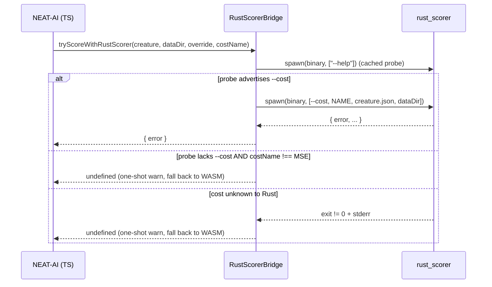

# Pass configured `costName` to `rust_scorer` via `--cost` flag

## Summary

Plumbed `NeatConfig.costName` through to the external `rust_scorer` binary so
the native scorer computes the same cost as the TypeScript training loop
instead of silently defaulting to MSE. Before this change,
`tryScoreWithRustScorer` invoked the binary positionally with no cost flag,
which silently disagreed with the TS layer whenever
`costName !== "MSE"`. Closes #2745.

Changes:

- `RustScorerBridgeInternal.ts` — probe state now records `costSupported`,
  parsed from the binary's `--help` output (looks for `--cost` token).
- `RustScorerBridge.ts` — `tryScoreWithRustScorer` accepts an optional
  `costName: BuiltInCostName`. When supplied and the probe advertises
  `--cost`, the bridge prepends `["--cost", costName]` to argv. When the
  probe lacks `--cost` and a non-MSE cost is configured, the bridge logs a
  one-shot warning and falls back to WASM scoring.
- `BatchRustScorerBridge.ts` — same `--cost` plumbing for the
  once-per-generation batch path.
- `CreatureActivation.ts::evaluateDir` — narrows the configured cost name
  against `BUILT_IN_COST_NAMES` and only off-loads to Rust when it is a
  built-in. Custom (user-registered) costs stay on the TS/WASM path.
- `Fitness.ts` — accepts an optional `costName` constructor argument and
  forwards the narrowed `BuiltInCostName` to the batch bridge.
- `Neat.ts` — passes `this.config.costName` to the `Fitness` constructor.

## Evidence

CLI/bridge change, no UI to screenshot. Verified by the new unit tests in
`test/score/RustScorerBridgeCostFlag.ts` (all 7 pass) and existing
`test/score/*` (127 pass) plus `test/architecture/Fitness*.ts` (31 pass).

### Sequence

## Test Plan

Added `test/score/RustScorerBridgeCostFlag.ts` covering:

- Bridge prepends `--cost <NAME>` when probe advertises the flag.
- Bridge falls back to WASM with a one-shot warning when the probe lacks
  `--cost` and the configured cost is non-MSE.
- Bridge still uses the rust path for MSE when probe lacks `--cost`
  (preserves prior behaviour since MSE is the binary's historical default).
- Custom (user-registered) cost names bypass the rust path entirely — the
  runner is not invoked at all (no probe, no score call).
- Non-zero exit on unknown cost logs exactly one warning across repeated
  calls and returns `undefined` so the caller falls back to WASM.
- Batch bridge prepends `--cost <NAME>` and falls back identically.

Existing tests verified untouched:

- `test/score/RustScorerBridgeHardening.ts` — 5 tests pass.
- `test/score/RustScorerIntegration.ts` — 4 tests pass.
- `test/score/BatchRustScorerBridge.ts` — 10 tests pass.
- `test/architecture/Fitness*.ts` — 31 tests pass.
