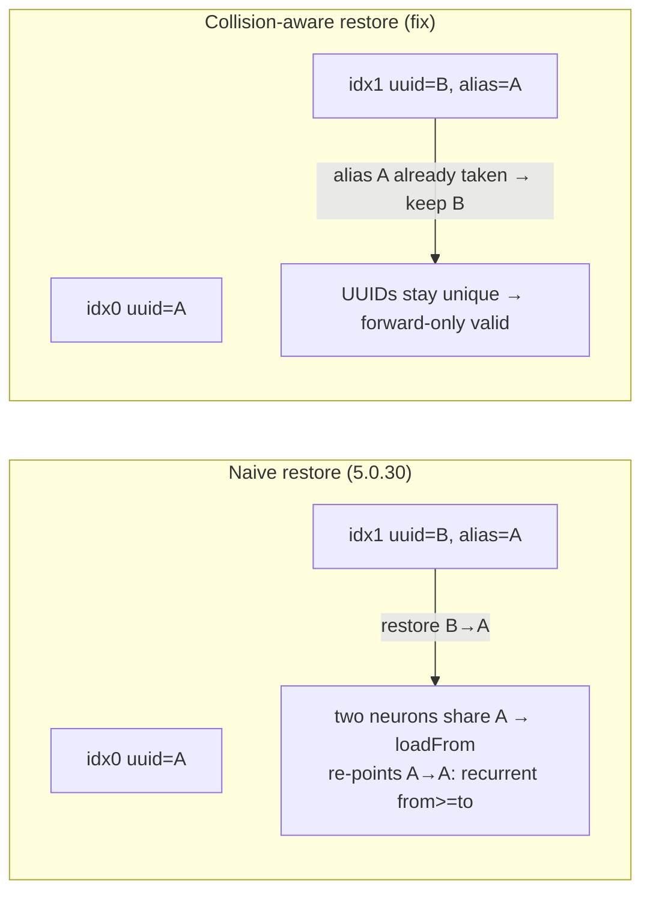

# Fix graft-alias UUID collision that corrupts forward-only offspring (Issue #2746)

## Summary

5.0.30 introduced a regression in incompatible (graft) crossover that forced
NEAT-AI-Examples to pin back to 5.0.29
([PR #473 comment](https://github.com/stSoftwareAU/NEAT-AI-Examples/pull/473#issuecomment-4526352714)).
Breeding failed with
`TopologyError: 🚨 [loadFrom] Recurrent synapse … source=breed:fixAliases` and a
downstream `RangeError: Maximum call stack size exceeded`.

**Root cause:** When parents are genetically incompatible, `editParentByIndex`
renames a parent's unmatched hidden neurons onto the other parent's UUIDs and
records the original UUID in an `alias` tag. After breeding, the
`breed:fixAliases` round-trip restored that original UUID. The restore was **not
collision-aware** — it blindly set `neuron.uuid = alias` even when the alias was
already used by another neuron in the offspring. The duplicate UUID made
`loadFrom` map that UUID to a single index and re-point the other neuron's
synapses at it, turning a forward edge into a recurrent one (`from >= to`) on a
forward-only creature, which trips the recurrent-synapse `TopologyError`.

**Fix:** Extracted the restore into `src/breed/RestoreGraftAliases.ts` and made
it collision-aware — an alias is only restored when it does not duplicate a UUID
already present in the offspring; otherwise the neuron keeps its deduplicated
identity (the alias tag is consumed either way). `Offspring.breed` now calls
`restoreGraftAliases(fixed)`.

Closes #2746.

## Evidence

This is a backend/library change with no web interface, so no screenshot
applies. Evidence is the regression reproduction and unit tests.

Running the **pre-fix** restore logic against the minimal collision graph
reproduces the exact error from the bug report:

```
🚨 [loadFrom] Recurrent synapse 2->2 (fromUUID=A, toUUID=A, depth=0)
on forward-only creature (... source=fromJSON). This indicates upstream
corruption (Issue #2514).
```

After the fix the same graph loads as a valid forward-only creature.



## Test Plan

- Added `test/breed/RestoreGraftAliases.ts`:
  - `restores a non-colliding alias` — happy path: alias restored, tag removed,
    synapse endpoints rewritten.
  - `skips alias that collides with an existing UUID` — regression test for the
    recurrent-synapse scenario; asserts UUIDs stay unique and the export loads
    and validates as forward-only.
- Re-ran existing breed/serialisation suites
  (`OffspringForwardOnlyChildAlwaysValidates`,
  `OffspringEnsureUniqueUuidRoundTrip`, `OffspringBreed`, `Breed`,
  `EditParentByIndex`) — all pass.
- `./quality.sh` passes (fmt, lint, type-check, tests).
