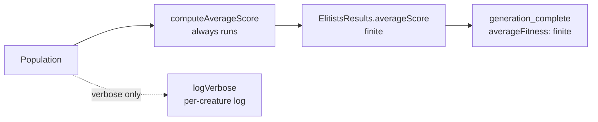

# PR Summary — Issue #2753

## Summary

`generation_complete` training events emitted `averageFitness: NaN` on the
default code path (`verbose: false`), because `makeElitists()` only computed the
population mean when `verbose === true`. Downstream consumers (loggers, charts,
TSV exports) could not distinguish "average not computed" from a genuine
numerical failure, and `.toFixed()` / JSON serialisation surfaced `NaN` to
operators.

This applies **Option 1** from the issue: the population average is now always
computed for `generation_complete`. The `verbose` flag continues to control only
the per-creature training log emitted by `logVerbose()`, not whether the
aggregate is available to telemetry — matching how `bestFitness` is always
populated.

Changes:

- `src/architecture/ElitismUtils.ts`: extracted a `computeAverageScore()` helper
  that sums `creature.score` over the population. `makeElitists()` now always
  calls it to populate `averageScore`; `verbose` only gates `logVerbose()`.
- `src/config/TrainingEvent.ts`: clarified the `averageFitness` doc comment — it
  is always a finite number, independent of `verbose`.

Closes #2753.

## Evidence

Backend/CLI change — no web interface to screenshot. Verified via unit tests
(see Test Plan). The `./quality.sh` gate passed cleanly: `6865 passed | 0 failed`.

### Data flow

## Test Plan

- `test/architecture/ElitismUtils.ts`:
  - Added `computeAverageScore` tests (mean, single creature, empty-population throw).
  - Updated the former `averageScore is NaN when not verbose` test (which
    documented the old buggy behaviour) to
    `averageScore is computed when not verbose`, asserting a finite mean of `0.7`.
- `test/config/TrainingEvent.ts`:
  - Added regression test `averageFitness is finite when verbose is false
    (Issue #2753)`, evolving with `verbose` omitted and asserting every
    `generation_complete` event has a finite `averageFitness`.
- Full `./quality.sh` gate passed (lint, format, type-check, WASM sync, all tests).
