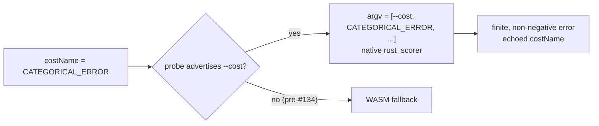

## Summary

Adds an end-to-end guard that keeps the batch and per-creature `rust_scorer`
bridges wired for the `CATEGORICAL_ERROR` cost, so classification workloads
(e.g. MNIST) do not silently fall back to WASM scoring once a scorer release
supporting the cost is deployed. `CATEGORICAL_ERROR` is one of the seven
`BUILT_IN_COST_NAMES`; #2745 already plumbs any built-in `costName` through to
the binary via `--cost <NAME>`, so this change locks that contract for the
classification cost with tests + documentation rather than new bridge logic.

Closes #2756.

## Evidence

Backend/CLI change — no web interface to screenshot. Verified via the new Deno
test suite below (`deno test test/score/RustScorerCategoricalError.ts`): 3
passed, 1 ignored (the live-binary smoke is gated on
`NEAT_AI_RUST_SCORER_BINARY_PATH`).

The 3-class fixture has an analytically-known argmax misclassification rate of
`2/8 = 0.25` (derived at runtime via `CategoricalError.calculate`, not
hard-coded); the mock runner simulates the scorer returning that value and the
bridge passes it through unchanged.

## Test Plan

New `test/score/RustScorerCategoricalError.ts`:

- `per-creature bridge prepends --cost and returns analytic error` — asserts
  `tryScoreWithRustScorer` prepends `["--cost", "CATEGORICAL_ERROR", ...]` and
  returns the fixture's known `0.25` error.
- `batch bridge prepends --cost in directory mode` — same argv contract for
  `tryBatchScoreWithRustScorer`, plus echoed `costName`.
- `Fitness.calculate batch path does not log reconciliation failure` — drives
  the batch path with `costName: "CATEGORICAL_ERROR"` and asserts no
  `Batch rust scorer reconciliation failed` error is logged and the worker
  fallback is bypassed.
- `live rust_scorer smoke (requires real binary)` — opt-in, gated on
  `NEAT_AI_RUST_SCORER_BINARY_PATH`; asserts a finite non-negative error.

Custom-cost behaviour is unchanged (still TS/WASM-only) — covered by the
existing `RustScorerBridgeCostFlag.ts` suite.

Docs: added the `CATEGORICAL_ERROR` row and a "Native scorer off-load" note to
`docs/api/COSTS_AND_ACTIVATIONS.md`, and documented native off-load eligibility
in `src/config/RustScorerConfig.ts`.

## Quality gate

`./quality.sh` passes except for the pre-existing flaky heap-growth test
`test/creature/evolveRL_heapStability_test.ts` (Issue #2693), which is GC
nondeterministic — it measured 392 KB/gen on the clean tree (pass) and 569–627
KB/gen across other runs (fail), independent of this change (an isolated test
file + doc edits cannot affect evolveRL heap usage). All 6873 other tests,
including the four new ones, pass.
