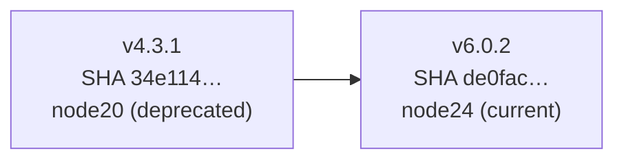

## Summary

Bumped pinned `actions/checkout` SHA from
`34e114876b0b11c390a56381ad16ebd13914f8d5` (v4.3.1, Node 20) to
`de0fac2e4500dabe0009e67214ff5f5447ce83dd` (v6.0.2, Node 24) across all GitHub
Actions workflows to eliminate the Node 20 runner-deprecation warnings reported
in #2763. Closes #2763.

## Evidence

This is a workflow/config change with no UI surface and no runtime behaviour
change — there is nothing to screenshot. Verification:

- `./quality.sh --lint-only < /dev/null` passes cleanly (formatting, linting,
  bash checks).
- `grep -rn 'actions/checkout@' .github/workflows` confirms every pin now
  resolves to `de0fac2e4500dabe0009e67214ff5f5447ce83dd` with a matching
  `# actions/checkout@v6.0.2` comment.
- Upstream `action.yml` at `v6.0.2` declares `using: node24`, so the deprecation
  warning will no longer be emitted.

Files updated (11):

- `.github/workflows/actionlint.yml`
- `.github/workflows/deno-outdated.yml`
- `.github/workflows/dependency-review.yml`
- `.github/workflows/github-release.yml`
- `.github/workflows/markdown-lint.yml`
- `.github/workflows/publish.yml`
- `.github/workflows/quality.yml`
- `.github/workflows/semgrep.yml`
- `.github/workflows/shellcheck.yml`
- `.github/workflows/spellcheck.yaml`
- `.github/workflows/update-package-version.yml`

`coverage.yaml` was already on `v6.0.2` and is unchanged.

## Test Plan

- [x] `./quality.sh --lint-only < /dev/null` passes
- [ ] On merge, confirm workflow run logs no longer show
      `Node.js 20 actions are deprecated` for `actions/checkout`
