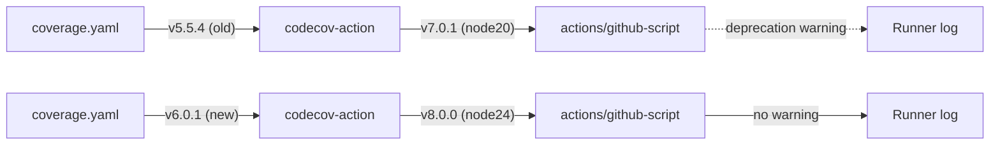

## Summary

Bumped `codecov/codecov-action` from `v5.5.4`
(`75cd11691c0faa626561e295848008c8a7dddffe`) to `v6.0.1`
(`e79a6962e0d4c0c17b229090214935d2e33f8354`) in
`.github/workflows/coverage.yaml`. The v5.5.4 composite action invoked
`actions/github-script@60a0d83039c74a4aee543508d2ffcb1c3799cdea` (v7.0.1,
`node20`) which triggered the runner deprecation warning surfaced on
[run 26382950042](https://github.com/stSoftwareAU/NEAT-AI/actions/runs/26382950042).
The v6.0.1 release bumps the bundled `actions/github-script` to v8.0.0
(`ed597411d8f924073f98dfc5c65a23a2325f34cd`), which runs on `node24` and
clears the deprecation warning ahead of the 2026-09-16 node20 removal
date. Closes #2768.

## Evidence

This is a CI workflow change — no UI, no benchmark. Verification:

```bash
# Confirm v6.0.1 codecov composite uses github-script v8.0.0
gh api 'repos/codecov/codecov-action/contents/action.yml?ref=e79a6962e0d4c0c17b229090214935d2e33f8354' \
  --jq '.content' | base64 -d | grep github-script
# -> uses: actions/github-script@ed597411d8f924073f98dfc5c65a23a2325f34cd # v8.0.0

# Confirm github-script v8.0.0 runs on node24
gh api 'repos/actions/github-script/contents/action.yml?ref=ed597411d8f924073f98dfc5c65a23a2325f34cd' \
  --jq '.content' | base64 -d | grep using
# -> using: node24
```

Resolution chain visualised:



Other action SHAs referenced in the run-26382950042 warning
(`actions/upload-artifact@ea165f8d65b6e75b540449e92b4886f43607fa02`) are
tracked by separate audit issues and are intentionally out of scope here
per the project's change-scope guidance.

## Deno regression avoided

The repo is a Deno project (`deno.json` present at root). The fix is a
pure workflow-pin bump — no Node tooling, `package.json`, or
`node_modules/` was introduced.

## Test Plan

- `./quality.sh --lint-only` passes (fmt, lint, type-check, bash check).
- Workflow YAML parses cleanly (`python3 -c "import yaml; ..."`).
- Coverage workflow continues to upload JUnit XML + lcov artefacts via
  the bumped action; no input/output schema changes between v5.5.4 and
  v6.0.1 — only the bundled runtime was bumped.
