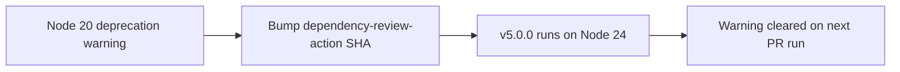

## Summary

Bumped `actions/dependency-review-action` from v4.9.0 (Node 20) to v5.0.0
(Node 24) in `.github/workflows/dependency-review.yml` to clear the Node 20
runner-deprecation warning reported by the GitHub Actions audit. Closes #2769.

The new SHA `a1d282b36b6f3519aa1f3fc636f609c47dddb294` corresponds to the
v5.0.0 release tag, which migrates the action runtime from Node 20 to Node 24
(upstream PR #1084). Action pin remains a 40-char commit SHA per the project's
supply-chain policy.

## Evidence

Backend/CI-only change — no UI to screenshot. The change is a single-line SHA
bump in a GitHub Actions workflow.

Verification:

- Latest upstream release confirmed via
  `gh api repos/actions/dependency-review-action/releases/latest`:
  `v5.0.0`, published 2026-05-08, runtime upgraded to Node 24.
- SHA `a1d282b36b6f3519aa1f3fc636f609c47dddb294` resolved via
  `gh api repos/actions/dependency-review-action/git/refs/tags/v5.0.0`.
- Workflow comment updated alongside the SHA so the pinned tag matches the
  resolved commit.

## Test Plan

- The change is a workflow SHA bump; it will be exercised by the
  `Dependency review` job on the PR itself.
- No NEAT-AI source code changed, so no Deno tests are affected.
- Confirmed no other references to the old SHA remain in
  `.github/workflows/` (only historical mentions in archived PR summaries).
