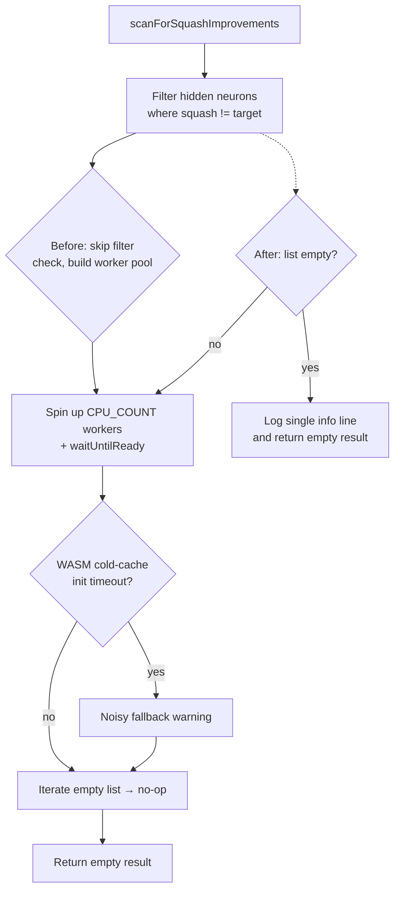

## Summary

`scanForSquashImprovements` now early-returns **before** any worker is created
when the filtered hidden-neuron list is empty. Forward-only champions (e.g.
MNIST `784 → 10` with zero hidden neurons) previously spun up a worker pool
for a guaranteed no-op scan; under heap pressure the WASM cold-cache init
could hit the 60s timeout and emit a noisy stack trace ("Worker init failed;
falling back to direct execution…") for work that had nothing to do.

The filter (`type === "hidden" && squash !== targetSquash`) runs first; if
the result is empty, the function logs one info line and returns a clean
no-op result. No worker pool is constructed, no WASM init is attempted, and
no fallback path is taken.

Closes #2783.

## Evidence

This is a backend/CLI change — no UI to screenshot. Verified by:

- New unit tests in `test/intelligentDesign/ImproveSquashScan.ts` that
  inject a counting `createWorker` factory and assert it is invoked **zero
  times** when there are no hidden neurons (or when every hidden neuron
  already has the target squash).
- Full quality gate (`./quality.sh --skip-discovery --skip-wasm`): 6881
  tests passed, 0 failed.

### Control flow before vs after

## Test Plan

Tests added to `test/intelligentDesign/ImproveSquashScan.ts`:

- `scanForSquashImprovements early-returns without creating any worker when
  there are no hidden neurons (Issue #2783)` — builds a forward-only
  `Creature(3, 2, { layers: [] })`, asserts `createWorker` is invoked zero
  times, `score` is called zero times, and the result is a clean no-op
  (`tested = attempted = failed = improved = 0`, no errors, not timed out).
- `scanForSquashImprovements early-returns when every hidden neuron already
  has the target squash (Issue #2783)` — covers the second path that
  produces an empty filtered list.

Existing tests (`records improvement then upgrades via alternative squash`,
`terminates workers if a file write fails`, `reports timedOut when task
remains pending past deadline`) continue to pass — the early-return only
triggers when the filtered list is empty.
