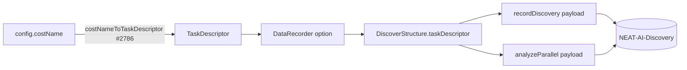

## Summary

Send the cost `TaskDescriptor` (from the mapping helper, #2786) to Discovery on
both wire entry points: `recordDiscovery()` (`RustRecordInput`) and
`analyzeParallel()` (`RustParallelAnalysisInput`). Built-in costs send their
canonical descriptor name; any custom JS cost collapses to the neutral `OTHER`
descriptor inside `costNameToTaskDescriptor`, so a custom cost's real name never
leaves the process. The field is optional on the wire, so an older Discovery
build that ignores it still works. Closes #2785.

### Touch points

- `RustDiscoveryTypes.ts` — added optional `taskDescriptor?: TaskDescriptor` to
  `RustRecordInput` and `RustParallelAnalysisInput`.
- `DiscoverStructureTypes.ts` / `DiscoverStructureBase.ts` — new
  `taskDescriptor` option, stored on the coordinator and defaulting to the
  neutral `OTHER_TASK_DESCRIPTOR` when no cost is supplied.
- `DiscoverStructureRecording.ts` — populates `taskDescriptor` on the
  `recordDiscovery` payload.
- `RustAnalysisCache.ts` / `DiscoverStructureAnalysis.ts` — forwards the stored
  descriptor onto the `analyzeParallel` payload (omitted when absent).
- `DataRecorder.ts` — maps `config.costName` → descriptor via the #2786 helper
  so production discovery runs send the real built-in descriptor.

### Deno regression avoided

Implemented entirely with Deno-native TypeScript and `deno test`; no Node
tooling, dependencies, or config introduced.

## Evidence

Backend/FFI change only — no web interface to screenshot. Verified via unit
tests using the existing stubbed-deps harness (`recordDiscovery` /
`analyzeParallel` deps capture the wire payloads).

Custom cost path: any unrecognised name → `OTHER` + neutral descriptor before
it ever reaches `Rec`/`Anl`, so the real custom name is never serialised.

## Test Plan

Added `test/ErrorGuidedStructuralEvolution/DiscoveryTaskDescriptor.ts`:

- `recordDiscovery` carries the configured built-in descriptor (canonical name).
- `recordDiscovery` defaults to the neutral `OTHER` descriptor when no cost is
  configured.
- `analyzeParallel` carries the configured descriptor through the full
  record → merge → analyse path.
- `ensureRustCombinedAnalysis` never leaks a custom cost name — sends `OTHER`,
  and the raw custom name is absent from the serialised payload.
- `analyzeParallel` omits the descriptor field when none is supplied (backward
  compatible).

Full `./quality.sh` passes: 6930 passed, 0 failed, 5 ignored.
