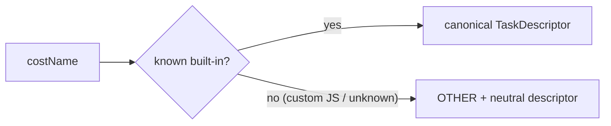

# Add a costName → TaskDescriptor mapping helper

## Summary

Adds a pure helper, `costNameToTaskDescriptor`, that maps a configured cost name
to the structural `TaskDescriptor` NEAT-AI sends to Discovery. Built-in costs
map to their canonical descriptor (topology / range / output squash family); any
custom JS cost or unrecognised name collapses to the `OTHER` sentinel with a
neutral descriptor, and the custom cost's real name is **never** emitted. No
wire/FFI changes are included — sending the descriptor is handled separately
(#2785). Closes #2786.

New file `src/costs/CostTaskDescriptor.ts` exports the descriptor types
(`TaskDescriptor`, `CostTopology`, `CostRange`, `OutputSquashFamily`,
`DescriptorCostName`), the `OTHER_COST_NAME` / `OTHER_TASK_DESCRIPTOR`
sentinels, and the `costNameToTaskDescriptor` function. All are re-exported from
`mod.ts`.

### Mapping table (Issue #2786)

| costName              | topology    | range         | output squash family |
| --------------------- | ----------- | ------------- | -------------------- |
| MSE, MAE              | independent | unbounded     | unbounded            |
| MAPE, MSLE            | independent | positive      | positive             |
| BINARY_CROSS_ENTROPY  | independent | unit          | bounded_unipolar     |
| CROSS_ENTROPY         | simplex     | unit          | bounded_unipolar     |
| HINGE                 | margin      | signed_unit   | bounded_bipolar      |
| CATEGORICAL_ERROR     | one_hot     | unit          | bounded_unipolar     |
| **OTHER (custom JS)** | **unknown** | **unbounded** | **any**              |

### Design notes

- A `Map` (not a plain object) backs the lookup so arbitrary inputs such as
  `"toString"` or `"__proto__"` cannot resolve to inherited prototype members.
- Descriptors are `Object.freeze`d and safe to share without defensive copies.
- The input string is never reflected into the returned descriptor, so a custom
  cost name cannot leak to Discovery.

## Evidence

Backend/library change only — no web interface to screenshot. Verified via the
unit tests below (`15 passed | 0 failed`), plus `deno fmt`, `deno lint`, and
`deno check` across the tree.

## Test Plan

Added `test/costs/CostTaskDescriptor.ts`:

- Each of the eight named costs in the table maps to its exact descriptor.
- Every registered built-in (`BUILT_IN_COST_NAMES`) echoes its own name and a
  non-`unknown` topology.
- Unknown cost → neutral `OTHER` descriptor.
- A custom cost name is never reflected back into the descriptor JSON.
- Empty string, prototype member names, and non-string input all map to `OTHER`.
- Returned descriptors are frozen.
