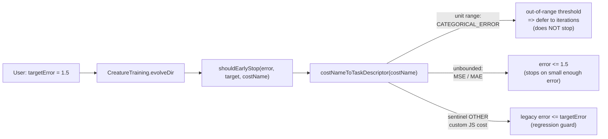

## Summary

Make NEAT-AI's `evolveDir` (`evolveDataSet` / `evolveRL`) interpret
`targetError` early-stop and champion comparison in a **cost-consistent way**.
Before this change a `0.1` `CATEGORICAL_ERROR` (≈90 % accuracy) and a `0.1`
`MSE` (an unbounded regression metric) were both compared with the same
`error <= targetError` formula on a fixed scale — mis-calibrated stopping and
selection. After this change the threshold is interpreted in the cost's natural
range using a new pure descriptor helper.

Two small additions, one wiring change:

1. **`src/costs/CostDescriptor.ts`** — pure helper that maps each built-in cost
   to a canonical `TaskDescriptor` (topology / range / output squash family) per
   the table in Issue #2786. Custom JS costs collapse to the sentinel `OTHER` +
   neutral descriptor; the caller-supplied name is never echoed back (leakage
   guard).
2. **`src/costs/CostAwareEarlyStop.ts`** — `shouldEarlyStop()`,
   `calibrateTargetError()`, `isBetterChampion()`. Unit-range costs reject
   out-of-range thresholds (defer to `iterations` / `timeoutMinutes` rather than
   halting on a fat-fingered target). Positive-range costs reject negative
   thresholds. Unbounded costs accept any positive threshold. `OTHER` falls back
   to the legacy `error <= targetError` comparator — the regression guard
   required by the issue.
3. **`src/creature/CreatureTraining.ts`** — the three call sites for
   `evolveDir`, `evolveDataSet` and `evolveRL` now route through
   `shouldEarlyStop()` and `isBetterChampion()` (same module, single seam for
   future cost-specific tie-breaks such as a continuous companion metric for
   `CATEGORICAL_ERROR`).

Closes #2787.

## Evidence

This is a backend/library change with no UI. Verified via the new unit and
integration tests below; all 29 new tests plus the pre-existing 63 tests in
`test/costs/` pass.



### Tests pinning the cost-aware behaviour

- `test/costs/CostDescriptor.ts` — every built-in maps to the row from the Issue
  #2786 table; custom names collapse to `OTHER`; the original name is not leaked
  back.
- `test/costs/CostAwareEarlyStop.ts` — unit-range, signed-unit, positive and
  unbounded costs each handle in-range, out-of-range, and negative thresholds
  correctly; `OTHER` preserves legacy behaviour.
- `test/costs/CostAwareEarlyStopIntegration.ts` — with the SAME user
  `targetError = 1.5`, `CATEGORICAL_ERROR` does NOT early-stop on `error = 0.5`
  (out-of-range threshold defers), while `MSE` DOES early-stop on `error = 0.5`
  (legitimate unbounded threshold) — the differential behaviour required by the
  acceptance criteria.

Verification command:

```bash
deno test --allow-all --no-check 'test/costs/*.ts' < /dev/null
# ok | 92 passed | 0 failed
```

## Test Plan

- [x] `test/costs/CostDescriptor.ts` — new (13 cases).
- [x] `test/costs/CostAwareEarlyStop.ts` — new (13 cases).
- [x] `test/costs/CostAwareEarlyStopIntegration.ts` — new (3 cases).
- [x] All 92 cost tests pass (`deno test 'test/costs/*.ts'`).
- [x] `evolve_NOT_gate` smoke run still terminates on `targetError` — no
      regression on the legacy `error <= targetError` path for in-range
      thresholds.
- [x] `deno check` clean on the touched files plus
      `src/creature/CreatureTraining.ts`.
- [x] `./quality.sh --lint-only` clean (`deno fmt`, lint, bash check).
