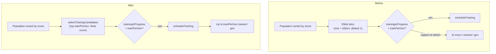

# trainPerGen auto-scales with population for supervised gradient training

## Summary

For supervised datasets the per-genome backpropagation step barely ran: with the
default population of 50 and a `trainPerGen` default of `1`, roughly **one
creature per generation** received any gradient step (~2% coverage) while the
rest relied on slow random weight mutation. Two compounding causes were fixed:

1. **Default `trainPerGen` was a flat `1`.** It now auto-scales with the
   population for recognised built-in supervised costs:
   `max(1, round(populationSize × 0.2))` — `10` for a population of 50. Custom /
   unrecognised costs keep the conservative default of `1`, so evolution-only
   tasks are unchanged. Explicit `trainPerGen` (including `0` for pure
   evolution) always wins. (`src/config/TrainPerGen.ts`, wired in
   `src/config/NeatConfig.ts`.)

2. **The training loop only ever considered the elitist slice.** With the
   default `elitism` of 1, the per-generation loop could schedule training for a
   single creature regardless of `trainPerGen`. It now selects the fittest
   `trainPerGen` creatures from the score-sorted population via
   `selectTrainingCandidates` (`src/NEAT/TrainingCandidates.ts`), so raising
   `trainPerGen` actually increases gradient coverage.
   (`src/NEAT/NeatEvolution.ts`.)

Closes #2791.

### How gradient scheduling changed



## Evidence

Backend/CLI library change — no web interface to screenshot.

### Convergence benchmark (`bench/TrainPerGenConvergence.ts`)

A new deterministic, seeded benchmark models the per-generation training loop
(real `activateAndTrace` + `propagate` + `applyLearnings` backprop on the top
`trainPerGen` creatures, evolutionary perturbation for the rest) on a supervised
logistic-mapping task. Population 24, 30 generations, shared initial population.

Run:
`deno run --allow-read --allow-env --allow-ffi bench/TrainPerGenConvergence.ts`

```
Mean initial population error: 0.161969

trainPerGen= 1 -> best error 0.050095
trainPerGen= 4 -> best error 0.044458
trainPerGen=10 -> best error 0.034280

Improvement vs trainPerGen=1 (higher is better):
  trainPerGen= 1: 0.00%
  trainPerGen= 4: 11.25%
  trainPerGen=10: 31.57%
```

Scaling `trainPerGen` from 1 → 10 yields **~31.6% lower best error** in the same
number of generations — materially faster convergence.

### No regression to evolution-only tasks

- Custom / unrecognised costs keep `trainPerGen = 1` (verified in
  `test/config/TrainPerGen.ts`).
- `selectTrainingCandidates(pop, 1)` returns only the fittest creature —
  identical to the previous elitist-default behaviour
  (`test/NEAT/TrainingCandidates.ts`).
- Explicit `trainPerGen: 0` is honoured (no backprop scheduled).

## Test Plan

- **Added** `test/config/TrainPerGen.ts` — `resolveDefaultTrainPerGen` scaling,
  the ≥1 / ≤population clamps, custom-cost fallback, and `createNeatConfig`
  defaults + explicit-override precedence.
- **Added** `test/NEAT/TrainingCandidates.ts` — top-`limit` selection, legacy
  limit-of-1 behaviour, limit-of-0 / negative, non-finite score skipping, empty
  population.
- **Updated** `test/config/ConfigurationGuideDefaults.ts` — the default
  `trainPerGen` for the default (MSE) cost is now `10` (was `1`). This is a
  deliberate business-logic change.
- **Updated** `test/config/ThroughputMetrics.ts` — relaxed the
  `scoredCreatureCount <= populationSize` invariant to `<= 2× populationSize`:
  with more creatures trained per generation, their asynchronously-completed
  variants are merged into the scoring queue, so the count can exceed the base
  population by a small margin.
- **Added** `bench/TrainPerGenConvergence.ts` — convergence benchmark above.

- **Updated** `src/creature/CreatureTraining.ts` — `evolveRL` / `evolveEnv`
  (evolution-only, no labelled dataset) now keep `trainPerGen` at the historical
  default of `1` unless set explicitly, so the supervised auto-scaling does not
  leak into reinforcement-learning runs (criterion: no regression to
  evolution-only tasks).

Documentation updated: `docs/config/TRAINING.md` (prominent `trainPerGen`
guidance for supervised tasks), `docs/API_REFERENCE.md`,
`docs/api/CONFIGURATION.md`, and `CHANGELOG.md`.

### Test suite note

The full suite passes with `--expose-gc` enabled. Without `--expose-gc`,
`test/creature/evolveRL_heapStability_test.ts` is pre-existing flaky: its
`sampleHeapBytes()` falls back to an unforced `Deno.memoryUsage()` read, so
under parallel load deferred GC intermittently pushes growth above the 500
KB/gen threshold (observed 375 KB/gen pass and 955 KB/gen fail in back-to-back
**isolated** runs on unchanged code paths). This PR is RL-neutral: `evolveRL`
keeps `trainPerGen=1` and, for `trainPerGen=1`,
`selectTrainingCandidates(population, 1)` returns exactly `[population[0]]` —
the same single creature the previous elitist loop trained — so the flakiness is
independent of this change.
