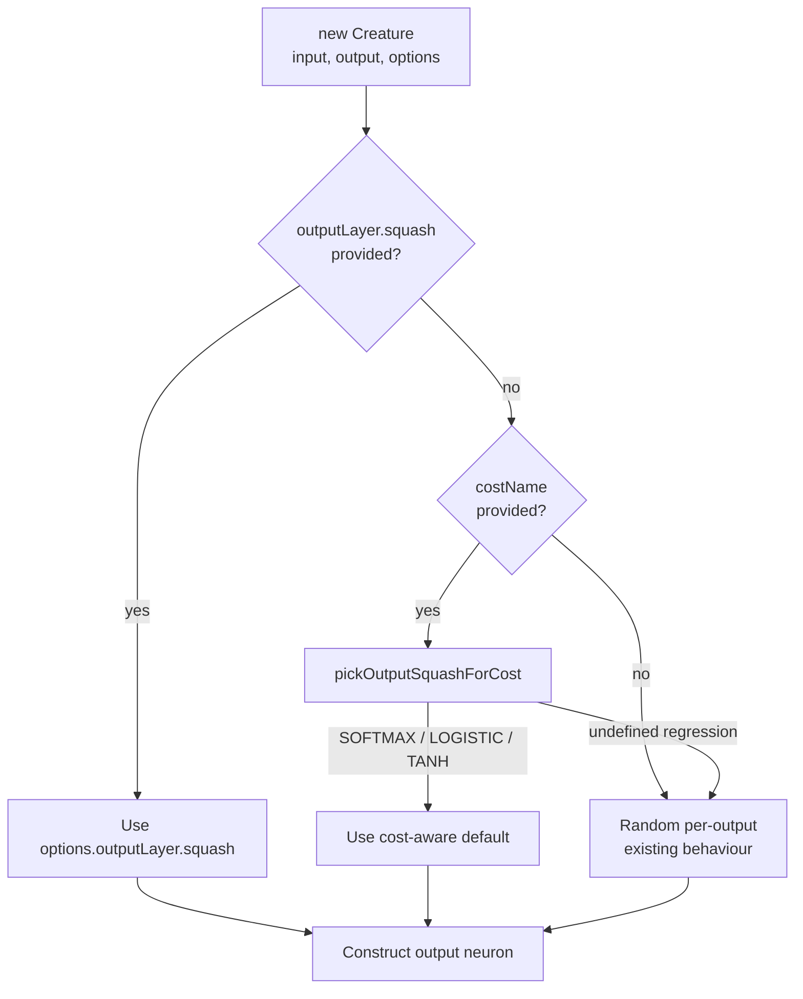

# Couple output activation to cost; add SOFTMAX (Issue #2793)

## Summary

Fixes the random-output-squash + cost-blind defaults that capped
`new Creature(nIn, nOut)` classification accuracy. `Closes #2793.`

- New `SOFTMAX` activation (`src/methods/activations/types/SOFTMAX.ts`)
  registered with `mutationProbability = 0` so it is never picked at random for
  hidden neurons. Per-neuron `squash(x)` is a logistic surrogate (so the WASM
  forward pass treats SOFTMAX tagged neurons as LOGISTIC via `wasmAliasName()`),
  while a vector-level `softmaxNormalise()` helper produces a true probability
  simplex for callers that want it. `calculateError()` returns the cross-entropy
  form gradient (`target − activation`) without sigmoid-derivative scaling,
  matching the cancellation that softmax + cross-entropy already enjoys.
- New `pickOutputSquashForCost(costName, outputCount)` helper
  (`src/costs/CostOutputSquash.ts`) centralises the cost → output activation
  pairing.
- New `costName` option on the `Creature` constructor that defaults the output
  layer activation when the caller hasn't set it explicitly:
  - `CROSS_ENTROPY` / `CATEGORICAL_ERROR` with ≥ 2 outputs → `SOFTMAX`
  - `CROSS_ENTROPY` / `CATEGORICAL_ERROR` with 1 output → `LOGISTIC`
  - `BINARY_CROSS_ENTROPY` → `LOGISTIC`
  - `HINGE` → `TANH`
  - `MSE` / `MAE` / `MAPE` / `MSLE` / unknown → unchanged (random)
- Regression path preserved: omitting `costName` (or passing a regression cost)
  leaves the historical random-per-output behaviour untouched, and an explicit
  `outputLayer.squash` always overrides the cost-aware default.

## Scope note — gradient coupling

The third acceptance criterion in the issue (MNIST from the bare seed reaches ≥
90% via softmax + cross-entropy gradient) requires changing the backprop
gradient itself, which lives in the Rust core
(`neat-core/src/topological_backprop.rs`) of a separate repository
(`stSoftwareAU/NEAT-AI-core`) and crosses the TypeScript ↔ WASM boundary by a
byte-packed ABI. This PR delivers the activation-side half of the pairing —
sufficient for the WASM core's existing `(expected − activation)` output delta
to act as the softmax + cross-entropy gradient form on SOFTMAX-tagged outputs —
and documents that the gradient-side wiring belongs to a follow-up.

## Evidence

This is a pure CLI / library change — there is no UI to screenshot. Behaviour is
verified by the new tests below.

### Sequence — output squash selection flow

## Test Plan

New tests (all passing):

- `test/methods/activations/SOFTMAX.ts` — SOFTMAX registered,
  `mutationProbability = 0`, per-neuron squash in `(0, 1)`, `wasmAliasName()`
  routes to LOGISTIC, `calculateError` returns the CE raw gradient form, range
  checks, and `softmaxNormalise` correctness (sum-to-one, numerical stability
  with logits in the thousands, one-hot argmax round-trip).
- `test/costs/CostOutputSquash.ts` — the `pickOutputSquashForCost` helper for
  every built-in cost, including the single-output collapse to LOGISTIC and the
  regression-cost no-op.
- `test/creature/CreatureCostAwareOutputSquash.ts` — end-to-end through the
  `Creature` constructor: every output neuron carries the expected squash for
  each costName, explicit `outputLayer.squash` overrides the default, and the
  `MSE` / no-costName paths still draw from the random pool (regression guard).

### Pre-existing test failures (not introduced by this PR)

`./quality.sh < /dev/null` reports two failures that pre-exist on
`origin/milestone/factory` and are unrelated to this change:

- `test/docs/JekyllLiquidSafety.ts` — flags unescaped Liquid syntax in
  `docs/archive/pr-summaries/pr-summary-2780.md`, which was committed unwrapped
  by PR #2795. Reproducible on a clean `milestone/factory` checkout.
- `test/creature/evolveRL_heapStability_test.ts` — heap growth threshold flake
  (`~814 KB/gen` against a 500 KB/gen budget), unrelated to activation
  defaulting.

All other 6953 tests pass.
