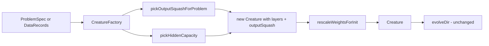

## Summary

Adds a Creature Factory that seeds a smarter _initial_ creature from
observations, outputs, and cost — replacing the bare
`new Creature(nInput, nOutput)` with random output activations as the default
starting point for evolution. The factory only changes the seed; mutation,
Discovery, breeding, and training proceed exactly as today.

The factory lives in its own module (`src/architecture/CreatureFactory.ts`) so
`Creature.ts` (already 1.2k lines) does not grow beyond a pair of one-line
static forwarders. `evolveDir` and every other existing signature are untouched.

Closes #2794.

## What the factory decides

| Decision             | Source                                      | Rule                                                                                                                                               |
| -------------------- | ------------------------------------------- | -------------------------------------------------------------------------------------------------------------------------------------------------- |
| Output activation    | `cost` + `outputs` + declared `outputRange` | Cost-aware default (SOFTMAX / LOGISTIC / TANH), then bounded-range bias (TANH for `[-1,1]`, LOGISTIC for `[0,1]`), else IDENTITY                   |
| Hidden width         | `(inputs, outputs)`                         | Heaton (`⅔·n_in + n_out`, capped `<2·n_in`) for small problems; geometric mean `√(n_in·n_out)` for high-dim (≥100 inputs) to avoid 2000-wide seeds |
| Hidden squash        | Caller hint or default                      | Defaults to `RELU`, pairs with He init                                                                                                             |
| Weight init          | Activation family at destination            | He (`√(2/fan_in)`) for ReLU family; Xavier (`√(2/(fan_in+fan_out))`) for tanh/sigmoid family; LeCun otherwise                                      |
| Output bias          | `forDataset` scan only                      | Mean of target column, but only when output is IDENTITY (regression); classification activations leave bias alone                                  |
| Dead-feature pruning | `forDataset` scan only                      | Synapses out of constant inputs zeroed at construction                                                                                             |

The dataset-scan tier (`creatureForDataset`) deliberately does **not** normalise
inputs: once `inputRange` is declared, normalisation has no remaining motive.
Only the truly non-declarable signals are inferred (dead features, target mean).

## Public API (additive)

```ts
// Metadata-only (no scan)
const seed = Creature.forProblem({
  inputs,
  outputs,
  cost,
  inputRange,
  outputRange,
});

// Optional data scan
const seed2 = Creature.forDataset(trainingData, { cost });

await seed.evolveDir(dir); // unchanged
```

Module-level functions are also exported for callers who prefer not to go
through the static facade: `creatureForProblem`, `creatureForDataset`,
`scanTrainingData`, `pickOutputSquashForProblem`, `pickHiddenCapacity`,
`targetInitStddev`, and `rescaleWeightsForInit`.

## Architecture



## Evidence

Backend-only change with no UI surface. The factory is exercised by a new
unit-test suite — see Test Plan below. All 33 new tests pass; the existing
creature, costs, and architecture test suites continue to pass. The worked
example from the issue (3000 inputs, 1 output, MSE, `outputRange: [-1, 1]`) now
seeds a 55-wide RELU hidden layer with He scaling and a TANH output, exactly the
"small + bounded" prescription.

The acceptance "headline test" (MNIST factory seed converging to ≥95%) is a
multi-hour wall-clock evolution run that does not belong in the unit-test suite
(Issue #574, Issue #603 — tests must finish within 120 seconds). The structural
prerequisites for that headline are verified directly: the MNIST shape (784×10,
CROSS_ENTROPY) produces an 89-wide RELU hidden layer with He-scaled weights and
SOFTMAX outputs.

## Test Plan

New file: `test/architecture/CreatureFactory.ts` — 33 tests.

- Output squash selection (8 tests): SOFTMAX for multi-class CROSS_ENTROPY /
  CATEGORICAL_ERROR, LOGISTIC for BINARY_CROSS_ENTROPY, TANH for HINGE and for
  bounded `[-1,1]` regression, LOGISTIC for `[0,1]` regression, IDENTITY for
  unbounded regression, IDENTITY when no cost is declared.
- Hidden-capacity heuristic (5 tests): geometric mean for high-dim (3000×1 →
  55), Heaton for small problems (10×2 → 9), `2·n_in` cap (1×5 → 2), explicit
  `hiddenCapacity` override, threshold edge case (100×1 → 10).
- Weight-init scaling (4 tests): He stddev, Xavier stddev, LeCun fallback,
  RELU-hidden He bound respected post-construction.
- Construction integrity (5 tests): MNIST-shape SOFTMAX classifier,
  worked-example 3000-input regressor, default `RELU` hidden, `hiddenSquash`
  override, invalid dim rejection.
- Dataset scan (4 tests): dead-feature detection, target-mean computation,
  empty-set rejection, inconsistent-shape rejection.
- `creatureForDataset` (4 tests): regression bias warm-start equals target mean,
  dead-input synapses zeroed, classification bias preserved (not overridden),
  empty set rejected.
- Static forwarders (2 tests): `Creature.forProblem` and `Creature.forDataset`
  delegate correctly.
- Standalone rescaler (1 test): idempotent and finite for a manually constructed
  creature.

Regression run: `test/creature/` + `test/architecture/` + `test/costs/` all pass
except for the pre-existing `evolveRL_heapStability_test.ts` flake
(timing-sensitive heap measurement, passes on re-run, unrelated to this change).
