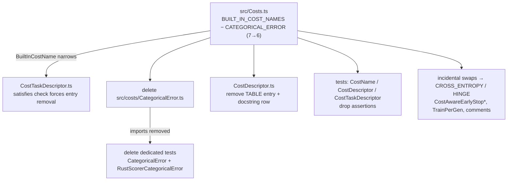

# Remove CATEGORICAL_ERROR cost from core NEAT-AI

## Summary

Hard-removes the non-standard `CATEGORICAL_ERROR` cost from core NEAT-AI —
its class, registry entry, both descriptor-table entries, and every
dedicated/incidental reference in source and tests. `CATEGORICAL_ERROR`
was `1 − argmax accuracy`: a non-differentiable step function meaningful
only as a *reported metric*, never as a training/selection cost. The
standard multi-class training cost — softmax + cross-entropy — already
exists as `CROSS_ENTROPY`, which is now the single supported multi-class
cost.

The cross-repo prerequisite (`stSoftwareAU/NEAT-AI-Examples#523`,
switching the MNIST example to `CROSS_ENTROPY`) merged via PR #532 into
that repo's `milestone/factory` branch before this removal was started.

Closes #2805.

## What changed

**Source**

- **Deleted** `src/costs/CategoricalError.ts`.
- `src/Costs.ts` — dropped the import, the `BUILT_IN_COST_NAMES` entry
  (7 → 6) and the registry registration. `BuiltInCostName` no longer
  includes `"CATEGORICAL_ERROR"`.
- `src/costs/CostTaskDescriptor.ts` — removed the `CATEGORICAL_ERROR`
  entry from `BUILT_IN_DESCRIPTORS` (required: the `satisfies
  TaskDescriptor[]` check fails once the literal leaves `BuiltInCostName`).
- `src/costs/CostDescriptor.ts` — removed the `CATEGORICAL_ERROR` `TABLE`
  entry and the matching docstring row.
- `src/costs/CostAwareEarlyStop.ts`, `src/creature/CreatureTraining.ts`,
  `src/costs/CostOutputSquash.ts`, `src/Creature.ts`,
  `src/methods/activations/types/SOFTMAX.ts`,
  `src/architecture/CreatureFactory.ts`,
  `src/config/RustScorerConfig.ts` — removed comment/docstring
  references; re-pointed unit-range examples to `CROSS_ENTROPY`; removed
  the redundant `case "CATEGORICAL_ERROR"` fall-through in
  `pickOutputSquashForCost`; updated the built-in count "seven" → "six".

**Tests**

- **Deleted** `test/costs/CategoricalError.ts` and
  `test/score/RustScorerCategoricalError.ts` (the generic `--cost` bridge
  is already covered by `test/score/RustScorerBridgeCostFlag.ts`).
- `test/costs/CostName.ts`, `test/costs/CostDescriptor.ts`,
  `test/costs/CostTaskDescriptor.ts` — dropped `CATEGORICAL_ERROR`
  expectations/assertions.
- `test/costs/CostAwareEarlyStop.ts`,
  `test/costs/CostAwareEarlyStopIntegration.ts`,
  `test/config/TrainPerGen.ts` — re-targeted `CATEGORICAL_ERROR` →
  surviving built-ins (`CROSS_ENTROPY` / `HINGE`); both are unit/supervised
  so the clamp / early-stop / scaling assertions are unchanged in meaning.

**Tests removed as redundant (documented per TDD rules)**

The removed cost left behind duplicate SOFTMAX-mapping tests already
covered identically by a surviving `CROSS_ENTROPY` case. Keeping them as
`CROSS_ENTROPY` would have collided with the existing test names, so the
duplicate `CATEGORICAL_ERROR` assertions were removed and the surviving
`CROSS_ENTROPY` coverage retained:

- `test/costs/CostOutputSquash.ts` — dropped the `CATEGORICAL_ERROR
  ⇒ SOFTMAX` case (covered by the `CROSS_ENTROPY ⇒ SOFTMAX` case).
- `test/creature/CreatureCostAwareOutputSquash.ts` and
  `test/architecture/CreatureFactory.ts` — converted the
  `CATEGORICAL_ERROR` multi-class → SOFTMAX cases to `CROSS_ENTROPY`
  (distinct input arities, so both kept as coverage).

**CHANGELOG**

`CATEGORICAL_ERROR` was both added (#2736) and removed within the same
`[Unreleased]` cycle, so it never shipped. The `[Unreleased]` notes were
made consistent: the #2736 *Added* entry was removed and the two
incidental mentions (#2791 cost list, #2787 example) were updated.

## Evidence

Backend/CLI library change — no web interface to screenshot. Verified by
the full quality gate and a direct runtime check of the acceptance
criteria:

```
BUILT_IN_COST_NAMES.length = 6
names = CROSS_ENTROPY, MSE, MAE, MAPE, MSLE, HINGE
excludes CATEGORICAL_ERROR = true
find throws: Unknown cost function: CATEGORICAL_ERROR
```

`quality.sh` (fmt, lint, type-check, full test suite): **6988 passed, 0
failed, 4 ignored**.

> Note: `test/creature/evolveRL_heapStability_test.ts` flaked once under
> full-suite parallelism (a heap-growth measurement inflated by
> concurrent GC pressure — exactly the perf-in-unit-test anti-pattern).
> It passes in isolation (~253 KB/gen, well under the 500 KB/gen
> threshold) and is unrelated to this change; the subsequent full run was
> green.



## Test Plan

- `deno test` (via `quality.sh`) — full suite green (6988 passed).
- Runtime acceptance check: `Costs.find("CATEGORICAL_ERROR")` throws
  `Unknown cost function`; `getAvailableCosts()` excludes it;
  `BUILT_IN_COST_NAMES.length === 6`.
- Repo grep confirms no `CATEGORICAL_ERROR` / `CategoricalError` reference
  remains under `src/` or `test/`.
- Re-targeted `CostAwareEarlyStop*` and `TrainPerGen` tests pass with
  identical meaning on the surviving costs.
