# PR Summary — Document Temporal vs Date/performance.now() migration policy

## Summary

Adds a single source of truth for date/time handling so the upcoming `Temporal`
migration sub-issues (part of #2804) can reference one canonical policy and
contributors don't reintroduce `Date`-based wall-clock timestamps or extra
date/time dependencies.

- New **"🕒 Date/time handling — Temporal vs Date"** sub-section under _Coding
  Conventions_ in `AGENTS.md`.
- A short pointer to it from the conventions area of `CONTRIBUTING.md`,
  mirroring the existing Logging-policy pointer.

The policy codifies:

- **Use `Temporal`** (e.g. `Temporal.Now.instant().toString()`) for wall-clock /
  calendar-style timestamps — anything logged, emitted as an event payload,
  persisted to JSON on disk, or printed in a user-facing report.
- **Keep `Date.now()` / `performance.now()`** for elapsed-time measurements —
  per-phase timings, throttling cool-downs, sliding-window TTLs, and deadline
  computations driven by `Date.now()` deltas. `Temporal` is not the right tool
  for monotonic elapsed timing.
- Native `Temporal` is stable in **Deno 2.7+** (no `--unstable-temporal` flag,
  no polyfill).
- **Forbidden dependencies:** `@js-temporal/polyfill` (redundant — native
  `Temporal` is stable) and `@std/datetime`, plus any new `package.json`-only
  dependency (consistent with the project's Deno-regression guardrail).
- Canonical **"do NOT migrate"** examples: `src/NEAT/MemoryMonitor.ts`,
  `src/NEAT/ThroughputMetrics.ts`, and per-phase timing in
  `src/NEAT/NeatEvolution.ts`.

This is greenfield guidance: a survey confirmed no current `@std/datetime`
imports and no existing `Temporal.*` usage in the repo.

Closes #2813.

## Acceptance criteria

- [x] `AGENTS.md` contains a new "Date/time handling — Temporal vs Date" section
      (Australian English spelling).
- [x] The section explicitly lists what counts as wall-clock vs elapsed-time and
      gives one canonical code snippet for each.
- [x] The section states that `@std/datetime` and `@js-temporal/polyfill` must
      not be added.
- [x] `quality.sh` formatting + lint pass (see Evidence).

## Evidence

Documentation-only change — no web interface to screenshot.

- `deno fmt AGENTS.md CONTRIBUTING.md` → clean.
- `./quality.sh --lint-only` → passed: formatting (2449 files), linting (1640
  files), and bash-script checks all green.

```mermaid
flowchart TD
    Q{What does the value represent?}
    Q -->|"at what point on the calendar?"| W[Temporal.Now.instant&#40;&#41;.toString&#40;&#41;]
    Q -->|"how long did it take?"| E[Date.now&#40;&#41; / performance.now&#40;&#41;]
    W --> WU["logs, event payloads,<br/>persisted JSON, user reports"]
    E --> EU["phase timings, cool-downs,<br/>sliding-window TTLs, deadlines"]
    EU --> KEEP["MemoryMonitor, ThroughputMetrics,<br/>NeatEvolution phase timing — do NOT migrate"]
```

## Test Plan

No code paths changed, so no unit tests were added or modified — the change is
limited to `AGENTS.md` and `CONTRIBUTING.md` policy documentation. Verification
was via the quality gate's formatting and lint steps (above).
