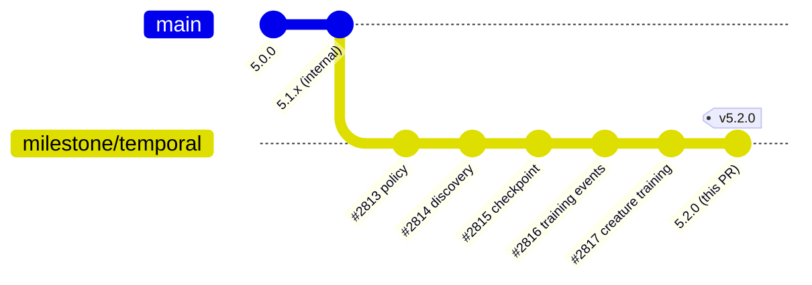

## Summary

Bumped the package version from `5.1.3` to `5.2.0` in `deno.json` and added a
`## [5.2.0] - 2026-05-30` heading to `CHANGELOG.md` summarising the Temporal
migration completed across Issues #2813–#2817. The previously unreleased
entries are now grouped under the `5.2.0` heading, leaving `[Unreleased]`
empty for the next cycle. Closes #2818.

The version bump from `5.1.x` to `5.2.0` is a minor bump: it adds new
user-visible capability (native `Temporal` wall-clock timestamps) without
breaking changes — elapsed-time call sites continue to use `Date.now()` /
`performance.now()`.

## Evidence

This is a metadata-only change (no UI, no public API surface area added),
verified by:

- `./quality.sh --skip-discovery --skip-wasm` passed cleanly:
  `ok | 6993 passed (2 steps) | 0 failed | 4 ignored (2m21s)`.
- Acceptance grep confirms no forbidden imports remain in source:
  `Grep "std/datetime|@js-temporal" src/` returns no matches.
- `deno.json` `version` field is `5.2.0`.
- `CHANGELOG.md` now carries a `## [5.2.0] - 2026-05-30` section whose
  `### Changed` lead entry documents the Temporal adoption with references to
  Issues #2813, #2814, #2815, #2816, and #2817.

### Release lineage

## Test Plan

- [x] `deno.json` `"version"` is `5.2.0`.
- [x] `CHANGELOG.md` has a `## [5.2.0]` section dated `2026-05-30` that lists
      the Temporal adoption referencing Issues #2813–#2817.
- [x] `grep -r "std/datetime\|@js-temporal" src/` returns no matches.
- [x] `./quality.sh --skip-discovery --skip-wasm` passes (full test suite
      including lint, format, type-check, bash check, and all 6993 tests).
