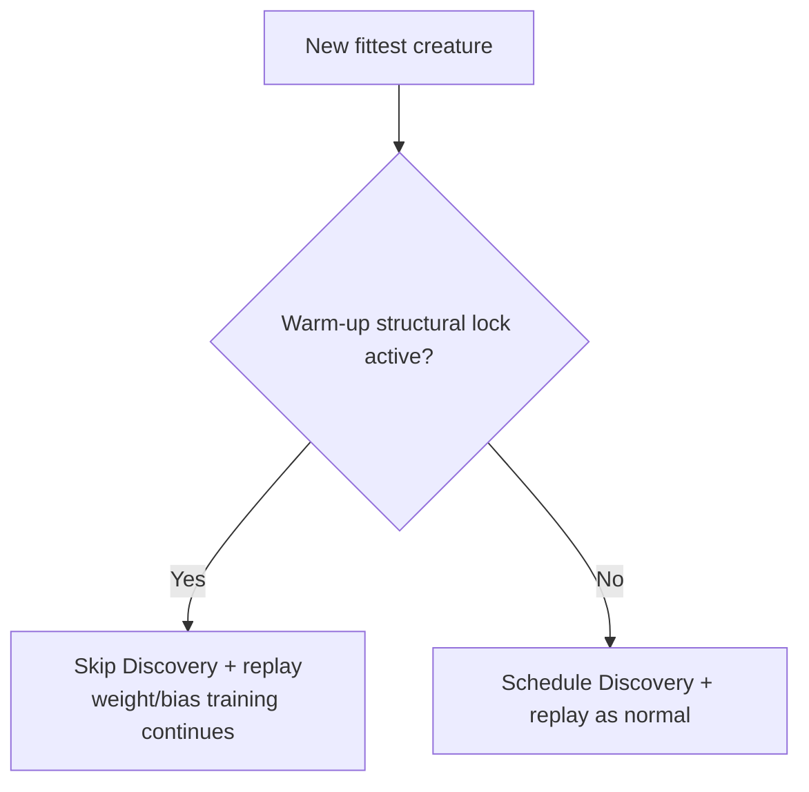

# Seed warm-up: gate Discovery and DiscoveryReplay behind the structural lock

## Summary

Creatures seeded with `warmupGenerations` (Creature Factory #2825) are meant to
defer **all structural reduction and squash changes** until the warm-up window
has elapsed (`currentGeneration > warmupGenerations`), so the factory topology
can align weights/biases first. The warm-up gate was only enforced in
`Mutator.applySeedWarmupFilter()` — **inline Discovery and cached-discovery
replay bypassed it entirely**, so factory seeds were pruned/rewired (e.g. 51 →
17 neurons) long before generation 1440.

This change centralises the lock and applies it to every structural path.
**Closes #2828.**

- **New single source of truth** in `CreatureFactory.ts`:
  `isSeedWarmupStructuralLockActive(warmupGenerations, currentGeneration)` and
  the creature-tag convenience wrapper
  `isSeedWarmupStructuralLockActiveForCreature(creature)`. The helper is
  **conservative**: a seed declaring `warmupGenerations > 0` whose
  `currentGeneration` is not yet known stays **locked**, so nothing prunes
  before warm-up can be proven elapsed.
- **`NeatEvolution`** (primary fix): skips both `scheduleDiscovery` and
  `discoveryReplayQueue.scheduleReplay` while the lock is active, using the
  reliable `neat.warmupGenerations` / `neat.currentGeneration` state.
- **`NeatScheduling.scheduleDiscovery`**: defensive early-return guard.
- **`DiscoveryReplayQueue.scheduleReplay`**: defensive guard read from the
  creature's own warm-up tags (the queue does not hold the owning `Neat`).

Mutation gating (`Mutator`) is unchanged — it already enforced the warm-up
filter; this PR closes the Discovery/replay bypass without altering existing
mutation behaviour.

## Evidence

This is a backend/algorithm change with no web interface to screenshot. It is
verified by unit and integration tests that call the real functions.

Quality gate: `./quality.sh` — **7016 passed** (full suite), formatting, lint,
type-check, and markdownlint all clean.

## Test Plan

New tests (all call real functions and assert on results):

- `test/architecture/SeedWarmupStructuralLock.ts`
  - `isSeedWarmupStructuralLockActive`: inactive with no warm-up; active across
    the window including the `currentGeneration == warmupGenerations` boundary;
    released once elapsed; conservative when generation unknown/`<= 0`; ignores
    non-finite inputs.
  - `isSeedWarmupStructuralLockActiveForCreature`: reads warm-up tags off a
    creature for the no-tag, mid-window, elapsed, and missing-generation cases.
- `test/NEAT/DiscoveryReplayWarmup.ts` (exercises the real
  `DiscoveryReplayQueue` with an injected `replayDir` spy):
  - skips replay during the warm-up window;
  - skips replay when the `currentGeneration` tag is missing (conservative);
  - replays once warm-up has elapsed;
  - replays when no warm-up is configured.

Existing suites confirmed green (no regressions): `test/NEAT/MutatorWarmup.ts`,
`test/NEAT/DiscoveryReplayQueue.ts`, `test/NEAT/DiscoveryReplayIntegration.ts`,
`test/NEAT/DiscoveryReplayQueueCompletion.ts`,
`test/architecture/SeedWarmupPersistence.ts`,
`test/NEAT/NeatPopulatePopulation.ts`.
