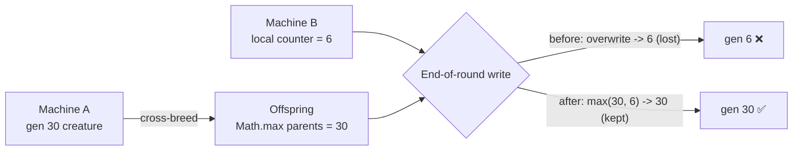

# Carry over the higher generation count when breeding and loading creatures

## Summary

When evolving across machines (evolve ~15 min, change the sample size, then
cross-breed with other machines), the evolution generation count was being
silently reset, so a population that had accumulated many generations never
converged. With ~1-minute generations and ~15-minute rounds, repeatedly losing
the count means the population never gets there.

Root cause (found via TDD): breeding already carried the **higher** of the two
parents' generations (`Math.max`, `Offspring.ts:139`), but the **end-of-round
tagging** clobbered it. After each round `NeatEvolution` calls
`writeSeedWarmupProgressTags(fittest, neat.warmupGenerations, neat.currentGeneration)`,
which **overwrote** the fittest creature's `currentGeneration` tag with the
local `Neat.currentGeneration` counter. A cross-bred offspring that inherited a
higher generation (e.g. 30) from a creature loaded from another machine was
reset to the lower local count (e.g. 6).

The fix makes the `currentGeneration` tag **monotonic** at the single shared
write point: `writeSeedWarmupProgressTags` now reads the creature's existing
generation and writes `Math.max(existing, currentGeneration)` — it never lowers
the value. This carries the higher generation through breeding, the save/load
round-trip, and the end-of-round write, defensively across every path that
writes the tag.

Closes #2831.

## Evidence

This is a backend/library change with no web interface to screenshot. It is
verified by unit tests that call the real functions and assert on the resulting
tags.



The new failing-then-passing test demonstrates the clobber and the fix:

```
writeSeedWarmupProgressTags: never lowers an existing higher generation
  before fix -> Actual 6 / Expected 30  (FAILED)
  after  fix -> ok
```

## Test Plan

Added to `test/architecture/SeedWarmupPersistence.ts`:

- `writeSeedWarmupProgressTags: never lowers an existing higher generation` —
  writes gen 30 then a later gen 6; asserts the tag stays 30 (the regression
  test; fails against the unfixed code).
- `writeSeedWarmupProgressTags: still raises generation when higher` — writes
  gen 6 then gen 14; asserts the tag advances to 14 (monotonic increase still
  works).
- `Offspring.breed: carries the HIGHER of two differing parent generations` —
  parents with generations 30 and 5; asserts the offspring inherits 30.

Existing tests continue to pass unchanged (no test removed or commented out),
including `populatePopulation: restores warm-up tags from seed creature` and the
`OnPolicyDistillationBreed` warm-up carryover.

Commands run:

- `deno test test/architecture/SeedWarmupPersistence.ts` — 9 passed
- `deno test test/architecture/CreatureFactory.ts test/architecture/SeedWarmupStructuralLock.ts test/breed/OnPolicyDistillationBreed.ts`
  — 54 passed
- `deno test test/NEAT/NeatPopulatePopulation.ts test/multithreading/WorkerHandler.ts`
  — 12 passed
- `deno test test/NEAT/DiscoveryReplayWarmup.ts test/NEAT/NeatFinishUp.ts` — 12
  passed
- `./quality.sh --lint-only` — format, lint, bash checks pass
- `deno check` on changed/related files — passes
