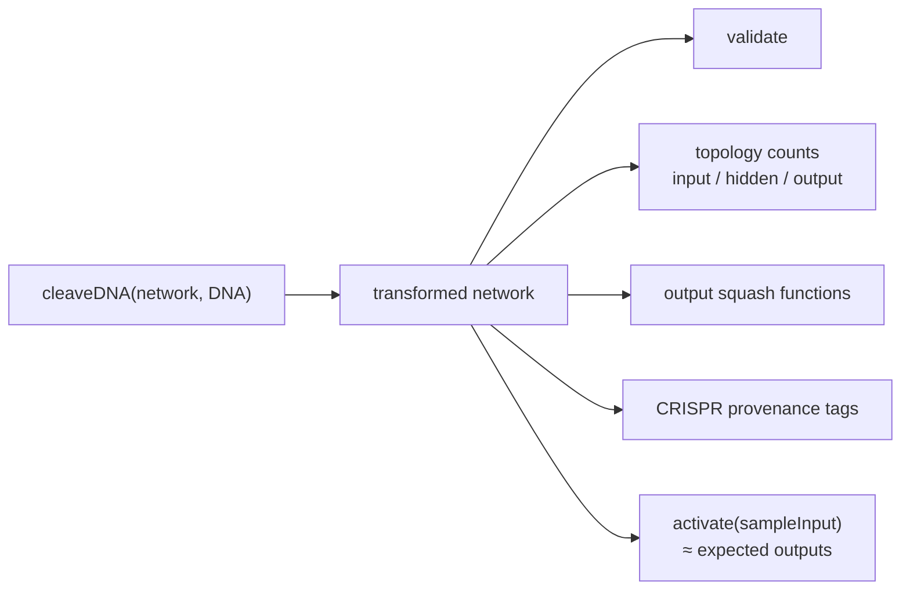

# Replace opaque whole-export golden snapshots in `test/CRISPR/CRISPR.ts`

## Summary

The CRISPR suite asserted byte-for-byte string equality against a whole-export
golden blob (`assertEquals(actualTXT, expectedTXT)`). This is the classic
**HOW-test** anti-pattern: it locks the suite to the exact serialisation of
`exportJSON()` (field ordering, float precision, key set, whitespace) rather
than to what `cleaveDNA()` actually computes. A behaviour-preserving change
breaks every test, inviting a developer to regenerate the golden and ride a
genuine regression along with it.

Worse, the `clean()` helper mutated its argument in place and returned
`undefined`, so every headline assertion was effectively
`assertEquals(undefined, undefined)` — the golden comparisons verified
_nothing_.

This PR rewrites the five golden tests (`CRISPR`, `CRISPR_twice`,
`CRISPR-Volume`, `CRISPR-multi-outputs1`, `CRISPR-multi-outputs2`) to assert
observable, semantic properties of the transformed network instead, following
option (a) in the issue. The `REMOVE` and `CRISPR-uuid` behavioural tests are
unchanged (apart from dropping a debug-only file write in `CRISPR-uuid`).

Closes #2835.

### What the tests now assert (the _what_, not the _how_)

- **Topology counts** — input layer untouched; previous output(s) demoted to
  hidden; the DNA-defined neurons appended; exact synapse-count delta.
- **Introduced squash functions** — e.g. the IF/MINIMUM/MEAN/MAXIMUM outputs the
  DNA introduces, in order.
- **CRISPR provenance** — the introduced neurons and synapses carry the DNA's
  `CRISPR` tag.
- **Computed behaviour** — `activate()` on a fixed input yields the expected
  outputs (`assertAlmostEquals`), which is the most important check: it asserts
  what the network computes.
- **Idempotency** (`CRISPR_twice`) — re-applying the same DNA is detected via
  the CRISPR tag and leaves topology and output unchanged.
- `validate()` is retained throughout.

These survive a serialisation refactor (reordered fields, changed float
precision, renamed internal keys) but still fail on a real behavioural
regression.



## Evidence

Backend/test-only change — no UI to screenshot. Verified by running the
rewritten suite and the full quality gate.

```
running 7 tests from ./test/CRISPR/CRISPR.ts
CRISPR ... ok
CRISPR_twice ... ok
CRISPR-Volume ... ok
REMOVE ... ok
CRISPR-multi-outputs1 ... ok
CRISPR-multi-outputs2 ... ok
CRISPR-uuid ... ok
ok | 7 passed | 0 failed
```

`./quality.sh` passes cleanly:
`ok | 7037 passed (2 steps) | 0 failed | 4 ignored`.

## Test Plan

- Rewrote the five golden-snapshot tests in `test/CRISPR/CRISPR.ts` to assert
  semantic properties (neuron/synapse counts, output squash functions, CRISPR
  tags, and deterministic `activate()` outputs) instead of whole-export string
  equality.
- Added small DRY helpers (`neuronTypeCounts`, `outputSquashes`,
  `taggedNeuronCount`, `taggedSynapseCount`, `sampleInput`, `loadNetwork`,
  `loadDNA`) and removed the no-op `clean()` helper and the debug-only
  `.actual-*` / `.expected-*` / `.network*` file writes that only supported the
  golden diff.
- No production code changed; `REMOVE` and `CRISPR-uuid` behavioural tests
  retained.
