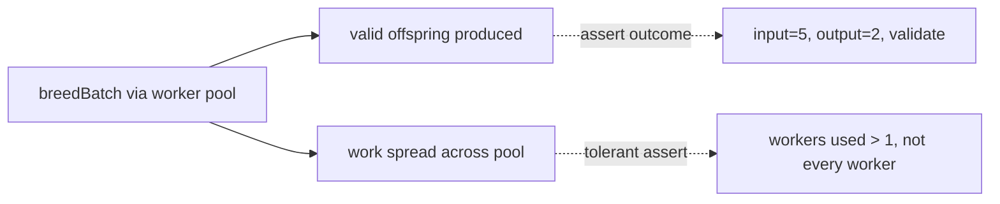

## Summary

Removed a HOW-test anti-pattern from `test/breed/ParallelBreeding.ts`. The test
`ParallelBreeding - worker path distributes work across all workers` asserted
that **every** mock worker was called at least once — coupling the test to the
scheduler's internal distribution strategy. A behaviour-preserving change (e.g.
a work-stealing scheduler that drains tasks through one fast worker, or a change
in pool sizing) would produce identical offspring yet leave a worker at zero
calls and break the test.

The test now asserts the **observable contract** of `breedBatch()`: the batch
yields valid offspring with the correct input/output shape. A **tolerant**
load-spreading check is retained — that the pool processed the batch and work
was spread across more than one worker — without demanding a specific per-worker
count. This survives any distribution strategy that genuinely uses the pool.

Closes #2837.

## Evidence

This is a test-only change (no production code touched), so there is no UI or
performance evidence. Verification is via the test suite.

- Targeted run: `deno test --allow-all test/breed/ParallelBreeding.ts` →
  `10 passed | 0 failed`.
- Full quality gate: `./quality.sh` → `7037 passed | 0 failed | 4 ignored`.

## Test Plan

- Renamed `ParallelBreeding - worker path distributes work across all workers`
  to `ParallelBreeding - worker path spreads a batch across the pool`.
- Replaced the per-worker `callCounts[i] > 0` loop (HOW-assertion) with:
  - outcome assertions: `offspring.length > 0`, each child `validate()`s with
    `input === 5` and `output === 2`;
  - a tolerant distribution assertion: total calls `> 0` and `workersUsed > 1`.
- No existing tests were removed or commented out; the sibling worker-path tests
  remain unchanged.
