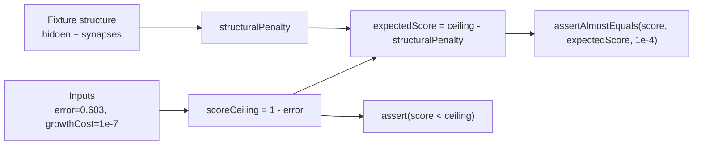

## Summary

Removed the undocumented hard-coded MSE magic value `0.396_802` from
`test/score/Penalty.ts:36` and replaced it with a documented, input-derived
WHAT-test. Closes #2838.

The previous assertion captured the exact score the scorer happened to produce
for the `large.json` fixture to six decimal places with a `1e-6` tolerance, with
no derivation or spec reference. That is a HOW-test anti-pattern: any change to
the penalty/MSE formula — including a legitimate improvement — forced a
developer to paste in whatever the new run printed, so the assertion could not
distinguish an intended change from a regression.

The fixture is large (180 hidden neurons, 13,135 synapses), so hand-computing
the MSE is not practical. Instead the test now asserts the scoring **spec**
(`score = 1 - error - complexityPenalty - versionPenalty`, per
`src/architecture/Score.ts`):

- **Strict ceiling** — `score < 1 - error`, because every penalty term is
  non-negative. This catches the error not being subtracted, a flipped penalty
  sign, or a penalty going negative.
- **Structure-derived expectation** — the expected score is derived from the
  fixture's own structure (`hidden * growthCost + synapses * growthCost / 10`)
  rather than copied from output, asserted with a `1e-4` tolerance that bounds
  the small weight/bias and version-penalty terms.



## Evidence

Backend/test-only change — no web interface to screenshot.

`test/score/Penalty.ts` passes after the change:

```
Score: Calculation with given parameters ... ok
Score: Weight change should affect score ... ok
valuePenalty: Edge Cases ... ok
valuePenalty: Various Values ... ok
ok | 4 passed | 0 failed
```

`./quality.sh --lint-only` and `./quality.sh --check-only` both pass cleanly.

## Test Plan

- Modified `test/score/Penalty.ts` → `Score: Calculation with given parameters`:
  replaced the magic-constant assertion with a strict ceiling assertion plus a
  structure-derived expected-score assertion. Verified the test still passes
  (score `0.3968016…` sits below the `0.397` ceiling and within `1e-4` of the
  structure-derived expectation).
- Existing relational checks (`upgradedScore >= score`, weight-change raises the
  score) are unchanged and still pass.
