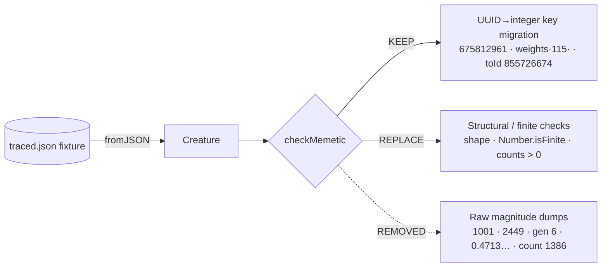

## Summary

Removed the hard-coded fixture-dump (HOW-test) assertions from
`test/propagate/Trace.ts` and kept only the assertions that protect real
behaviour. Closes #2839.

The test previously pasted raw magnitudes straight out of
`test/data/traced.json` — `neurons.length === 1001`, `synapses.length === 2449`,
`memetic.generation === 6`, `memetic.score === 0.47133930519315353`, the exact
bias/weight magnitudes (`0.0001412`, `0.1234`), and `nodeState.count === 1386`.
These carry no spec or rationale: they assert "the fixture currently contains
these numbers", so regenerating `traced.json` (or any change that alters stored
magnitudes while preserving behaviour) broke the test for a non-regression.

Following suggestion (a) in the issue, `checkMemetic` now separates the two
concerns:

- **Kept (genuine WHAT-assertions)** — the documented UUID→integer key
  migration: bias key `552c68d3-…` → `675812961`, weight key `input-115` →
  `115`, and `weights[115][1].toId === 855726674`. These verify observable
  migration behaviour and survive a fixture regeneration.
- **Replaced (fixture-dump magnitudes)** — exact counts/score/generation and the
  bias/weight magnitudes are now structural/finite checks: the memetic block
  exists with the expected shape, `generation` is an integer, `score` and the
  migrated bias/weight values are finite, and neuron/synapse counts are
  positive.
- **Node-count test** — `nodeState.count === 1386` is now `Number.isInteger` and
  `> 0`, asserting the trace state restores a positive accumulation count
  without echoing the fixture magnitude.

No production code changed — `Creature.fromJSON` migration behaviour is
unchanged. This is a test-quality refactor.

## Evidence

Backend/test-only change — no web interface to screenshot.

Targeted test run after the refactor (all 5 tests pass):

```
running 5 tests from ./test/propagate/Trace.ts
Trace - loads creature with memetic data from JSON ... ok
Trace - loads creature trace state with a positive node count ... ok
Trace - traceJSON round-trip preserves memetic data ... ok
Trace - exportJSON round-trip preserves memetic data ... ok
Trace - applyLearnings modifies creature and remains valid ... ok

ok | 5 passed | 0 failed
```

`./quality.sh --lint-only` and `./quality.sh --check-only` both pass cleanly.



## Test Plan

- Modified `test/propagate/Trace.ts`:
  - `checkMemetic` — retains the three documented migration assertions; replaces
    fixture magnitudes with shape + `Number.isFinite` + positive-count checks.
  - Renamed `Trace - loads creature trace state with correct node count` →
    `… with a positive node count`; asserts `Number.isInteger` and `> 0` instead
    of the exact `1386`.
  - Dropped the now-unused `assertAlmostEquals` import.
- Verified all 5 tests in the file pass after the change.
- No existing tests were commented out or removed.
