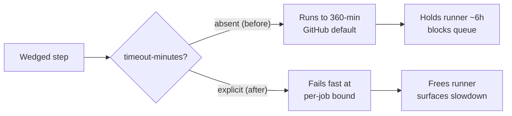

## Summary

Every job in `.github/workflows/*.y*ml` inherited the GitHub default of 360
minutes (6 hours) because none declared `timeout-minutes:`. A wedged step — a
hung `deno test` in `coverage.yaml`, a stalled network fetch, or a `git push`
blocked on a prompt in `quality.yml` — could therefore hold a runner for up to
six hours, burning minutes quota and blocking the queue before GitHub kills it.

This PR adds an explicit per-job `timeout-minutes:` to all 12 workflow jobs,
sized to each job's normal runtime plus headroom, capping the blast radius of a
wedged step and surfacing genuine slowdowns as fast failures.

Closes #2841.

| Workflow file                | Job                 | `timeout-minutes` |
| ---------------------------- | ------------------- | ----------------- |
| `actionlint.yml`             | `actionlint`        | 10                |
| `markdown-lint.yml`          | `markdownlint`      | 10                |
| `shellcheck.yml`             | `shellcheck`        | 10                |
| `spellcheck.yaml`            | `spellcheck`        | 10                |
| `dependency-review.yml`      | `dependency-review` | 10                |
| `semgrep.yml`                | `semgrep`           | 15                |
| `github-release.yml`         | `release`           | 15                |
| `publish.yml`                | `publish`           | 15                |
| `deno-outdated.yml`          | `outdated`          | 15                |
| `update-package-version.yml` | `update-version`    | 15                |
| `coverage.yaml`              | `coverage`          | 30                |
| `quality.yml`                | `quality`           | 30                |

Short lint/scan jobs get a tight 10-minute bound; the SAST scan and the
release/maintenance jobs get 15; the heavier test/build jobs get 30.

## Evidence

This is a CI configuration change with no web interface to screenshot. It is
verified by a new governance test, `test/ci/WorkflowJobTimeoutMinutes.ts`, which
parses every workflow YAML and asserts each job declares a positive-integer
`timeout-minutes` below the 360-minute default. The test fails against the
unfixed tree and passes after the change.

```
running 2 tests from ./test/ci/WorkflowJobTimeoutMinutes.ts
at least one workflow file is present to validate ... ok
every workflow job declares an explicit timeout-minutes ... ok

ok | 2 passed | 0 failed
```

The full `test/ci` workflow-governance suite (67 tests) remains green after the
change.



## Test Plan

- Added `test/ci/WorkflowJobTimeoutMinutes.ts`:
  - `at least one workflow file is present to validate` — guards against the
    suite silently passing on an empty directory.
  - `every workflow job declares an explicit timeout-minutes` — parses each
    `.github/workflows/*.y*ml`, iterates its jobs, and asserts each declares a
    positive-integer `timeout-minutes` tighter than the 360-minute default.
- Confirmed the new test fails before the YAML change and passes after.
- Ran the existing `test/ci/*.ts` workflow-governance suites plus the
  `test/scripts` workflow tests — all 67 pass.
- `deno fmt --check`, `deno lint`, and `deno check` clean on the new test and
  the changed workflow files.
