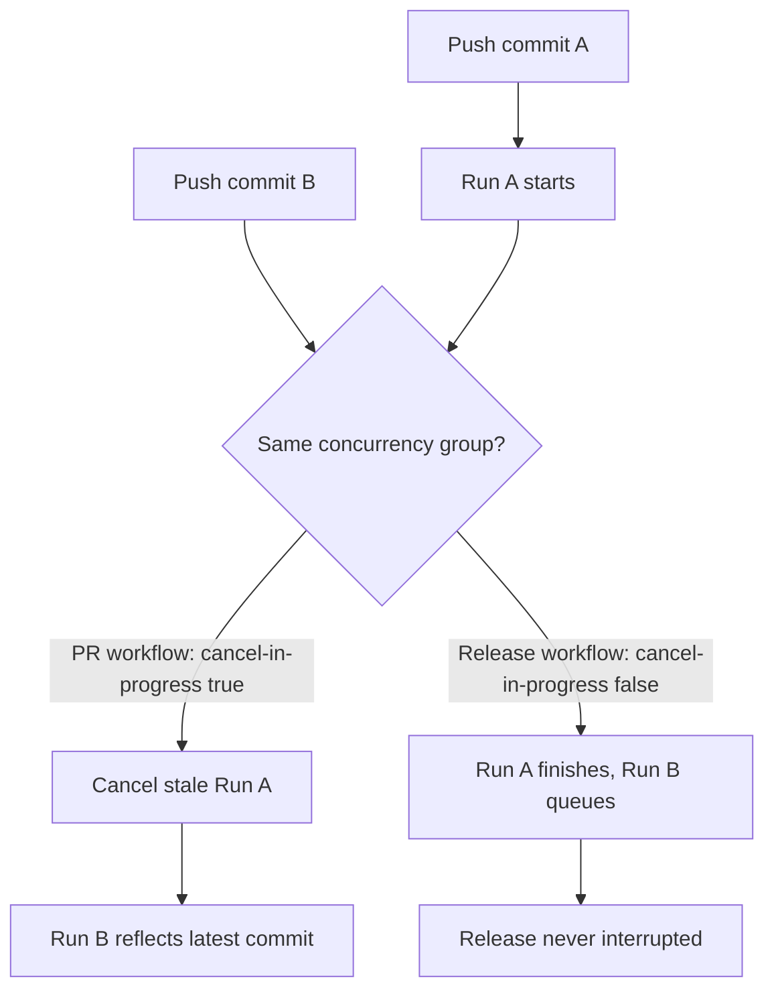

# Add `concurrency:` cancel-in-progress to pile-up-prone workflows

## Summary

No workflow in `.github/workflows/` declared a `concurrency:` group, so
superseded runs were never cancelled. When a contributor pushed several commits
to a PR branch in quick succession, every push started a fresh run of each
`pull_request` workflow while the earlier runs kept executing — wasting minutes
quota (especially on the heavy `coverage` and `quality` jobs) and delaying the
run that reflects the latest commit.

This change adds a top-level `concurrency:` block keyed on the workflow and ref
to every pile-up-prone PR-triggered workflow, with `cancel-in-progress: true` so
a stale run is cancelled as soon as a newer one starts. The release/publish
workflows also gain a concurrency group to serialise runs, but keep
`cancel-in-progress: false` so an in-flight release or JSR publish is never
interrupted mid-run.

Closes #2842.

### Workflows changed

| Workflow                     | Trigger                 | `cancel-in-progress`                    |
| ---------------------------- | ----------------------- | --------------------------------------- |
| `actionlint.yml`             | `pull_request` + `push` | `true`                                  |
| `coverage.yaml`              | `pull_request`          | `true`                                  |
| `dependency-review.yml`      | `pull_request`          | `true`                                  |
| `markdown-lint.yml`          | `pull_request` + `push` | `true`                                  |
| `quality.yml`                | `pull_request`          | `true`                                  |
| `semgrep.yml`                | `pull_request`          | `true`                                  |
| `shellcheck.yml`             | `pull_request`          | `true`                                  |
| `spellcheck.yaml`            | `pull_request`          | `true`                                  |
| `update-package-version.yml` | `pull_request`          | `true`                                  |
| `github-release.yml`         | `push: Develop`         | `false` (never interrupt a release)     |
| `publish.yml`                | `push: Develop`         | `false` (never interrupt a JSR publish) |

Each group is `${{ github.workflow }}-${{ github.ref }}` so
concurrent runs of the **same** workflow on the **same** ref collapse, without
colliding across different workflows or branches/PRs.

`deno-outdated.yml` is intentionally left unchanged — it triggers only on a
weekly `schedule` and `workflow_dispatch`, so it is not pile-up-prone from rapid
pushes.

## Evidence

This is a CI-configuration change with no web interface to screenshot. It is
verified by a new behavioural test that parses the committed workflow YAML and
asserts on the resulting configuration.



Test run:

```
deno test --allow-read test/ci/WorkflowConcurrencyGroup.ts
ok | 11 passed | 0 failed
```

Full `test/ci/` suite (no regressions): `56 passed | 0 failed`.

## Test Plan

- Added `test/ci/WorkflowConcurrencyGroup.ts`:
  - For each of the 9 pile-up-prone workflows, asserts a top-level
    `concurrency:` block exists, its `group` includes both `github.workflow` and
    the ref (`github.ref`/`github.head_ref`), and `cancel-in-progress` is
    `true`.
  - For `github-release.yml` and `publish.yml`, asserts that if a concurrency
    block is present, `cancel-in-progress` is `false` so an in-flight release is
    never cancelled.
- Confirmed the test fails against the unfixed workflows (9 failures) and passes
  after adding the concurrency blocks.
- Re-ran the existing `test/ci/` and `test/scripts/` workflow tests (timeouts,
  container-image pinning, persist-credentials, least-privilege permissions) —
  all pass, confirming no regressions.
