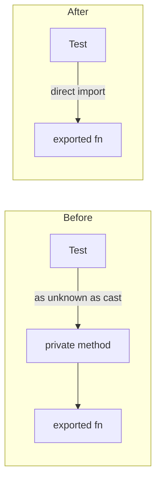

# Replace HOW-assertions on private DiscoverStructure methods with public-surface calls (Issue #2849)

## Summary

Two test files asserted on **private** `DiscoverStructure` methods reached
through `as unknown as` casts — anti-pattern #1 (testing implementation
internals the public API does not expose). A behaviour-preserving refactor
(renaming/inlining the helpers, or the in-progress TypeScript→Rust migration)
would leave the observable discovery output unchanged yet break these tests,
because the private methods they reached for would vanish.

In all three cases the private method is just a thin delegator to a
**documented, module-level exported function**. The fix points the tests at
that stable public surface instead of casting through `unknown`:

- `mapRustNeuronCandidate` / `mapRustCandidate` →
  `DiscoverAnalysis.ts` exports `mapRustNeuronCandidate` / `mapRustCandidate`.
- `findCandidateSquash` →
  `DiscoverSquashAnalysis.ts` exports `findCandidateSquash`.

No production code changed — the asserted behaviour (a Rust candidate's optional
`comment` survives mapping; which squash candidate is selected and how its
error/impact scale) is identical. The squash test mirrors the facade's
estimator/index-map caching via a small `makeImpactFn` closure backed by the
public `calculateNeuronImpact`, so `findCandidateSquash` sees the same inputs as
the production call site.

Closes #2849.

## Evidence

Backend/test-only change — no UI to screenshot. Verified by running the two
affected files and the full quality gate:

- Targeted: `deno test test/ErrorGuidedStructuralEvolution/RustDiscoveryCandidateCommentCompatibility.ts test/discovery/DiscoverStructureSquash.ts` → `4 passed | 0 failed`.
- Full `./quality.sh` (fmt + lint + type-check + all tests) → `7037 passed | 0 failed | 4 ignored`.

The squash test retains its original assertions (`currentError ≈ 1`,
`expectedCreatureScoreGain < 1e-4`), confirming the observable behaviour is
unchanged after dropping the cast.

## Test Plan

- Rewrote `test/ErrorGuidedStructuralEvolution/RustDiscoveryCandidateCommentCompatibility.ts`
  to call the exported `mapRustNeuronCandidate` / `mapRustCandidate` directly,
  removing the `DiscoverStructurePrivateApi` shape, the `as unknown as` cast, and
  the now-unnecessary `DiscoverStructure` instantiation and temp-dir plumbing.
- Rewrote `test/discovery/DiscoverStructureSquash.ts` to call the exported
  `findCandidateSquash` directly, supplying a `calculateNeuronImpact`-backed
  closure in place of the private instance method and the `internal` cast.
- No tests removed or disabled; both files retain their original assertions.
