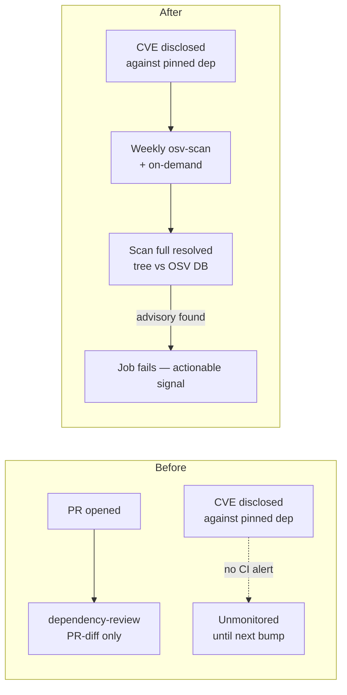

# SCR-VULN-SCAN: scheduled OSV vulnerability scan for pinned Deno deps

## Summary

Added a scheduled, full-tree dependency vulnerability scanner to close the
**SCR-VULN-SCAN** detection gap. `Closes #2864.`

NEAT-AI pins every external dependency to an exact version in `deno.json` and
only bumps on the weekly `deno-outdated` schedule. Before this change, nothing
in CI re-scanned those already-merged, exact-pinned deps against an advisory
database: `dependency-review.yml` is PR-diff scoped (it only flags deps that
change in a PR), and `deno-outdated.yml` is a _freshness_ bump, not a
vulnerability scan. So a CVE disclosed against a version we already ship went
unmonitored until the next Monday bump.

`.github/workflows/osv-scan.yml` closes that gap:

- Runs on a **weekly `schedule`** (07:00 UTC Wednesday — offset from the Monday
  `deno-outdated` bump) plus **`workflow_dispatch`** for on-demand runs.
- Generates an **ephemeral `deno.lock`** in CI (`deno cache --lock=deno.lock`)
  because `deno.json` sets `"lock": false`. The lockfile is never committed, so
  the repo's lock policy for normal development is left untouched.
- Scans the resolved tree with the **SHA-pinned**
  `google/osv-scanner-action@9a49870…` (v2.3.8), consistent with the repo's
  existing action-pinning policy. osv-scanner exits non-zero on any known
  advisory, so the job fails and the signal is actionable.
- Declares **least-privilege** `permissions: contents: read`, an explicit
  `timeout-minutes`, and a `concurrency` group — matching the repo's workflow
  hygiene tests.

### Detection-gap before/after

## Evidence

Backend/CI-only change — no web interface to screenshot. Verified via tests and
the repo's quality gate:

- New tests pass: `deno test --allow-read test/ci/OsvScanWorkflow.ts` → **9
  passed**.
- All existing CI workflow tests still pass (the new workflow satisfies the
  cross-workflow action-pinning, container-pinning, timeout, and
  concurrency-group invariants): `test/ci/*.ts` → **65 passed**.
- `actionlint .github/workflows/osv-scan.yml` → OK.
- `./quality.sh --lint-only`, `markdownlint-cli2`, and `cspell` → clean.

## Test Plan

Added `test/ci/OsvScanWorkflow.ts` — parse-and-assert ("what") tests over the
committed YAML and `deno.json`:

- `osv-scan.yml exists and parses as YAML`
- `runs on a weekly schedule` (5-field cron with a pinned day-of-week)
- `supports manual dispatch` (`workflow_dispatch`)
- `grants least-privilege permissions` (`contents: read`)
- `job declares an explicit timeout` (positive, below the 360-minute default)
- `generates an ephemeral lockfile for the scan` (`deno cache --lock` →
  `deno.lock`)
- `never commits the ephemeral lockfile` (no `git add deno.lock` / `git commit`)
- `invokes the OSV scanner action against the lockfile` (`google/osv-scanner`,
  `scan-args` → `deno.lock`)
- `deno.json keeps "lock": false` so the scan does not change dev policy
