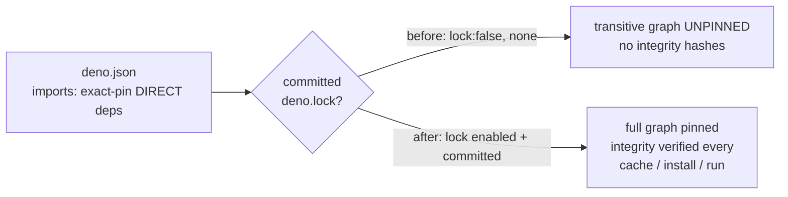

# SCR-LOCKFILE: commit deno.lock for transitive-dependency integrity pinning

## Summary

`deno.json` previously set `"lock": false` with **no committed `deno.lock`**, so
the **transitive** dependency graph was unpinned and no integrity hashes were
recorded. Exact-pinning the _direct_ `jsr:` imports does not pin what those
packages themselves resolve to — a newly published (potentially malicious)
patch/minor within an allowed transitive range could be pulled into a build even
though nothing in `deno.json` changed.

This change closes that supply-chain readiness gap:

- Removed the `"lock": false` line from `deno.json`, re-enabling Deno's lockfile
  (default behaviour).
- Generated and committed `deno.lock` (Deno lockfile v5) recording the exact
  resolved version **and** an integrity hash for every dependency in the tree.
  Deno now verifies the resolved graph on every `cache`/`install`/`run`, so any
  tamper or unexpected transitive substitution fails the integrity check. This
  makes the existing 24h bump quarantine meaningful by pinning what actually
  ships between bumps.

The lockfile is repo-local only — it is **not** in `publish.include`, so nothing
changes for downstream JSR consumers; it restores integrity verification for
this repo's own CI and contributors. It also gives the scheduled OSV scanner
(#2864) a real committed lockfile rather than relying solely on an ephemeral
one.

Closes #2865.

### Test change documented (business-logic supersession)

`test/ci/OsvScanWorkflow.ts` contained an assertion (from #2864) that
`deno.json` must **keep** `"lock": false`. Issue #2865 deliberately reverses
that policy, so this single test was updated — not removed — to assert the new,
correct posture (`config.lock !== false`). All other OSV-scan assertions
(ephemeral lockfile generation, never-commits, scanner wiring) are unchanged and
still pass.

## Evidence

Backend/config change — no web interface to screenshot. Verified via tests and
the full quality gate.

- `deno.lock` generated with `deno cache mod.ts test/**/*.ts` (Deno 2.8.1),
  recording integrity hashes for all resolved `jsr:` dependencies including
  transitive `@std/internal`.
- New test `test/scripts/LockfilePinning.ts` (4 cases) — all pass.
- Updated `test/ci/OsvScanWorkflow.ts` — all 9 cases pass.
- Full `./quality.sh`: **7050 passed | 0 failed | 4 ignored**.

## Test Plan

Added `test/scripts/LockfilePinning.ts` ("what" tests parsing the committed
manifest/lockfile):

- `deno.json does not disable the lockfile` — asserts `lock !== false`.
- `a committed deno.lock exists at the repo root`.
- `deno.lock records integrity hashes for dependencies` — asserts at least one
  integrity hash is recorded across the jsr/npm/remote sections.
- `deno.lock pins the exact-pinned direct dependencies` — asserts every direct
  `jsr:` import in `deno.json` is present in the lockfile.

Modified `test/ci/OsvScanWorkflow.ts`:

- Renamed/rewrote the `"lock": false` assertion to assert the lockfile is
  **not** disabled, reflecting the #2865 policy change (documented above).
