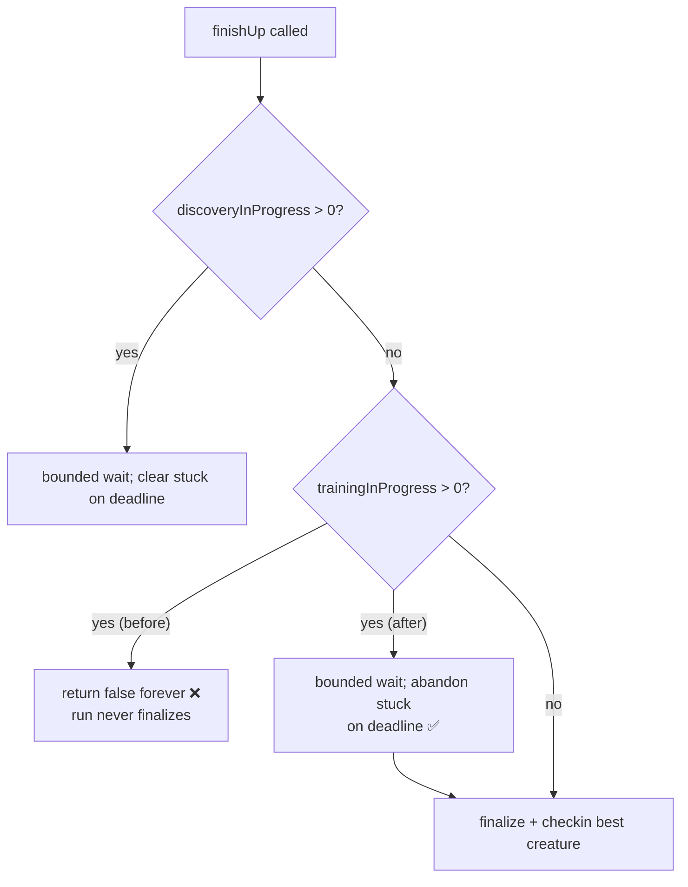

# Evolution never finalizes: bound the finish-up wait for optional training tasks

## Summary

A training task whose worker promise never settled (e.g. a timed-out
per-creature CPU score whose worker task is orphaned) was **never reaped from
`Neat.trainingInProgress`**, so the finish-up loop spun forever and the
evolution run never finalized — discarding the whole compute window with no
champion checkin.

The root cause is in `Neat.finishUp()`: the **discovery** branch already bounds
its wait and clears stuck tasks (Issues #2432), but the **training** branch
simply logged `Waiting for N training task(s)` and returned `false` every
generation, with no deadline. A single optional training task that failed to
settle therefore wedged the entire run.

Training and discovery are optional/best-effort phases — they may be waited on
for a _bounded_ time but must **never** gate finalisation + checkin. This change
makes the training branch use the **identical** bounded-wait logic as discovery:
the smaller of an iteration-derived cap and a wall-clock-derived cap. Once the
budget is exhausted (or the caller's `--timeout` wall-clock deadline passes),
the stuck training task is abandoned and the run finalizes and checks in the
best-so-far creature.

The duplicated cap computation (previously inline in the discovery branch) was
extracted into a shared private helper `computeMaxWaitGenerations()` used by
both branches, so the two paths stay in lock-step (DRY).

Closes #2871.

## Behaviour change



Before: the training branch had no deadline, so a never-settling training
promise pinned `trainingInProgress.size` and `finishUp()` returned `false`
indefinitely. After: training is bounded exactly like discovery — the run always
proceeds to checkin.

## Evidence

Backend/library change only — no UI to screenshot. Verified via unit tests that
drive `Neat.finishUp()` with an injected never-settling training promise and
assert the map is emptied and the loop reaches a terminal `true`.

New/updated tests in `test/NEAT/NeatFinishUp.ts`:

- `finishUp: training timeout clears stuck trainings` — a never-settling
  training promise is abandoned after the generation-count budget.
- `finishUp: clears stuck trainings promptly when wall-clock deadline has
  passed`
  — an expired `--timeout` clears the stuck task within a few calls even with a
  generous iteration cap.
- `finishUp: eventually finalizes despite a never-settling training task` — the
  finish-up loop reaches a terminal `true` (finalize + checkin) rather than
  spinning forever.

All existing `finishUp` tests (including the discovery-timeout and cleanup-delay
cases) continue to pass, confirming the extracted `computeMaxWaitGenerations()`
preserves discovery behaviour.

```
ok | 35 passed | 0 failed
```

(test/NEAT/NeatFinishUp.ts, NeatAwaitInFlightTasks.ts,
MaxConcurrentDiscoveries.ts, NeatSchedulingLogReplaySummary.ts)

## Test Plan

- `deno test --allow-all test/NEAT/NeatFinishUp.ts` — new and existing finish-up
  cases.
- `deno test --allow-all test/NEAT/NeatAwaitInFlightTasks.ts
  test/NEAT/MaxConcurrentDiscoveries.ts
  test/NEAT/NeatSchedulingLogReplaySummary.ts`
  — adjacent scheduling/await tests.
- `./quality.sh --skip-tests` — lint, format, type-check, WASM/discovery sync
  (exit 0).

## Notes

- The fix is deliberately at the `Neat.finishUp()` level (suggested fixes #1 and
  #3 in the issue): it guarantees the run finalizes regardless of _why_ a worker
  training promise leaked, matching the design intent that optional tasks must
  never gate checkin. The worker-side path already returns with `timedOut: true`
  on the normal timeout; this defensive bound covers the case where the promise
  is nonetheless orphaned.
- Consistent with the existing discovery path, abandoned tasks are cleared from
  the in-progress map (no per-task worker abort handle is tracked at this
  layer).
