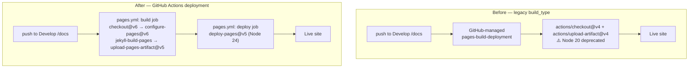

# Migrate GitHub Pages off the Node 20 legacy build (Issue #2877)

## Summary

The `github-actions-audit` finding `BP-RUNNER-actions-upload-artifact-node20`
fired again because the runner reported Node 20 deprecation warnings for
`actions/checkout@v4` and `actions/upload-artifact@v4` — but the evidence run
was **`pages-build-deployment`**, GitHub's _managed_ legacy Pages builder, not
any workflow in this repository. Every repo-owned workflow was already migrated
(checkout `@v6`, upload-artifact `@v7`, all SHA-pinned), so the only remaining
Node 20 source was the legacy "deploy from a branch" Pages build, which we
cannot edit because GitHub generates and runs it itself.

GitHub Pages was configured as `build_type: legacy` (source: `Develop` branch,
`/docs`). The fix is to stop using that managed builder by owning the deployment
ourselves: a new `.github/workflows/pages.yml` builds the `docs/` site and
publishes it through the modern, SHA-pinned Pages actions, all of which run on
**Node 24** (or a pinned Docker image) rather than Node 20:

| Action                          | Pin                  | Runtime                                 |
| ------------------------------- | -------------------- | --------------------------------------- |
| `actions/checkout`              | `de0fac2…` (v6.0.2)  | node24                                  |
| `actions/configure-pages`       | `45bfe01…` (v6.0.0)  | node24                                  |
| `actions/jekyll-build-pages`    | `44a6e6b…` (v1.0.13) | pinned Docker image                     |
| `actions/upload-pages-artifact` | `fc324d3…` (v5.0.0)  | composite → upload-artifact@v7 (node24) |
| `actions/deploy-pages`          | `cd2ce8f…` (v5.0.0)  | node24                                  |

Closes #2877.

> **One-time human/admin step (after merge):** flip **Settings → Pages →
> "Source"** to **"GitHub Actions"** (Pages `build_type: workflow`). This change
> is admin-gated and must happen _after_ the workflow lands on `Develop` —
> flipping it earlier would break the live site, since the deploying workflow
> would not yet exist on the default branch. Until it is flipped the legacy Node
> 20 builder keeps running; flipping it hands deployment to the new workflow and
> retires the deprecated runner for good.

## Evidence

This is a CI/configuration change with no web UI to screenshot. Validation is
via `actionlint` (clean across all workflows) and the Deno CI test suite under
`test/ci/` (70 tests pass, including the 5 new ones).



## Test Plan

New test file `test/ci/PagesDeploymentWorkflow.ts` (TDD — written first, failed
against the absent workflow, passes after adding `pages.yml`):

- **exists and parses** — `pages.yml` is present and valid YAML with at least
  one job.
- **publishes via `actions/deploy-pages`** — confirms migration to the
  GitHub-Actions deployment model (`configure-pages`, `upload-pages-artifact`,
  `deploy-pages`), so the legacy `pages-build-deployment` runner is retired.
- **builds `./docs`** — `jekyll-build-pages` builds from the same `./docs`
  source the legacy build served, preserving the rendered site.
- **deploy permissions** — the deploy job grants `pages: write` and
  `id-token: write`, which `deploy-pages` requires.
- **no Node 20 actions** — no `uses:` directive pins `actions/checkout` or
  `actions/upload-artifact` to its deprecated `@v4` (Node 20) major.

The new workflow is also covered by the repo's existing generic CI tests
(`WorkflowActionPinning`, `WorkflowJobTimeoutMinutes`,
`WorkflowPersistCredentialsFalse`, container-image pinning) — all green.

Run:

```bash
deno test --allow-read --allow-env "test/ci/*.ts"   # 70 passed
actionlint                                           # clean
```

## Deno regression avoided

Kept the change Deno-native: the validation is a Deno test under `test/ci/` run
by `deno test`; no Node tooling, `package.json`, or `node_modules` was
introduced.
