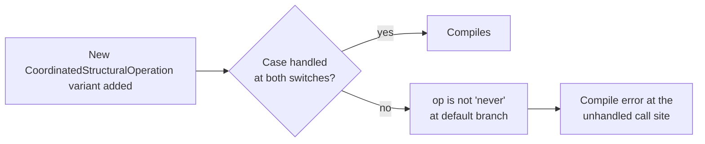

# Add `assertNever` exhaustiveness guard to CoordinatedStructuralOperation switches

## Summary

The `switch` over the `op.type` discriminant of the
`CoordinatedStructuralOperation` discriminated union was used in two places
**without an exhaustiveness guard**:

- `src/architecture/ErrorGuidedStructuralEvolution/ApplyCoordinatedStructuralCandidate.ts`
  — the loop body's arms end in `continue`, so a missing case would **silently
  skip** a structural edit at runtime, corrupting a coordinated ablation that
  Discovery emitted (the operations "must be applied in-order" as "a single
  ablation").
- `src/discovery/DiscoveryWireFormat.ts` (`toWireCoordinatedOperation`) — its
  arms `return`, so a missing case surfaced only as an unhelpful "not all code
  paths return a value" error rather than a precise exhaustiveness failure.

This PR adds a shared `assertNever(x: never)` helper and a `default` branch to
both switches. If an eighth operation variant is ever added to
`CoordinatedStructuralOperation`, both call sites now **fail to compile** until
the new variant is handled — turning a latent data-loss bug into a
compile-time error.

Closes #2880.

## Changes

- **New** `src/utils/assertNever.ts` — generic exhaustiveness guard. The
  parameter type `never` makes the compiler reject any unhandled union variant
  at the call site; at runtime (malformed wire data that escaped the type
  system) it throws with the offending value embedded so the failure is loud.
- **`ApplyCoordinatedStructuralCandidate.ts`** — added `default: assertNever(op)`
  to the operation-apply switch.
- **`DiscoveryWireFormat.ts`** — added `default: return assertNever(op)` to
  `toWireCoordinatedOperation`.

### Exhaustiveness flow

## Evidence

Backend/type-system change — no UI to screenshot. Verified by:

- `deno check src/utils/assertNever.ts ApplyCoordinatedStructuralCandidate.ts DiscoveryWireFormat.ts`
  — passes, confirming the `default` branches narrow `op` to `never` (i.e. all
  seven variants are currently handled at both sites).
- `deno check mod.ts` — full project type-check passes.
- `deno lint` / `deno fmt` — clean.
- Test run: `20 passed | 0 failed` across the new guard tests and the existing
  coordinated-structural suites.

## Test Plan

Added `test/utils/AssertNever.ts`:

- **Runtime throw path** — `assertNever` cast through `never` throws an `Error`
  whose message contains `"Unhandled variant"` and the offending value.
- **Exhaustive switch** — an exhaustive `switch` returns the handled value and
  never reaches the guard.
- **String value** — a string-only rogue value is serialised safely into the
  error message.

Existing coordinated-structural suites (`CoordinatedStructuralCandidate`,
`CoordinatedStructuralCandidateMoreOps`,
`CoordinatedStructuralCandidatePreserveSynapseMetadata`) continue to pass,
confirming the added `default` arms do not change behaviour for the seven
existing variants.
