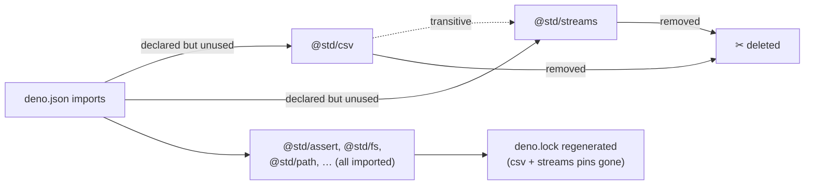

# Remove dead deps `@std/csv` and `@std/streams` from `deno.json`

## Summary

Two entries in the `imports` map of `deno.json` declared dependencies that no
source file imports:

- `@std/csv` (`jsr:@std/csv@1.0.6`)
- `@std/streams` (`jsr:@std/streams@1.1.1`)

A tree-wide search (`src/`, `mod.ts`, `test/`, `bench/`, `scripts/`) for both
specifiers returned **zero** `import` / dynamic-import references. They were
dead weight in the resolution graph — still fetched and cached, still widening
the supply-chain attack surface (Issue #2184), and misleading audits about what
`@stsoftware/neat-ai` actually consumes.

This PR deletes both entries and regenerates `deno.lock`. Removing `@std/csv`
also drops its transitive `@std/streams@^1.0.9` pin from the lockfile, so the
graph is now honest. A new guardrail test prevents the regression from
returning.

Closes #2881.

### Deno regression avoided

Refreshed the lockfile with Deno-native tooling (`deno cache --reload mod.ts`) —
no Node/npm tooling introduced.

## Evidence

Backend/CLI-only change — no web interface to screenshot.

- **Pre-fix (red):** the new guardrail tests failed, reporting
  `Unused external dependencies declared in deno.json: @std/csv, @std/streams`.
- **Post-fix (green):** `deno test test/utils/NoUnusedStdDependency.ts` →
  `7 passed | 0 failed`.
- **Usage audit** — import-site counts confirm only the two removed deps were
  unused; every other external dep has at least one import site:

  | dep                | import sites    |
  | ------------------ | --------------- |
  | `@std/assert`      | 1080            |
  | `@std/bytes`       | 1               |
  | `@std/crypto`      | 3               |
  | `@std/csv`         | **0 (removed)** |
  | `@std/fmt`         | 18              |
  | `@std/fs`          | 47              |
  | `@std/path`        | 44              |
  | `@std/streams`     | **0 (removed)** |
  | `@std/uuid`        | 1               |
  | `@std/yaml`        | 8               |
  | `@std/testing`     | 6               |
  | `@stsoftware/tags` | 100             |

- `deno lint` (1674 files), `deno fmt --check`, and `deno check mod.ts` all
  pass.
- `deno.lock` no longer references `@std/csv` or `@std/streams` (including the
  transitive `@std/streams@^1.0.9`).

## Test Plan

Added `test/utils/NoUnusedStdDependency.ts` — a guardrail (modelled on
`test/utils/NoStdLogDependency.ts`) asserting that **every** external
`jsr:`/`npm:`/`https:` entry in `deno.json` is imported by at least one source
file. Cases:

- `isExternalDependency` distinguishes registry deps from `./` path aliases.
- `externalDependencySpecifiers` returns only registry keys.
- `importSpecifierRegExp` matches static, side-effect and dynamic imports, and
  respects specifier boundaries (`@std/path` ≠ `@std/pathx`, ignores prose).
- `isSpecifierImported` finds a used dep and rejects an unused one.
- **Regression test:** "every external deno.json dependency is imported by
  source" — fails against the unfixed `deno.json` (lists `@std/csv`,
  `@std/streams`), passes after removal.
- "deno.json no longer declares the removed `@std/csv` and `@std/streams` deps".
